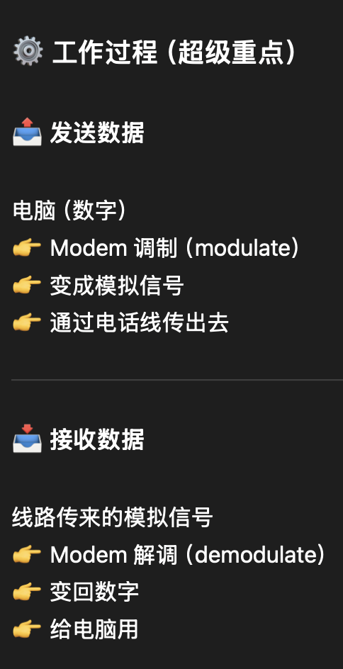
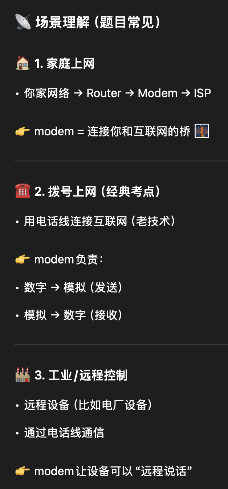
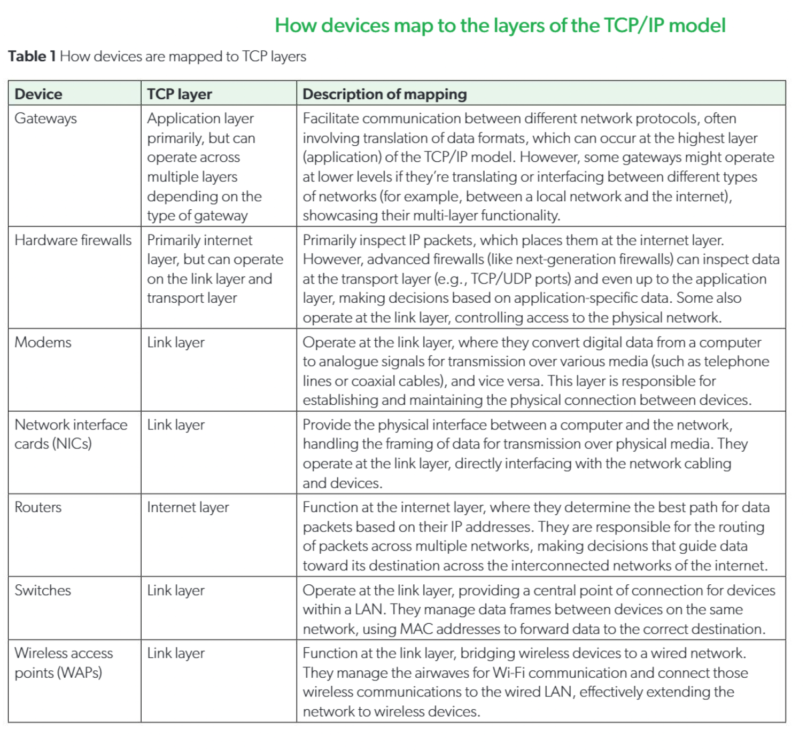

[TOC]

# A2 Network Fundamental

## A2.1.1 Describe the purpose and characteristics of networks

---
- Local Area Network (LAN)
  - connects network devices over a short distance 
  - LANs are designed to operate distances not exceeding approximately 1km
  - longer distances will result in latency

  - LANs are characterized by high data transfer rates and relatively low latency
  - LANS can be both wired or wireless, but are usually a mix of two 

  > The primary goal of LAN is to facilitate the sharing of resources such as files, printers, and software applications among multiple users in a local area.

- Wide Area Network (WAN)
  - a WAN connects network devices across larger geographic areas that can span cities, countries, and even continents. 
  - WANs are characterized by their ability to maintain reliable data communication over longer distances, comparing to LAN.
  - However, WANs often have lower data transfer rates and higher latency than LANs, because the primary goal is to enable communication among long distances. 

  - The default and primary purpose for WANs is to enable businesses, governments, and other entities to operate on a wide scale. 
  - WANs facilitate the connection of smaller, geographically dispersed networks such LANs and MANs in to a **cohesive system**, allowing for **centralized data processing, collaborative work, and access to shared resources regardless location.**

  - WANs can be established over leased lines or satellite links, or through public internet connections through VPNs to ensure security and privacy. 

- Personal Area Network (PAN)
  - PAN is designed for personal use and usually spans no more than 10 meters. 
  - This range is optimal for devices **centred around a single person's workspace or within their immediate physical environment**.

  - PANs are characterized by their **convenience for inter-device communication on a such small scale, facilitating direct interaction between personal devices such as phones, computers, printers, smart watches and wearable devices.**

  > The primary goal of a PAN is to enable the connection and communication of personal devices for individual use, streamlining the sharing of data and access to personal resources like contacts, internet access, and multimedia files. This network type enhances personal productivity and entertainment by allowing seamless device synchronization, data transfer and internet sharing in a highly localized setting.

  
  - Examples of PAN usage include:
    - connecting a smartphone to wireless headphone for music streaming
    - syncing a laptop with a mouse and keyboard
    - connecting a smartphone to a smartwatch for fitness tracking

  - PANs can be established using **wireless technologies such as Bluetooth and WIFI Direct**. 
    - which are specifically designed for short range communication and require minimal power, making them ideal for personal device connectivity. 

- Virtual Private Network (VPN)
  - A virtual private network (VPN) **extends a private network across a public network**, allowing users **to send and receive data as if their devices were directly connected to the private network**. 
  - A VPN can function over **unlimited distances** since it **uses the internet to create a secure and encrypted connection between devices and the private network**. 
    - This encryption ensures that **data transmitted over the VPN is protected from unauthorized access.**

  - The primary goal of a VPN is to **provide secure remote access to a private network and its resources**, such as files, printers, and software applications, **from any location with internet access**. Remote workers, organizations with global operations, and individuals concerned with privacy and security online all benefit from VPNs. 
  - **By creating a “tunnel” through the public internet that encrypts data as it travels back and forth**, VPNs ensure that sensitive information **remains confidential and secure from potential cyber threats**.

  - Examples of VPN usages include:
    - employees access to their **company's internal servers and documents securely while working from home.**
      - They can access to their company's **private network** directly and securely.
    - individuals browsing the internet privately without revealing their **IP address or location**
      - This is because the encryption ensures that data transmitted over the VPN tunnel is protected, and cannot view by others without proper authorization.
    - connecting to a geo-restricted content by appearing to be in a different geographical location
      - A VPN **routes user traffic through a remote server in another geographical location**, **replacing the user’s IP address with that server’s IP**. As a result, websites identify the user as being in that location, allowing access to geo-restricted content.
      - **The VPN server acts as a gateway to the private network. A secure encrypted tunnel is established over the public network, and all traffic is routed through the VPN server, making it appear as if the user’s IP address is that of the server.**

## A2.1.3 Describe the function of network devices

---
- Gateways 
  - Gateways are network devices that act as a bridge between two networks that use disparate protocol. 
  - A device that connects two different networks and allows data to pass between them.

  - A gateway can **enable communication between an office network and the internet**, **converting private network addresses to a public address using protocols such as NAT (network address translation)**. 
  - Additionally, gateways might **incorporate security functions, filtering, and traffic management to enhance data flow and security across the networks they bridge.**
  - A gateway can also be used to **convert data between different network protocols**.
    - For example, a gateway might translate email traffic from the simple mail transfer protocol (SMTP) on an enterprise network to another messaging protocol used by an external network, **facilitating seamless communication between different email systems.**
    - **Gateway can convert between different protocols.**

  - Within the context of voice over internet protocol (VoIP) communications, a gateway **can translate between the digital signals used within an IP network and the analogue signals of traditional phone lines.**
    - This enables calls to be made between internet-based VoIP users and traditional telephone users.

  > An example: If you use Wechat to call landline, gateway is being used here.

- Hardware firewalls
  - Firewalls are **network security devices that monitor and control incoming and outgoing network traffic (packets) based on predetermined security rules.** 
  - A firewall typically **establishes a barrier between a trusted internal network and untrusted external networks**, such as the internet, to **block malicious traffic and prevent unauthorized access**.

  - Key features and functions
    - monitoring packets and data
    - prevent malicious data, packets and traffic
    - allow safe and legitimate packets, data, and traffic

  - Usage Scenarios
    - Prevent attack/Direct interception 直接拦截
      - from skeptical IP address
      - contains malicious data packets

    - Quality of Service (QoS)
      - Zoom/VoIP(voice over internet protocol) or other important services **higher priority**
      - game **lower priority**
      - reduce latency and optimize experience 

    - Family Scenario 
      - routers contain firewall
      - prevent the potential threat form hacker 
      - parent control(restrict websites) 

  - Software and hardware firewalls

  | Category        | Software Firewall              | Hardware Firewall              |
  |-----------------|-------------------------------|--------------------------------|
  | Location        | On a single device            | At the network gateway         |
  | Scope           | One computer                  | Entire network                 |
  | Flexibility     | High (customizable)           | Lower                          |
  | Protection Area | Internal threats              | External attacks               |
  | Example         | Windows Defender              | Router / Enterprise firewall   |

  > A firewall is a network security device that monitors and controls incoming and outgoing traffic based on predefined rules, protecting a network from unauthorized access and malicious attacks.

- Modems 
  - Modems stands for the **modulator-demodulator**.

  > Modems (modulator–demodulators) are devices that **facilitate data transmission over telephone lines or broadband connections by converting digital data from a computer into analogue signals suitable for sending over these lines, and vice versa**. They serve as a **bridge between the digital data networks and analogue phone systems**.

  - Modulator is used for transferring the digital signals(0,1) from a computer to analogue signals.
  - Demodulator is used for transferring the analogue signals to digital signals. 

  - 

  

  - 

  - **A modem converts digital signals into analogue signals for transmission over communication lines and converts them back into digital signals at the receiving end.**

- Network interface cards (NICs)
  - Network interface cards (NICs) are hardware components within a computer or network device which **facilitate the interface between the physical network and the device’s processing capabilities.**
  - NICs **perform the critical function of converting electrical signals received from the network into digital data that the computer’s processor can understand and vice versa. This conversion is essential for the communication process over computer networks.**

  > A NIC connects a device to a network by converting signals into digital data, transmitting and receiving packets, and using a MAC address to ensure correct delivery.

  - characteristics
    - connect 
      - enables the device to connect to network 
    - convert 
      - convert electrical/light/radio signal to digital data, or vice versa 
    - transmit/receive
      - send or receive data (bidirectional)
    - identify MAC address
      - MAC address uniquely identifies each device
      - ensure that packages are being sent to the correct/intended device
    - protect 
      - buffer: prevent package loss 
      - CRC: error checking 

- Router 
  - Routers are **network devices that manage the exchange of data between different networks. They direct data packets by determining the optimal path for transmission using routing tables and routing protocols.**
  - At its core, a router **examines the destination IP address in each packet and uses a routing table to determine the best next hop**. Routers update their routing tables using static or dynamic routing protocols, allowing them to learn network paths and make efficient routing decisions.

  - Routers are responsible for receiving, processing, and forwarding data packets to their correct destinations. A packet may pass through multiple routers before reaching its destination. Routers inspect packet headers and use protocols such as RIP (Routing Information Protocol) to find the fastest path.

  - Key Functions
    - Determine the best path for data transmission
    - Forward packets between networks
    - Use IP addresses to identify destinations
    - Maintain routing tables
    - Use routing protocols (e.g., RIP) to update paths

  > A router directs data packets between networks by using IP addresses and routing tables to determine the best path.
  > A router can establish a connection between LAN and WAN.

- Switches 
  - **Switches are networking devices that connect devices within a LAN. Switches manage the flow of data within a network by receiving, processing and forwarding data packets (also called frames) to the correct destination device.**

  - At their core, switches receive incoming data packets from one device and **use the MAC address information contained within the packet to forward it to the appropriate destination device.**

  - Switches **maintain a MAC address table**, also known **as a forwarding table**, which **maps each MAC address to the corresponding switch port**. This allows the switch to effectively direct traffic by looking up the destination MAC address of each frame and forwarding the frame directly to the port associated with that address.

  - While switches are efficient at **directing traffic**, they must **handle broadcasts (sent to all devices) and multicasts (sent to a group of devices) differently**. For these types of traffic, the switch forwards the frames to multiple ports based on the needs of the network protocol being used.

| Scenario                | Description                                                                 |
|------------------------|-----------------------------------------------------------------------------|
| Small / Home Office    | Connects devices (computers, printers, storage) and enables resource sharing |
| Enterprise Networks    | Supports VLAN segmentation, link aggregation, improves security & performance |
| Data Centres           | Manages server traffic, high throughput, low latency, handles large data     |
| Schools / Universities | Connects campus networks, supports thousands of devices                      |

- Wireless access points (WAPs)
  - **Wireless access points (WAPs) serve as the interface between the wired infrastructure and wireless devices. WAPs convert wired Ethernet data into wireless signals and vice versa, effectively extending the reach of the network to areas where wiring is impractical, impossible or undesirable.**

  - **WAPs broadcast wireless signals that wireless devices can detect and connect to. They operate by receiving data packets from the wired network, converting these packets into radio frequencies, and transmitting them wirelessly. The process is reversed for incoming signals from wireless devices, which are converted back into data packets and relayed onto the wired network.**

  - In larger installations, multiple WAPs can be configured to create a wireless network mesh. This setup allows users to move between different areas (for example, between floors or rooms in a building) without losing connection, as their devices automatically switch to the strongest available signal from the nearest WAP.

  - WAPs can be managed centrally, often via controllers that configure settings, manage network policies and provide tools for monitoring network usage and performance. This central management helps maintain consistent configurations across multiple WAPs and simplifies the task of updating network settings or firmware.

| Scenario                | Function                                      | Benefits                                      |
|------------------------|-----------------------------------------------|-----------------------------------------------|
| Office                 | Wireless access across building               | Mobility, collaboration                        |
| Schools / Universities | Campus-wide wireless coverage                 | Access from classrooms, libraries, outdoors    |
| Public / Retail        | Provide free Wi-Fi                            | Customer satisfaction, location-based services |
| Residential            | Home wireless connectivity                    | Supports multiple smart devices                |

- How devices map to the layers of the TCP/AP model

## A2.1.4 Describe the network protocols used for transport and application

---

- Transmission Control Protocal (TCP)

  - is a core protocal of the internet

  - it operates at the **tranport layer(3rd layer)** of the TCP/IP model

    - TCP/IP Model: Application layer(forth layer), Transport layer(3rd layer), Internet layer(2nd layer), Network Interface layer(1st layer)

  - **TCP provides reliable, ordered, and error-checked delivery of stream of bytes(packets) between hosts communicating via an IP network.** 

  - Key features

    - **connection establishment**

      - three-way handshake mechanism

        - Client → Server: **SYN**

          - “I want to establish a connection.”

          - *(client sends initial sequence number)*

        - Server → Client: **SYN-ACK**

          - “Connection accepted, I acknowledge your request.”

          - *(acknowledges client + sends its own sequence number)*

        - Client → Server: **ACK**
          - “Acknowledgement received. Connection established.”

    - **data transfer with acknowledgement**

      - **TCP** **uses acknowledgements (ACKs) to confirm that data has been successfully received.**
      - Each segment has a sequence number, this number must be acknowledged by the receiver.
      - how it works
        1. sender sends data with sequence number, for example, `seq = 100`
        2. receiver receives the data, then sends a ack, for example `ack = 101`
        3. This means: "I have received everything up to byte `100`, send from `101` next."
      - why is this important, it ensures:
        - **reliability(prevent package loss)**
          - ack won't increase if there's a package loss
          - sender detects the anomoly, then it will retransmit the data
        - **ordered** 
          - packets/data may arrive out of order
          - TCP can **reorder the packets based on the sequence number**
          - then tranfers them to the Application layer
        - **error detection** 
          - If corrupted(数据损坏):
            - no valid ACK
            - data is resent 

    - **flow control**

      - > TCP flow control uses a **sliding window mechanism** where the receiver advertises its available buffer size (window size) to the sender. This ensures that the sender does not transmit more data than the receiver can handle, preventing buffer overflow.

      - sliding window 滑动窗口

      - receiver返还回去的ACK会带一个叫做window size的东西

        - `window size = 500 bytes`
        - this means that the receiver 最多还能接 500 字节

      - sender limits the amount of data transmit

        - cannot exceed the window size
        - otherwise there will result in overflow

      - receiver updates the window size

        - processed data successfully -> window size increases
        - or window size decreases

      - if `window size = 0`

        - receiver will terminate the data transmision

        - 然后等待窗口恢复 

          

    - **connection termination**

      - Four-way handshake mechanism

        - FIN (client -> server)
          - "I'm finished. All data has been transmitted."
          - send `FIN = 1`
        - ACK (server -> client)
          - "OK, i know you are going to terminate. "
          - send `ACK = 1`
        - FIN (server -> client)
          - "I'm also finished."
          - send `FIN = 1`
        - ACK(client -> server)
          - "OK, connection terminates formally."
          - send `ACK = 1`

      - > Each side **sends a FIN to indicate it has finished sending data**, and the other side **responds with an ACK**. This ensures that **both sides have completed transmission before the connection is fully closed.**

        

- User Datagram Protocal (UDP)

  - enables a **connectionless mode of communication** whereby data packets, or datagrams, are sent between devices **without establishing or maintaining a stateful connection** between the communication endpoints. 
  - connectionless feature: faster, less-resource intensive then TCP, because it eliminates the overhead associated with setting up and maintaining a connection.
  - this feature is especially valuable in situation **where occasional data loss/package loss is tolerable.**
    - widely favoured for real-time application like video streaming, online gaming and VoIP. 
    - in these cases, **the priority is to reduce latency and to maintain continous flow of data**, even some data packets arrive out of order
  - UDP also supports **multicasting**:
    - **multicasting: the transmission of a packet to multiple destinations in a single send operation**
    - making it suitable for applications such as live broadcasts and group collaborations
    
    

- Hypertext Transfer Protocal (HTTP)

  - a foundational protocal for data communication over the **World Wide Web(WWW)**. 

  - 浏览器和服务器怎么说话的规则

    - open the browser, the browser **sends a HTTP request**
      - `GET /index.html`
    - the server receives the HTTP request, process it, then returns a **HTTP response**
      - Webpage content(HTML/CSS/JS)
      - status code

  - status code 

    - | HTTP Response Code        | Description                                                  |
    | ------------------------- | ------------------------------------------------------------ |
  	| 200 OK                    | Indicates that the request has succeeded and the server has returned the expected content. |
    | 404 Not Found             | The server cannot find the requested resource. Often triggered by broken links or incorrect URL input. |
    | 500 Internal Server Error | A generic error message indicating that the server encountered an unexpected condition that prevented it from fulfilling the request. |
    | 301 Moved Permanently     | This response code is used when the requested resource has been permanently moved to a new URL, and any future references should use one of the returned URLs. |
    | 403 Forbidden             | The server understands the request but refuses to authorize it. This often occurs when access to the requested resource is restricted or denied. |
  
  
    - Request / Response Model
  
      - HTTP 采用请求-响应（request/response）模型：
        - Request（客户端 → 服务器）
          - Method（方法）
            - GET：获取资源
            - POST：提交数据
          - Headers（头部）
            - 元数据（如 content type、authentication）
          - Body（可选）
            - 发送的数据
  
        - Response（服务器 → 客户端）
  
          - Status Code（状态码）
            - 200 / 404 / 500 等
          - Headers（响应头）
          - Body（响应内容）
            - 网页 / 数据 / 错误信息
  
  
  
    - HTTP 是一种 **stateless protocol（无状态协议）**
      - 每个请求都是独立的 **Each request is processed independently, as HTTP is a stateless protocol.**
      - 服务器不会记住之前的请求
  
      - 结果：
        - 无法自动识别用户身份
        - 无法保持登录状态或连续操作
  
  
  
  - 状态管理（State Management）
      - 由于 HTTP 无状态，需要额外机制来维护状态：
      - 🍪 Cookies（客户端）
        - 存储在浏览器中
        - 随请求自动发送到服务器
        - 用于保存：
          - 登录状态
          - 用户偏好
          - 浏览记录
      - 🧠 Sessions（服务器）
        - 存储在服务器端
        - 通过 Cookie 中的 session ID 识别用户
        - 用于：
          - 维护用户会话
          - 记录用户数据
  
  > HTTP uses a request-response model and is stateless, meaning each request is processed independently. Cookies and sessions are used to maintain state across multiple requests.

- Hypertext Transfer Protocal Secure (HTTPS)

  - is an extension of basic HTTP, **speficially designed to enhance security for communications over the WWW.**

  - HTTPS **incorporates encryption** into the **data transmission process** to **protect the integrity and privacy of the data exchanged between a web server and a browser.** 

  - It can protect the confidentiality and integrity of the data.

    

  - Encryption Mechanism

    - HTTPS uses:
      - TLS (transport layer security)
      - SSL(deprecated)
    - how does it work:
      - **encryption** before sending the data
      - **decryption** after receiving the data
      - **This ensures that even the data is being captured during the tramission process, the data is still unreadable.** 

  - Features of the URL

    - HTTPS uses `https://`, not `http://`

  - Why HTTPS is more secure?

    - it can prevent
      - eavesdropping（窃听）
      - tampering（篡改）
      - message forgery（伪造信息）
    - it can ensure the data during the transmission process
      - 不被读取
      - 不被修改
      - 来源可信（加密、解密)
      
  	  
    
    > HTTPS is a **secure version of HTTP** that uses **TLS encryption to protect data during transmission**.
    >
    > It **ensures confidentiality, integrity, and security against eavesdropping and tampering.**
    
    

- Dynamic Host Configuration Protocal (DHCP)

  - **DHCP automatically assigns IP addresses and other essential network configuration parameters to devices when they connect to a network.** 

    

  - Why DHCP?

    - 简化网络管理（no manual configuration）
    - 避免人工分配 IP 的：
      - 低效率 low efficiency
      - 易出错 human errors

  - How it works?

    -  设备连接网络时：
      - 发送 broadcast 请求
      - DHCP server:
        -  从地址池（address pool）分配 IP 地址

  - The DORA process

    1. Discover
       1. 客户端 → 广播（broadcast）
       2. 内容：“有没有 DHCP server？我需要 IP”
       3. 特点：没有 IP → 用广播， 发给整个网络
    2. Offer
       1. DHCP Server → 客户端
       2. 内容:
          1. 提供一个可用 IP
          2. 以及配置（subnet mask, gateway, DNS）
          3. 可以有多个 server 回复
    3. Request
       1. 客户端 → 广播
       2. 内容：
          1. “我要这个 IP（选中的那个）”
          2.  同时告诉其他 server：“你们的我不要了”
    4. Acknowlgement (ACK)
       1. DHCP Server → 客户端
       2. 内容：
          1.  确认分配成功
          2. IP 正式生效

  - The information that DHCP offers:

    - IP address
    - subnet mask 子网掩码
    - Default gateway 默认网关
    - DNS server DNS解析服务器

  - Subnet Mask 子网掩码
    - **determines the network segment the device is on**
    - 32-bit 数字
    - 用于划分
      - 网络部分（network）
      - 主机部分（host）
    - 规则
      - 1 → network part
      - 0 → host part
    - for example:
      - 255.255.255.0
      - 二进制: 11111111.11111111.11111111.00000000 
        - 前面的是network part，后面的是host part
  - Manners for allocating IP addresses
    - Dynamic Allocation
      - the IP address is lease(租用)，代表temporary，临时的
      - 到期后需要重新申请
      - 用于
        - 临时设备：Laptop, phone
    - Static Allocation
      - IP address is fixed 地址是固定的
      - 根据 MAC address 分配
      - 常用于: printer, server
  - Advantages:
    - 防止 IP 冲突（address conflict）
    - 自动化配置
    - 提高网络效率
    - 适用于大型或动态网络
  - Disadvantages:

    -  单点故障（Single Point of Failure）

      - DHCP server寄了，所有新加入的设备，或是IP到期后的设备，就寄了，无法获取IP，无法连接网络

    - 安全问题 Security Issue

      - 可能出现 rogue DHCP server，假的DHCP服务器

        - 分配恶意/错误IP
        - man-in-the-middle attack 中间人攻击

    - 不适合需要固定IP的设备
    - 完成DORA可能需要时间，导致startup latency

  >**DHCP automatically assigns IP addresses and network settings to devices. It reduces manual configuration and prevents address conflicts.**

## A2.1.5 Describes the function of the TCP/IP Model

- Why TCP/IP Model?
  -  网络非常复杂（devices + protocols + media）
  - 使用模型来：
    -  理解（understanding）
    - 标准化（standardizing）
    - 故障排查（troubleshooting）

- TCP/IP model has four different layers: **Application layer, Transport Layer, Internet Layer, Network interface layer**.

- | Layer                   | Role                                                         |
  | ----------------------- | ------------------------------------------------------------ |
  | Application Layer       | **Provides an interface between applications and the network** and **defines protocols such as HTTP, SMTP, DNS, and DHCP for data exchange.** |
  | Transport Layer         | **Provides end-to-end communication and ensures reliable data transfer** using **TCP, while UDP offers faster but less reliable transmission.** |
  | Internet Layer          | **Handles IP addressing and routing to ensure data packets reach their intended destination across networks.** |
  | Network Interface Layer | **Manages physical data transmission, including hardware, signal encoding, and MAC addressing over network media.** |

### 1️⃣ Application Layer (Client Request)｜应用层（客户端请求）
- The user enters a URL and the browser creates an HTTP GET request.  
  用户输入 URL，浏览器生成一个 HTTP GET 请求。
- The request is prepared according to the HTTP protocol and passed to the transport layer.  
  请求按照 HTTP 协议构建，并传递到传输层。

### 2️⃣ Transport Layer (Segmentation & Connection)｜传输层（分段与连接）
- The request is divided into TCP segments with headers including sequence numbers, ports, and checksums.  
  请求被分割为 TCP 段，并添加序列号、端口号和校验和等信息。
- A TCP connection is established using the three-way handshake (SYN, SYN-ACK, ACK).  
  通过三次握手（SYN, SYN-ACK, ACK）建立 TCP 连接。
- After connection establishment, the segments are sent to the internet layer.  
  连接建立后，数据段被发送到网络层。

### 3️⃣ Internet Layer (IP Packet & Routing)｜网络层（IP与路由）
- Each TCP segment is encapsulated into an IP packet with source and destination IP addresses.  
  每个 TCP 段被封装成 IP 数据包，包含源 IP 和目标 IP 地址。
- The packet is assigned a next hop and prepared for routing across networks.  
  数据包被分配下一跳地址，用于跨网络传输。

### 4️⃣ Network Interface Layer (Frame & Transmission)｜网络接口层（帧与传输）
- The IP packet is encapsulated into a frame with MAC addresses.  
  IP 数据包被封装为帧，并加入 MAC 地址。
- The frame is converted into electrical signals and transmitted through the network.  
  帧被转换为电信号或无线信号并进行传输。

### 🌐 (Between 4 and 5: Internet Routing)｜（互联网传输过程）

- The data travels through multiple routers.  
  数据经过多个路由器传输。
- Each router forwards the packet based on the destination IP address.  
  每个路由器根据目标 IP 地址转发数据包。

### 5️⃣ Server Receives Data｜服务器接收数据

- The network interface layer reconstructs the frame from signals.  
  网络接口层从信号中还原数据帧。
- The internet layer verifies the IP and extracts the TCP segment.  
  网络层验证 IP 并提取 TCP 段。
- The transport layer checks and reassembles the data.  
  传输层检查并重组数据。
- The request is passed to the application layer.  
  请求被传递到应用层。

### 6️⃣ Server Responds｜服务器响应

- The application layer generates an HTTP response.  
  应用层生成 HTTP 响应。
- The response is segmented, encapsulated, and transmitted back.  
  响应被分段、封装并发送回客户端。

### 7️⃣ Client Receives Data｜客户端接收数据
- The network interface layer reconstructs the frame.  
  网络接口层还原数据帧。
- The internet layer extracts the TCP segment.  
  网络层提取 TCP 段。
- The transport layer reassembles the data.  
  传输层重组数据。
- The application layer displays the web page.  
  应用层显示网页内容。
  
### 8️⃣ Connection Termination｜连接终止
- The TCP connection is closed using FIN and ACK packets.  
  使用 FIN 和 ACK 包关闭 TCP 连接。
- This ensures a graceful termination of the communication.  
  这确保连接被安全地关闭。

### Simplified version of the 8 steps

- Client creates an HTTP request.  
  客户端创建 HTTP 请求。

- Request is segmented and TCP connection is established.  
  请求被分段并建立 TCP 连接。

- Data is encapsulated into IP packets.  
  数据被封装为 IP 数据包。

- Packets are framed and transmitted as signals.  
  数据被封装为帧并转换为信号发送。

- Data travels through routers to the server.  
  数据通过路由器传输到服务器。

- Server processes the request and generates a response.  
  服务器处理请求并生成响应。

- Response is sent back and reassembled at the client.  
  响应被发送回客户端并重组。

- TCP connection is terminated.  
  TCP 连接被关闭。

