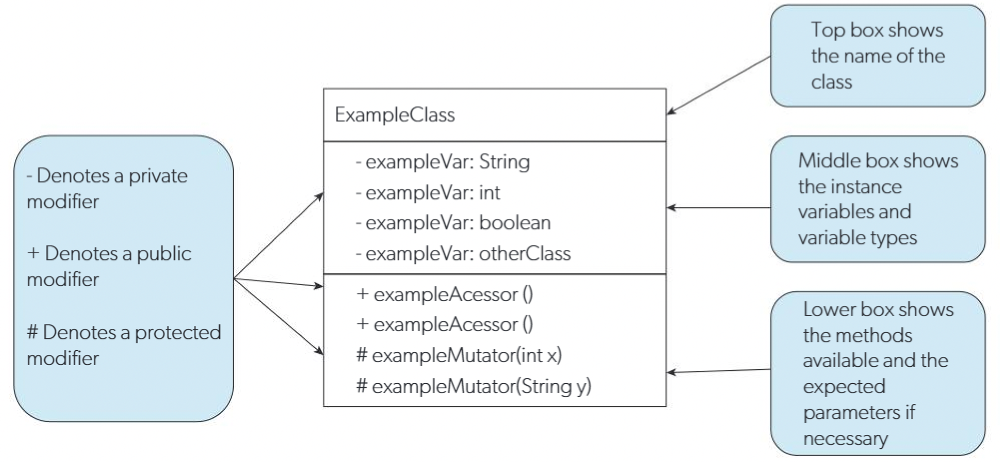
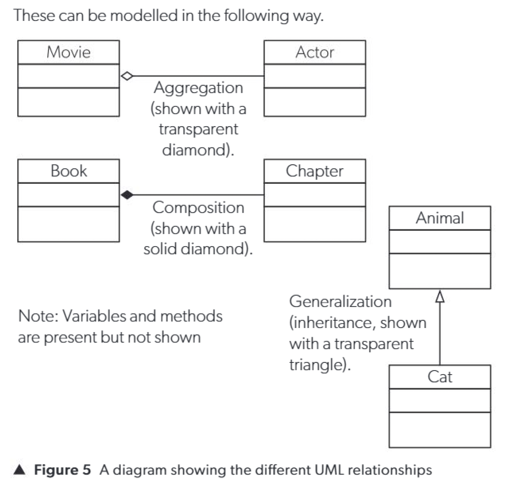

[TOC]

# B3.1 Fundamentals of OOP for a single class

## B3.1.1 Evaluate the fundemental of OOP

---

- Object-oriented programming (OOP) uses **objects and classes to represent real-world entities.**

- A class **is a blueprint that defines attributes (instance variables) and methods (behaviours).**

- An object **is an instance of a class with assigned values stored in memory.**

- **Instantiation** is the **process of creating an object by assigning values to its instance variables.**

- Using **only variables and lists** to store data can **become complex and inefficient when handling multiple entities.**

- Classes allow **multiple attributes and behaviours to be grouped into a single structure.**

- Each new object created from a class **represents a separate instance with its own data.**

- Inheritance **allows a subclass to reuse and extend the properties and methods of a superclass.**
- Common attributes and methods are stored in the superclass, while subclasses **add specific features**.
- This improves **code reuse and reduces duplication**.


- Encapsulation **restricts direct access to data by keeping variables and methods within a class.**

- It **improves security and protects data** from unintended interference.

- It also **allows code reuse and simplifies interaction with complex systems.**


- Polymorphism allows the **same method name to behave differently** depending on the context or parameters.

- The implementation of a method **depends on how it is called.**

- OOP provides access to **prewritten libraries,** improving development efficiency.

- It enables **large problems to be broken into smaller, manageable parts.**

- It supports code reuse through inheritance.

- It allows developers to **work on different parts of a program concurrently.**

- It **improves security through encapsulation.**

- It **models real-world systems effectively using objects.**


- OOP can **introduce overhead** and **may be inefficient for simple programs.**

- Programs **may become larger and slower due to abstraction.**

- The modular structure can make programs **more difficult for beginners to understand.**


## B3.1.2 Construct a design of classes, their methods and behaviours

---

- **UML (Unified Modelling Language) is used to represent and communicate class designs clearly.**  


- UML diagrams **help developers and non-technical users understand system structure.**  
- They **reduce ambiguity and improve communication between developers.**


- Sequence (event) diagrams **show the order** in which objects interact.  
- Use case diagrams show **how users interact with the system.**  
- State diagrams show **how objects change between states.**  
- Package diagrams show **dependencies between different parts of a system.**


- UML class diagrams **show classes and relationships in a visual form.**  


- A UML class diagram consists of three sections:
  - **Top: class name**  
  - **Middle: attributes (instance variables) and data types**  
  - **Bottom: methods (behaviours) and parameters**  
  - 


- Access modifiers define visibility:
  - **public (accessible everywhere)**  
  - **private (accessible only within the class)**  
  - **protected (accessible in subclasses)**  


- When designing classes, only **relevant attributes and methods** should be included.  
- Irrelevant data **should be excluded** based on the purpose of the system.

- UML diagrams improve communication skills by providing a standard representation of classes.  
- They ensure all developers **understand the system design.**

- Objects can be related in different ways in UML:

- Aggregation:
  - Classes can **exist independently** but **are related**.  
  - Example: **Actor and Movie**  

- Composition:
  - Classes **depend on each other and cannot exist independently**.  
  - Example: **Chapter and Book**  

- Inheritance (Generalization):
  - A **subclass inherits attributes and methods from a parent class**.  
  - Example: **Animal and Cat**  

- Aggregation is represented by a **hollow diamond.**  
- Composition is represented by a **filled diamond**.  
- Inheritance is represented by a hollow triangle.

- UML class diagrams **may omit variables and methods for simplicity in diagrams.**  

- 

## B3.1.3 Distinguish between static and non-static variables and methods
---

- **Static variables belong to the class**, not to i**ndividual objects (instances)**.  
- **Non-static (instance) variables belong to each object(instance) separately.**


- In Python, **static variables are defined inside the class but outside methods**.  

- Example: booksBorrowed = 0 (**shared by all objects**)

```python
  class Book:
    booksBorrowed = 0 # static varible/shared among all objects(instances)
```


- Instance variables **are defined inside init using self.**  It belongs to each object/instance separately. 

```python
  class Book:
    booksBorrowed = 0 # static varible/shared among all objects(instances)
    
     def __init__(self, title):
        self.title = title      # 🟢 instance variable
        self.borrowed = False   # 🟢 instance variable

```


- Each object has its **own copy of instance variables**.


- There is only **ONE copy of a static variable shared by all objects**.  
- Changing it f**rom one object affects all objects**.


- Static variables are **initialized once when the program starts**.  
- Their value **persists throughout execution**.


- Static variables **are accessed using the class name, not the object**.  
- **Example: Book.booksBorrowed**


- Static methods in Python **do not use self**.  
- They **use the class name or class reference instead**.

```python
class Book:
    booksBorrowed = 0   # 🔴 static variable

    def __init__(self, title):
        self.title = title      # 🟢 instance variable
        self.borrowed = False   # 🟢 instance variable

    # 🟢 instance method
    def borrow(self):
        if not self.borrowed:
            self.borrowed = True
            Book.booksBorrowed += 1   # 访问 static variable

    # 🔴 static method
    @staticmethod
    def getTotalBorrowed():
        return Book.booksBorrowed   # 只能直接访问 static
      
b1 = Book("A")
b2 = Book("B")

b1.borrow()
b2.borrow()

print(Book.getTotalBorrowed())  # 2
```


- Static methods **can only directly access static variables**.  
- They **cannot directly access instance variables without an object**.


- Instance methods **use self and can access instance variables**.  
- They **can also access static variables via the class name**.


- Static variables **are useful for storing shared data across all objects**.  
- Example: **total number of books borrowed in a library.**


- Static variables **must be used carefully to avoid unintended changes to shared data.**

## B3.1.4 Construct code to define classses and instantiate objects

---

- **A class is a blueprint used to create objects.**

- A class is **often designed first using a UML class diagram.**

- In Python, a class is defined **using the keyword `class`.**

- **Instance variables are defined inside the constructor using `self`.**

- The constructor method is `__init__`, which **initializes the object’s attributes.**

- Methods are **defined inside the class and use `self` to access instance variables.**

- Methods **allow objects to perform actions or return data.**

- The `__str__(self)` method **returns a formatted string representation of the object.** This is a "magic method".

- **Objects** are created by **calling the class like a function.**

- The values passed when creating an object **become the initial values of instance variables.**

- Each object **has its own copy of instance variables**.

- Each object **has its own identifier (variable name).**

- Example class:

```python
class Plant:
    def __init__(self, scientificName, scientificFamily, distribution, bloom):
        self.scientificName = scientificName
        self.scientificFamily = scientificFamily
        self.distribution = distribution
        self.bloom = bloom

    def getScientificName(self):
        return self.scientificName

    def __str__(self):
        return f"{self.scientificName}, {self.scientificFamily}"

myPlant = Plant("Narcissus", "Amaryllidaceae", "Worldwide", True)

print(myPlant.getScientificName())
print(myPlant) # equals to print(myPlant.__str__())
```

## B3.1.5 Explain and apply the concepts of encapsulation and information hiding in OOP

---

- **Encapsulation means data is hidden inside a class and accessed through methods**  
- Users **do not directly access internal variables**  

- Key idea: **hide internal details, expose only necessary functionality**  

- Advantages of encapsulation:
  - Protects data from **incorrect modification**  
  - Improves **security**  
  - Makes **code easier to maintain**  
  - Changes **inside a class do not affect other code**  
  - Supports **abstraction**  

- Python modifiers (convention):
  - public → var  
  - protected → _var  
  - private → __var  

- **Private variables cannot be accessed directly outside the class**  
- Access is **done using getter and setter methods**  

- Encapsulation ensures:
  - Data is **secure**  
  - Code is modular  
  - **Maintenance is easier**  

- Example (Python):

```python
class Dish:
    def __init__(self, name, dish_type, cost_price):
        self.__name = name
        self.__type = dish_type
        self.__cost_price = cost_price
        self.__retail_price = self.__calculate_price()

    def __calculate_price(self):
        return self.__cost_price * 1.6

    def get_name(self):
        return self.__name

    def set_name(self, name):
        self.__name = name

    def get_type(self):
        return self.__type

    def set_type(self, dish_type):
        self.__type = dish_type

    def get_cost_price(self):
        return self.__cost_price

    def set_cost_price(self, cost_price):
        self.__cost_price = cost_price
        self.__retail_price = self.__calculate_price()

    def get_retail_price(self):
        return self.__retail_price

    def __str__(self):
        return f"Name: {self.__name}, Type: {self.__type}, Price: {self.__retail_price}"


dish = Dish("Spaghetti Bolognese", "Main Course", 10)
dish.set_name("Spaghetti Carbonara")
dish.set_cost_price(10)

print(dish)
```

# B3.2 Fundamentals of OOP for multiple classes

## B3.2.1 Explain and apply the concept of inheritence in OOP to promote code reusability

---

- **Inheritance (OOP)**
  - Use **superclass to store common variables and methods**
  - Subclasses **inherit these and add specific ones**
  - Promotes **code reuse and easier maintenance**

- Real-world analogy
  - Mammals
    - Common: warm-blooded, backbone, limbs
    - Different: cat, whale, human
  - Vehicles
    - Common: move, brake, transport
    - Different:
      - Car → electric
      - Aeroplane → commercial
      - Ship → cargo capacity

- Key idea
  - **is-a relationship**
    - Car is a Vehicle
    - Aeroplane is a Vehicle
    - Ship is a Vehicle

- Advantages
  - **Reusing code**
  - **More efficient (write once)**
  - **Simpler maintenance**
  - **Modular code**

- Access modifiers
  - private
    - **only accessible inside the class**
    - **NOT accessible in subclass**
  - protected
    - **accessible in superclass + subclass**
    - **not outside**
  - public
    - **accessible everywhere**
  - default (Java)
    - accessible within package only

- Design thinking
  - **Put common features in superclass**
  - **Put specific features in subclasses**

- Python inheritance example

```python
class Vehicle:
    def __init__(self, fuelType, capacity, maxRange):
        self.__fuelType = fuelType
        self.__capacity = capacity
        self.__maxRange = maxRange

    def getFuelType(self):
        return self.__fuelType

    def getCapacity(self):
        return self.__capacity

    def getMaxRange(self):
        return self.__maxRange

    def __str__(self):
        return "Fuel Type " + self.__fuelType + ", Capacity " + str(self.__capacity) + ", Max Range " + str(self.__maxRange)


class Aeroplane(Vehicle):
    def __init__(self, fuelType, capacity, maxRange, commercial):
        super().__init__(fuelType, capacity, maxRange)
        self.__commercial = commercial

    def getCommercial(self):
        return self.__commercial

    def __str__(self):
        return super().__str__() + ", Commercial: " + str(self.__commercial)


class Car(Vehicle):
    def __init__(self, fuelType, capacity, maxRange, electric):
        super().__init__(fuelType, capacity, maxRange)
        self.__electric = electric

    def getElectric(self):
        return self.__electric


class Ship(Vehicle):
    def __init__(self, fuelType, capacity, maxRange, cargoCapacity):
        super().__init__(fuelType, capacity, maxRange)
        self.__cargoCapacity = cargoCapacity

    def getCargoCapacity(self):
        return self.__cargoCapacity


theVehicles = []

theVehicles.append(Car("Petrol", 5, 400, False))
theVehicles.append(Car("Electric", 5, 250, True))

theVehicles.append(Ship("Diesel", 5500, 800, 0))
theVehicles.append(Ship("Hybrid", 200, 1100, 10000))
theVehicles.append(Ship("Diesel", 7000, 800, 10))

theVehicles.append(Aeroplane("Diesel", 200, 600, True))
theVehicles.append(Aeroplane("Diesel", 240, 650, True))
theVehicles.append(Aeroplane("Diesel", 10, 500, False))

for x in theVehicles:
    if isinstance(x, Ship):
        if x.getCargoCapacity() > 5000:
            print(x)
```
