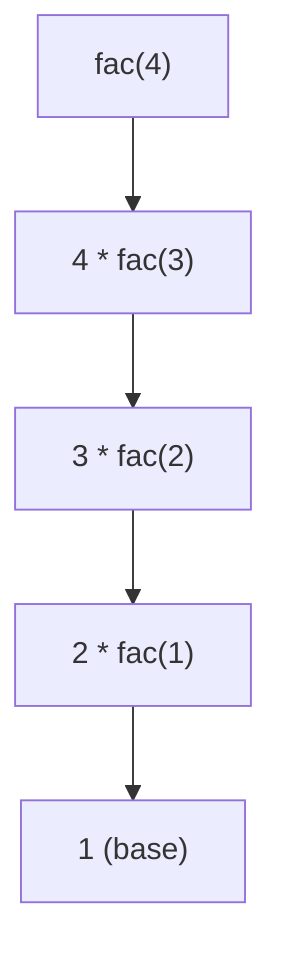

# A3 Databases

## A3.1.1 Explain the features, benefits and limitations of relational databases. 

- **Features:** 

  - Store data in tables(relations/entities), where *row = record = tuple = instance, column = attribute = field = feature.*

  - Each table has primary key to uniquely identify each record.

  - Foreign keys link tables together.

  - Allows relationships between tables (one-to-one, one-to-many, many-to-many).

  - Supports SQL (Structured Query Language) to query and manage data. Allow fast access and
    manipulation.

  - ***Primary Key***: A primary key is an attribute that uniquely identifies each record in a table and
    cannot be duplicated or null. 

  - ***Foreign Key***: is an attribute in one table that refers to the primary key of another table, thereby
    creating a relationship between the two entities. 

  - ***Cardinality***: is the type of relationship between the entities.
    • one-to-one: One-single record in the first table can only be connected with one record in the
    second table, vice versa.
    • one-to-many: An instance in one entity can be related to many instances(rows) in another
    entity.
    • many-to-many: Many instances in one entity can be related to many instances in another entity.
    Single record in tableA can be connected to multiple records in tableB, single record in tableB
    can also be connected to multiple records in tableA. 

  - ***Modality***: is the necessity of relationships between tables.
    • Mandatory: An entity occurrence must be related to another entity occurrence. Use full line
    to represent in ERD(**Chen's notation**).
    • Optional: An entity occurrence may or may not be related to another entity occurrence. Use
    dotted line to represent in ERD(**Chen's notation**).

  - Advantages of RDS:

    - Store large amount of data
    - Allow fast retrieval of information 
    - Allow multi-user access securely
    - Ensure data integrity and consistency

    

- **Benefits**: 

  - Scalability: RDS is more easier to scale than flat file database. 
  - Less duplication of data (because data can be split into different tables, linked by primary key and foreign key). Reduced redundancy.
  - More accurate and consistent data (because of primary/foreign keys and constraints). Better data integrity.
  - Easier to search and update using SQL.
  - Secure — access can be controlled.
  - Works well for large amounts of structured data.
  - Normalization is supported to reduce insert anomaly, update anomaly and deletion anomaly.
  - Reliable transaction processing: Relational databases have several checks that occur when transactions take place to ensure that the transactions are reliable. 
  - Community support: There are multiple streams of support for users of relational databases. 

- **Limitations**

  - Can be difficult to design at the start. The different entities and models within the database can be complex and challenging to implement. 

  - Big data scalability: Relational database models are not the best model for storing data that will be mined to make complex decisions. 

  - Rigid schema: The schemas of the database are rigid data types, and relationships must conform to very specific rules.

  - Unstructured data handling: Unstructured data that does not follow the rigid schema of the database model can be difficult to place within the model. For example videos. 

- **Composite key and Concatenated key**(used when single attribute cannot uniquely idendify each row)

  - ***Composite key***

    - A composite key is a logical **primary key** that consists of **two or more attributes** combined together to **uniquely identify a row** in a table.  
    - E.g. Neither `student_id` nor `course_id` alone can uniquely indentify each row, but the *combination* of both uniquely identifies an enrollment record.  `(student_id, course_id)` is a **composite key**.

  - ***Concatenated key*** 

    - A concatenated key is a physical implementation of a composite key, where multiple attributes are **literally joined (concatenated)** into a single value — often as a string — to serve as a **unique identifier.** Not primary key.     

  - **The difference between these two keys:** 

    - 

      


## A3.2.1 Describe database schema

- ***Database schema***:  is a blueprint of the database that identifies the different entities (tables), attributes (fields) and relationships (links) within the database, including the restraints on the data. 
  - ***Conceptual schema:*** identifies all the entities within the database and the relationship between these entities. This model does not contain specific details such as the attributes within the entities nor information about the restraints on the data, but does identify the types of relationships between the data.  
  - 
  
- ***Logical Schema***: This model of the database identifies the different attributes within each of the entities. This will include the primary keys and foreign keys which create the relationships between the entities. Primary key is bold, foreign key is represented by "*". 
    - 
    
  - ***Physical Schema***: This model of the databases identifies the different attributes and their data types as well as the primary key and foreign key link that will create the relationships between entities. 
- 

## A3.2.2 Construct ERDs

- **Entity relationship diagrams (ERDs)** show the entities (tables), attributes (fields), and relationships within a relational database. 
- ***Chen Notation Sytle*** 
  - 
- Steps to construct an ERD:  
  - Step1: Identify the level of ERD required (conceptual, logical or physical). This will determine the detail required. 
  - Step2: Identify the entities involved and, if required, the attributes and data types. 
  - Step3: Identify the relationships (using verbs) between the entities. 
  - Step4: Identify the cardinality of the relationship, one-to-one, one-to-many or many-to-many. 
  - Step5: Identify the modality of the relationships. Are they optional or mandatory?  

## A3.2.3 Outline the different data types used in relational databases

- String data types: 
  - 
  - ***Char*** is a fixed length. The length is defined by **CHAR(7)**, also includes spaces. If you insert a character less than 7 characters, Mysql will use spaces to replenish. Often used for fixed length ID, password, country code or status flags. 
  - ***VARCHAR*** is a variable length. Often used for names, emails, description. 
  - ***TEXT*** is a longer text, often used for blog posts, articles, or comments&product reviews.
  - ***MEDIUMTEXT*** is for larger texts, often used for complete books, novels, long documentation, or large JSON data. 
  - ***LONGTEXT*** is the largest data type. Used for complete software codebases, and archival data. 
  - For ***ENUM***, you must choose on value from the predefined list, often used for status fields or user roles. 
  - For ***SET***, you can choose zero or multiple records from the predefined list, often used for user skills/interests or multiple tags/categories. 
- Numeric data types:
  - 
  - ***BIT*** stores bit-field values where each bit can be 0 or 1. Often used to store boolean values(True/False,Open/Shut down), or permission flags. 
  - ***BOOL*** is best used for boolean flags, toggle(开关) settings, and status indicator. (Zero means false, non-zero means true).
  - ***INT*** can only store a whole number. Best used for primary keys(foreign keys), quantities or IDs(without character).
  - REMEBER, use ***FLOAT*** directly. If you want to add contraints on the decimal places of the number, use ***DECIMAL(a,b)***. The first argument a is the length of the whole number, b is the number of decimal places. 
- Date/time data types: 
  - 

## A3.2.4 Construct tables for relational databases

- 

## A3.2.5 Explain the difference between normal forms

> 如果要用一句话概括Normalization的要求，那就是the data **should rely on the key and only rely on the key, cannot rely on anything else.**
>
> Databases that are not designed properly can have the following issues. 
- **Insert Anomalies** 
  
  -  You cannot add data correctly as the data is dependent on other attributes in the database. You can’t insert a new record into the database without also adding other data that shouldn’t be required — because the table is not properly normalized. For example, you cannot add a course that isn't chosen by any students.
  
- **Deletion Anomalies:**
  
  - The database may have attributes that rely on non-related attributes. If you delete the non-related attributes, you unintentionally lose data. Non-related attributes are stored together in one table, if you want do delete an instance of an attribute and thus delete the whole row, you will lost other data in this row.
  
- **Update Anomalies: **
  
  -  Any update in a badly designed database will be a challenge as you have to look through every section of the database to ensure all items are deleted. This is not a challenge in a small database, but for a database with hundreds thousands, or millions of records, this becomes a significant problem. If there's duplicated data, and you want to update this data, if you don't change it everywhere manually, the data will be inconsistent and you will no longer know which one is the correct version.   
  
- **So what is normalization?**
  
  - Normalization is the process of organizing data in a database to reduce redundancy and improve data integrity & consistency. 
  - It involves breaking down large tables into smaller, related tables and defining relationships between them.
  
- **Functional Dependencies**
  
  - **Functional dependency** means that one attribute (or a group of attributes) uniquely determines another attribute.  
    
    > For example, If you know A, than you can find exactly one B, they we say A functionally determines B.
    > `Uniquely determine` means each value of A corresponds to exactly one value of B,
    but a value of B may correspond to many A’s. If two rows have the same value of A, they must have the same value of B. 
  
- **The process of normalization**
  
  - unformal form:
    - Initial candidate (possible) primary key identified
    - Repeating groups identified using indentation(缩进)
      - Repeating groups are the new data that needs to be added when a new entry is created.
      - Atomic的意思是每一个cell都只有一个值，没有重复，repeated group指的是一个单元格存了多个值，或者未来可能需要存多个值(potentially possible)。这是1NF需要确保的。 
  - 
  - 
  - 

> Here are some key terms that you must know when normalizing:
 - **Partial Dependency**: A partial dependency occurs when a non-prime attribute(非主键属性) is functionally dependent on part of a composite primary key, not on the whole key. 例如主键：(StudentID, CourseID)（复合主键）StudentName 只依赖 StudentID，不是整个主键 → 部分依赖。这是2NF需要消除的情况。

 - **Transitive Dependency**: A transitive dependency occurs when a non-prime attribute is functionally dependent on another non-prime attribute, which in turn is dependent on the primary key. 当一个非主键属性依赖于另一个非主键属性，而这个非主键属性又依赖于主键时，这叫叫传递依赖。这是3NF要消除的情况。

 - **Non-key Dependency**: A non-key dependency occurs when a non-prime attribute depends on another non-prime attribute rather than on the primary key. 任何非主键属性依赖于另外一个非主键属性，就是非键依赖。违反3NF，因为非键属性不应该依赖于非键属性。

> Here are some terms related to this topic

- **Referential integrity**: ensures that a foreign key value in one table must either be null or match an existing primary key value in another table, so that relationships between tables remain consistent.  

- **Data redundancy**: occurs when the same piece of information is stored in **multiple places in the database**, leading to inconsistencies and unnecessary storage. 

- **The characteris of unnormalized database and each normal forms:**

  - **Unnormalized data** contains **repeating groups, multi-valued attributes, and no defined primary key**, leading to data redundancy and anomalies. Not atomic. 

  - **First Normal Form(1NF)** means all attributes are atomic and each row is uniquely identifiable by a primary key. Unique means that there are no rows that are extactly the same. **All entries** in a **column** are of the **same kind**. 

  - **Second Normal Form(2NF)**: A relation is in **Second Normal Form (2NF)** if it is in 1NF and every non-prime attribute is fully functionally dependent on the entire primary key (no partial dependency). 说人话就是，**Every non-key column must depend on the** **entire** **Primary Key.**

  - **Third Normal Form(3NF):** A relation is in **Third Normal Form (3NF)** if it is in 2NF and no non-prime attribute is transitively dependent on the primary key.  说人话就是，**No non-key column depends on another non-key column.**


- **Three types of normal forms**:

  - **First normal form**:  The repeating data is moved into a new entity. The non repeating data stays in its own entity and is given a unique identifier (primary key). The primary key from the non-repeating entity is placed in the new entity as a foreign key. In the new entity a unique identifier is found. This will most likely be a composite key. The issue with the first normal form is that the new entity will have attributes that only rely on one part of the key, known as partial key dependencies. This does not align with the normalized database philosophy of the whole key and nothing but the key.
  - **Second normal form**: The partial key dependencies are removed into their own entity and a primary key is identified. The primary key features in the entity it was removed from as both a primary key and a foreign key at this point. The issue with second normal form is that some attributes in the entities do not rely on the key, they are their own information. These are known as transitive or non-key dependencies. These, again, do not align with the normalized database philosophy of "the whole key and nothing but the key".
  - **Third normal form**:  The transitive or non-key dependencies are moved into their own entity and given a primary key. The primary key becomes a foreign key in the entity it was removed from. Transitive dependencies can be present in any of the entities previously created. Once they are removed, your entities should meet the normalized database philosophy of "the whole key and nothing but the key". 

- **How to construct from UNF to 1NF to 2NF to 3NF:**

  - - Split, to get 1NF
    
    - Find a composite key, two attributes that can uniquely identify each record/row. 然后说人话就是，判断哪些attribute不依赖整个composite key，只是依赖一部分，找出来，然后拆分成2个表。原本的保留，新的attribute组成新的表，表的PK就是这些attribute依赖的那个，然后同样的那个attribute作为FK留在原表中。可能会拆分成多个。
    
    - 然后，判断哪些是partial dependent的，列出来, 这些再次拆分成子表。A partial dependent on B，那么把B这个attribute留在原表作为FK，新的表的PK就是这个attribute。新的表的另外一个attribute就是A。
    
    - 
    
    - 
    
    - 
    
      

## A3.2.6 Construct a database normalized to 3NF for a range of real-world examples

> 书上一堆废话，A3.2.5的内容掌握了就行

## A3.2.7 Evaluate the need for denormalizing databases

- **Advantages**
  - Simpler and faster queries as the database has to look at fewer entities to collect all the data.
  - Faster data retrieval as the database has fewer joins to complete. 
- **Disadvantages**
  - More challenging updates and inserts as some of the data is repeated.
  - Updating code can be difficult to write as the data is in multiple places. 
  - There may be inconsistencies as there are duplicate copies of data.
  - The fact there are many copies of some data requires more storage.
  - 这书上写的还是废话，其实就是**data redundancy**或者说是**duplicated data**

## A3.3.1 Outline the difference between data language types within structured query language (SQL)

- 

- ***Data definition language(DDL)***
  - is used to create the database structures. 
  - It is used to create the schema, the tables, and constraints within the database. Using DDL statements, you can create the outline of the database. 
  - Example ***DDL*** commands in SQL:
    - **CREATE** used to create a entity/table. 
    - **ALTER** used to change the structure of the table/database
    - **DROP** used to delete table/entity from within the database structure. 
    - **TRUNCATE** used to remove all records/rows from an entity/table within the database structure, **but will not delete the table itself, only the records inside will be affected.** 
    - **RENAME** used to rename an entity/table within a database structure. 
    - **COMMENT** used to add a comment to the table, used when creating the table. 

- ***Data manipulation language(DML)***
  - is used to access the data within the database and to manipulate the data within the database. For example, querying the table for information, updating records, and deleting records. 
  - 

- **Data control language(DCL)**
  - is used to control access to the database. The DCL helps to maintain security in the database as it allows user to have access to the database or it can revoke data from the database. 
  - **GRANT** allows user access privileges in a database. 
    - GRANT privileges ON database_name.table_name TO 'username'@'host';
      - E.g. 
        - GRANT SELECT, INSERT, ALTER, UPDATE ON demo.test TO 'username'@'host';
        - GRANT ALL PRIVILEGES ON demo.test TO 'username'@'host';
  - **REVOKE** allows the removal of privileges in a database. 
    - REVOKE privileges school.students FROM 'username'@'localhost';
      - E.g. 
        - REVOKE SELECT, INSERT, ALTER, UPDATE ON demo.test TO 'username'@'host';
        - REVOKE ALL PRIVILEGES ON demo.test TO 'username'@'host';

- **Transaction control language(TCL)**
  - is used to complete the changes in a database. 
  - 
  - 一个 transaction（事务）就是一组要么全部成功、要么全部失败的操作。
  - E.g.
  START TRANSACTION;
  UPDATE accounts SET balance = balance - 100 WHERE id = 1;
  UPDATE accounts SET balance = balance + 100 WHERE id = 2;
  COMMIT;
  - 如果中途出错，就可以用 `ROLLBACK` 回到最初状态。
  - `COMMIT` 将当前事务中的所有更改 **永久写入数据库**。
  START TRANSACTION;
  UPDATE students SET grade = 90 WHERE id = 1;
  COMMIT;
  - `COMMIT` 用于永久提交前面的 transaction 中的所有操作，无法撤销
  - `ROLLBACK` 撤销自上次 `START TRANSACTION` 以来所做的所有更改。
  START TRANSACTION;
  UPDATE students SET grade = 90 WHERE id = 1;
  ROLLBACK;
  - `ROLLBACK` 用于撤销前面的 transaction 中的所有操作(当 administrator 后悔前面的操作)

### Using SQL to develop a database/table

- **Create table**

```sql
CREATE DATABASE demoDB;

-- With primary key
CREATE TABLE table_name (
    Attribute1 datatype NOT NULL PRIMARY KEY,
    Attribute2 datatype,
    Attribute3 datatype
);

-- With primary key and foreign key
CREATE TABLE table_name (
    Attribute1 datatype NOT NULL PRIMARY KEY,
    Attribute2 datatype,
    Attribute3 datatype,
    Attribute4 datatype,
    FOREIGN KEY (Attribute4) REFERENCES other_table(Attribute4)
);
-- other_table is the name of another table that you are linking with
```

- **Drop table**

```sql
# Drop the tabel itself
DROP TABLE table_name;
```

- **Alter table**

```sql
-- Add a column
ALTER TABLE table_name
ADD COLUMN attribute datatype AFTER existing_attribute;

-- Example
ALTER TABLE Customer
ADD COLUMN deliveryAddress VARCHAR(255) AFTER customer_name;

-- Drop a column
ALTER TABLE table_name
DROP COLUMN attribute;

-- Example
ALTER TABLE Customer
DROP COLUMN deliveryPreference;

-- Modify column datatype
ALTER TABLE students
MODIFY COLUMN age VARCHAR(50);

-- Change column name and datatype
ALTER TABLE students
CHANGE COLUMN old_name new_name VARCHAR(50);

-- Rename the table
ALTER TABLE students RENAME TO pupils;

-- Add primary key
ALTER TABLE students
ADD PRIMARY KEY (id);

-- Add foreign key
ALTER TABLE orders
ADD CONSTRAINT fk_customer
FOREIGN KEY (customer_id)
REFERENCES customers(customer_id);

-- Add constraints
-- Primary key constraint
ALTER TABLE students
ADD CONSTRAINT pk_student_id PRIMARY KEY (student_id);

-- Unique constraint
ALTER TABLE students
ADD CONSTRAINT unique_email UNIQUE (email);

-- Check constraint
ALTER TABLE students
ADD CONSTRAINT check_age CHECK (age >= 0 AND age <= 120);

-- Drop a constraint
ALTER TABLE table_name
DROP CONSTRAINT constraint_name;

-- NOT NULL
ALTER TABLE students
MODIFY COLUMN name VARCHAR(50) NOT NULL;

-- Default value
ALTER TABLE students
ALTER COLUMN status SET DEFAULT 'active';
```

- **Modifying data in a table**

```sql
-- Insert value
INSERT INTO table_name (Attribute1, Attribute2, Attribute3, ...)
VALUES (value1, value2, value3, ...);

-- Update value
UPDATE table_name
SET Attribute1 = value1, Attribute2 = value2
WHERE condition;

-- Delete value with condition
DELETE FROM table_name
WHERE condition;
```


## A3.3.2 Construct queries between two tables in SQL

> I also include some common sql commands in this chapter, not only containing the contents in the textbook.

- **Queries** are used in databases to extract data and provide context for data.  Data within a database has little relevance unless it is put into context. Queries can be used for filtering, which means finding the data you want to know from the database. 

- **BETWEEN**

```sql
SELECT * FROM table_name 
WHERE attributel BETWEEN valuel AND value2;

# Example
SELECT * from students where score BETWEEN 90 and 100
```

-  **ORDER BY** 

```sql
# Order by attribute ASC(default), DESC
SELECT * from table_name WHERE condition order by attribute ASC or DESC;

# Example
SELECT student_name from tests_score order by score ASC;

SELECT student_name from tests_score order by score ASC, student_name ASC;
```

- **GROUP BY**

```sql 
# Group by certain attribute
SELECT Attribute1, Attribute2
FROM table_name
WHERE condition
GROUP BY Attribute1, Attribute2
ORDER BY Attribute1;  

# Example show the average score of each subject
SELECT avg(score) as average_score, subject from Subjects group by subject order by avg(score) DESC;

```

- **HAVING** 
- Can be only used after GROUP BY

```sql
# Using having to filter the rows in group
SELECT COUNT(Attribute2), Attribute from table_name GROUP BY Attribute HAVING COUNT(Attribute2) condition;

# Example
SELECT COUNT(CustomerID), CustomerCountry FROM Customer GROUP BY CustomerCountry HAVING COUNT(CustomerID) > 2;
```

- **JOIN**
- There are three types of JOIN
  - `INNER JOIN` returns all the records that have matching values in both tables.
  - `LEFT JOIN`  returns all rows from the left table, and the matched rows from the right table. If there is no match, the result will still include the left table row**, but the right table columns will **show NULL. 
  - `RIGHT JOIN` returns all rows from the right table, and the matched rows from the left table. If there is no match, the left table columns will **show NULL**.  

```sql
# INNER JOIN
SELECT table_name1.attribute1, table_name1.attribute2, table_name1.attribute3, table_name2.attribute2 FROM table_name1 INNER JOIN table_name2 WHERE table_name1.attribute1 = table_name2.attribute2;

# Example
SELECT Item.ItemID, Item.ItemDesc, Item.ItemCost, Item.ArtistID, Artist.ArtistName, Artist.ArtistEmail FROM Item INNER JOIN Artist ON Item.ArtistID = Artist.ArtistID WHERE ItemCost > 100;
```

- **LIKE**
- The Like operator is used within the Where operator to look for non-exact matches. This is known as pattern matching within the attribute.
- There are two wildcards used within the database system
  - `_` represents one single character
  - `%` represents any number of characters(zero, one, or many). 

```sql
# Only select the Artist whose name ends with 'work'
SELECT Attribute1, Attribute2 FROM table_name WHERE Attribute LIKE pattern;
SELECT * FROM Artist WHERE ArtistName LIKE '%work';

# Only select the Artist whose name starts with 'work'
SELECT Attribute1, Attribute2 FROM table_name WHERE Attribute LIKE pattern;
SELECT * FROM Artist WHERE ArtistName LIKE 'work%';

# Only select the Artist whose name contains the substring 'work'
SELECT Attribute1, Attribute2 FROM table_name WHERE Attribute LIKE pattern;
SELECT * FROM Artist WHERE ArtistName LIKE '%work%';
```

- **CASE WHEN** **and** **CASE**

```sql
# Format for CASE WHEN
CASE
    WHEN condition1 THEN result1
    WHEN condition2 THEN result2
    ...
    ELSE resultN
END AS xxx
FROM xxxx;

# Example for CASE WHEN
SELECT name, score,
    CASE
        WHEN score >= 90 THEN 'A'
        WHEN score >= 80 THEN 'B'
        WHEN score >= 70 THEN 'C'
        ELSE 'Fail'
    END AS grade
FROM Scores;

# Example for CASE
CASE score
    WHEN 90 THEN 'Perfect'
    WHEN 80 THEN 'Good'
    ELSE 'Average'
END AS grade
FROM Scores;

SELECT name,
  CASE score
      WHEN 90 THEN 'Perfect'
      WHEN 80 THEN 'Good'
      ELSE 'Average'
  END AS grade 
FROM Scores;
```
-  **IF** 

```sql
# Format for IF in Mysql
IF(condition, value_if_true, value_if_false)

# Example       
SELECT name, 
       IF(score >= 60, 'Pass', 'Fail') AS result
FROM Students;
```

- **IFNULL**
  - deal when null occurs

```sql 
# Format for IFNULL in Mysql
IFNULL(expression, default_value)

# Example
SELECT name, salary + IFNULL(bonus, 0) AS total_income
FROM Employees;
# This means, if bonus is NULL, the value returned by be zero, if you don't use IFNULL to check, the result may be NULL
```
- **NULLIF**
  - When two values equal, return null 

```sql
# Format for NULLIF in mysql
NULLIF(expr1, expr2)

# Example
SELECT NULLIF(10, 10);  -- return NULL
SELECT NULLIF(10, 5);   -- return 10

# Example: Dealing with potential ZeroDivisionError
SELECT year_salary / NULLIF(months,0) as avg_salary from employees;
```

- **Common Operations in Mysql**
```sql
=  # check if equals to 
!= # not equals to 
BETWEEN a AND b # both inclusive
xxx IN (x,y,z) # check whether the given value is in the predefined set
IS NULL
IS NOT NULL
AND, OR, NOT
/ # float division
div # integer division
```

- **Subquery 子查询**

```sql
# Basic format for subquery command
SELECT column_name
FROM table_name
WHERE column_name operator (SELECT column_name FROM table_name WHERE condition);

# Find the student whose score is above the average                        
SELECT name, grade
FROM Students
WHERE grade > (SELECT AVG(grade) FROM Students);

# 找出成绩前两位的同学
SELECT name, grade
FROM Students
where grade in (SELECT grade from Students order by grade DESC limit 2);
```

## A3.3.3 Explain how SQL can be used to update data in a database

> `INSERT INTO`以及`UPDATE`以及`DELETE`的用法前面都写了（注意这些都是DML，不需要`TABLE`关键字)

## A3.3.4 Construct caculations with a database using SQL's aggregate function

- Aggregate functions allow you to perform calculations on the data in the database.

```sql
# Calculate the average
SELECT AVG(attribute) FROM TABLE_NAME;

SELECT AVG(age) FROM student;

# Calculate the average with condition
SELECT AVG(attribute) FROM TABLE_NAME WHERE condition;

SELECT AVG(score) FROM student WHERE score > 87;

# Returns the number of rows using COUNT with condition
SELECT COUNT(attribute) FROM TABLE_NAME;

SELECT COUNT(student_id) FROM student;

SELECT COUNT(attribute) FROM TABLE_NAME WHERE condition;

SELECT COUNT(score) FROM student where score > 87;

# This only counts of the number of unique rows
SELECT COUNT(DISTINCT attribute) FROM student;

SELECT COUNT(DISTINCT hobby) FROM student;

# Returns the highest value in an entity for a selected attribute
SELECT MAX(attribute) FROM TABLE_NAME;

SELECT MAX(attribute) FROM TABLE_NAME WHERE condition;

# Returns the smallest value in an entity for a selected attribute
SELECT MIN(attribute) FROM TABLE_NAME;

SELECT MIN(attribute) FROM TABLE_NAME WHERE condition;

# Returnes the total sum of the data 
SELECT SUM(attribute) FROM TABLE_NAME;

SELECT SUM(attribute) FROM TABLE_NAME WHERE condition;
```


# B2 Programming

## B2.1.1 Construct and trace programs using a range of global and local variables of various data types

- A variable is a space in memory used to store data, referenced by a unique identifier. In python, variable is a **named reference** that points to the memory location where the object is stored, allow the program to **get access and manipulate** that object through the variable. 
- Data types in python
  - 
- **Global and Local variable** in python
  - Global variables:  
    - Defined **outside functions**.
    - Accessible anywhere in the file.
    - To modify inside a function, use `global`.

```python
x = 10  # global variable

def modify():
    global x
    x += 5

modify()
print(x)  # Output: 15
```
  - Local variables:
    - Defined inside a function.
    - Accessible only inside that function.
    - Can shadow a global variable with the same name.

```python
x = 10  # global

def func():
    x = 5  # local
    print(x)

func()  # Output: 5
print(x)  # Output: 10 (global unchanged)
```

## B2.1.2 Construct programs that can extract and manipulate substrings

- 
- **Negative Indexing** for subtring:
  - In Python, **negative indices** allow you to access elements from the **end of a list/string**. 
  - `-1` refers to the **last element**, `-2` to the **second last**, and so on.

```python
# Using negative indexing to extract substrings
text = "Data-Science-101"

print(text[-3:])    # Output: "101"       -> last 3 characters
print(text[:-4])    # Output: "Data-Science" -> all except last 4
print(text[-11:-6]) # Output: "Science"   -> slice using negative start and end

# The third argument: Steps
text = "abcdefghij"

print(text[-1:-6:-1]) # Output: "jihgf"  -> reverse slice from end
print(text[-2::-2])   # Output: "igeca"  -> every 2nd char from second last to start, remember that when you use a negative step, the sequence is from right to the left

# Combining both positive and negative indexes
text = "Machine-Learning"

print(text[8:-1])  # Output: "Learning" -> from index 8 to second last
print(text[-8:14]) # Output: "Learn"     -> from 8th last to index 14 (end exclusive)
```

## B2.1.3 Describe how programs use common exception handling techniques

- Benefits for handling exception:
  
  - Prevent program crashes – keeps the program running or ends it safely when errors occur. 
  
  - Improve user experience – gives clear error messages instead of raw system errors.
  - Support debugging and logging – records error details for analysis.
  - Handle special cases – e.g., catching ZeroDivisionError when dividing numbers.
  -Cleaner code – avoids excessive if checks by directly handling errors with try/excep 
- Python **exception handling** method

```python
# Basic try-except
try:
    x = 10 / 0   # This will raise ZeroDivisionError
except ZeroDivisionError:
    print("Cannot divide by zero!")

# Catching multiple errors
try:
    num = int(input("Enter a number: "))
    result = 10 / num
except ZeroDivisionError:
    print("Division by zero is not allowed.")
except ValueError:
    print("Invalid input. Please enter an integer.")
    
# Using else and finally
# else runs if no exception occurs. finally always runs, regardless of exception
try:
    number = int(input("Enter a number: "))
    result = 10 / number
except ZeroDivisionError:
    print("Cannot divide by zero!")
except ValueError:
    print("That's not a valid number.")
else:
    print(f"10 divided by {number} is {result}")
finally:
    print("End of program.")
    
# Tip: when you don't know what kind of error will occur
try:
    number = 10/0
except Exception as e:
    print("An error catched:",e)
```

- **Common Python Exceptions**
  - 

## B2.1.4 Construct and use common debugging techniques

## B2.2.1 Compare static and dynamic data structures

- Static structure:
  - Have a fixed size that is determined at compile time and cannot be changed during program execution. Faster access, but less flexible.
  -  Advantages: 
    - Faster access and operations(contiguous memory) 
    - Predictable memory usage(fixed size)
    - No runtime allocation overhead
  - Disadvantages:
    - Inflexible size
    - Potential memory waste
    - Cannot adapt to changing data needs 
    **Warning:  In python, tuple and list store the reference of the objects, reference points to the memory location of the objects.**
  
- Dynamic structure:
  - Can grow or shrink during program execution. Memory is allocated at runtime. More flexible but but slightly slower.
  - Advantages: 
    - Flexible size.  
    - Efficient memory storage. 
    - Adapt to runtime requirements. 
    - Easier to work with. 
  - Disadvantages:
    - Slightly slower due to resizing
    - Memory allocation overhead. 
    - More complex implementation
    - **Resize: In Python, list resize means that when the list runs out of capacity, the interpreter allocates a larger block of memory and copies the existing elements into it, so new items can be appended(this will consume longer time).** 

## B2.2.2 Construct programs that apply arrays and lists (Excluding Two-dimensional arrays in Java)

- **One dimensional list in python**

```python
# Creating list
# Empty list
my_list = []

# List with elements
fruits = ["apple", "banana", "cherry"]

# List with mixed types
mixed = [1, "hello", 3.14, True]
  
# Accessing list elements
fruits = ["apple", "banana", "cherry"]

print(fruits[0])   # "apple"
print(fruits[-1])  # "cherry" (negative index)

# Modifying list
fruits = ["apple", "banana", "cherry"]

# Add elements
fruits.append("orange")      # Add at the end
fruits.insert(1, "mango")    # Add at index 1

# Remove elements
fruits.remove("banana")      # Remove by value
popped = fruits.pop()        # Remove last element and return it
popped2 = fruits.pop(2) 		 # Remove by index, and return it
del fruits[0]                # Delete element at index 0 

# Update elements
fruits[0] = "blueberry"

# List operations
a = [1, 2, 3]
b = [4, 5]

# Concatenation
c = a + b        # [1, 2, 3, 4, 5]

# Repetition
d = a * 2        # [1, 2, 3, 1, 2, 3]

# Check membership
2 in a           # True

# Iterating over lists
for fruit in fruits:
    print(fruit)

for i in range(len(fruits)):
    print(i, fruits[i])
    
# Iterating over lists but also return the index
name = ["Michael","Jack","Charles","Tiago","Mike"]
for index, element in enumerate(name):
    print(index,name)

# List comprehension
# Simple comprehension: square numbers
squares = [x**2 for x in range(5)]  # [0, 1, 4, 9, 16]

# With condition: only even numbers
even_squares = [x**2 for x in range(5) if x % 2 == 0]  # [0, 4, 16]
```

- **Common list Methods**

- `len(list)`  
  - Returns the number of elements in the list.  
  - **Arguments:** only the list itself.

- `list.sort(key=None, reverse=False)`  
  - Sorts the list in place (modifies the original list).  
  - **Arguments:**  
    - `key` → function to specify sorting criteria, e.g., `key=str.lower`  
    - `reverse` → `True` for descending order, `False` for ascending (default)

- `list.reverse()`  
  
  - Reverses the elements of the list in place.  
  - **Arguments:** none
  
- `list.index(x, start=0, end=len(list))`  
  
  - Returns the index of the first occurrence of `x`.  
  - **Arguments:**  
    - `x` → element to find  
    - `start` → optional, index to start searching (default 0)  
    - `end` → optional, index to stop searching (default end of list)
  
- `list.count(x)`  
  - Returns the number of times `x` occurs in the list.  
  - **Arguments:**  
    - `x` → element to count

- `list.clear()`  
  - Removes all elements from the list.  
  - **Arguments:** none

- `max(list)`

- `min(list)`

  

### Shallow Copy vs Deep Copy in Python Lists

Python lists are **mutable**, so sometimes copying them needs care. There are two main ways to copy a list:

---

#### 1. Shallow Copy

- Creates a **new list object**, but the **elements themselves are still references** to the original objects(points to the same memory location).
- Modifying **mutable elements** inside the copy will affect the original list.
- Methods to create a shallow copy: 

```python
# Using slicing
original = [[1, 2], [3, 4]]
shallow = original[:]

# Using list() constructor
shallow2 = list(original)

# Using copy module
import copy
shallow3 = copy.copy(original)

```python
# Example
original = [[1, 2], [3, 4]]
shallow = original[:]
shallow[0][0] = 99
print(original)  # Output: [[99, 2], [3, 4]]
```

#### 2. Deep Copy

- Creates a **new list object** and **recursively copies all nested objects** (each element gets its own copy in memory).
- Changes in the deep copy **do not affect the original list**.
- Method to create a deep copy:

```python
import copy
# Using copy.deepcopy()
original = [[1, 2], [3, 4]]
deep = copy.deepcopy(original)

# Example
original = [[1, 2], [3, 4]]
deep = copy.deepcopy(original)
deep[0][0] = 99
print(original)  # Output: [[1, 2], [3, 4]]
```

## B2.2.3 Explain the concept of a stack as a “last in, first out” (LIFO) data structure (HL Only)

- **Stack** is a ADT(abstract data types) which defines a collection of elements with **LIFO (Last In, First Out)** behavior.
- **Stack is a linear data structure that follows the Last in, First out rule. The last elements pushed into the stack will be first one removed from the stack.**
- **Being an ADT means that a stack **specifies what operations are allowed and how they behave, **but does not dictate how it is implemented**. You could use arrays, linked lists, or other structures to implement stack. 
- Common Stack Methods:
  - 
- This will help you understand it more clearly:
  - 
- Overflow and underflow:
  - 
- Applications of stack in computing:
  - Function call management (Call Stack) : Stacks are essential in recursive algorithms. Every time a recursive call is made the current state is pushed onto the stack. Once the base case is resolved the pop method is used to resolve the calls.  
    - 
  - Undo/Redo in text editors
  - Parsing: A stack is used to ensure that all of the brackets are closed. For example, in Java if the bracket `{}` are closed, every time an open bracket `{ `is read it is pushed onto the stack and every time a closed bracket ``}`` is read it is popped from the stack.  An empty stack means the correct number of brackets. 
    - 
  - Undo functions: A stack is used to keep a track of the operations completed by a user of a program. Every operation is pushed onto a stack. Each time they undo an action, the last action is popped from the stack and reversed. 
  - Expression evaluation (postfix, infix)
  - Syntax parsing (like checking parentheses in code)
  - Memory management 
  - Move back to the last page in a browser(pop)
- Applications of stack outside computing
  - Pile of dishes, Tower of boxes,Undo history in drawing
- When are stack and queue suitable
  - 

## B2.2.4 Explain the concept of a queue as a “first in, first out” (FIFO) data structure (HL Only)

- **Queue** is also a ADT(abstract data types) which defines a collection of elements **with FIFO (First In, First Out) behavior.**
- **Queue is a linear data structure that follows the First in, First out rule. The first element enqueue into the queue will be first one removed from the queue.**  
- **Being an ADT means that a queue **specifies what operations are allowed and how they behave, **but does not dictate how it is implemented**. You could use multiple ways to implement queue.

- A diagram to help understand FIFO:

  - 

    - **Here, notice that the left is the rear(队尾)，the right is the head(队头), you can also do it reversly.**

  - Common Methods for Queue:

    - 

  - Applications of queue in computing:

    - CPU scheduling (process queues)
    - Print spooling 
    - If you send many jobs to the printer, they are added to the print queue. If your printer is connected to your machine then once each print job has completed, the dequeue () method is called to get the next one. 
    - I/O buffering
    - Network packet handling (router queues): 
    - Queues are used to manage traffic in routers and switches. Data packets are stored in the queue until they can be processed or serialized. 
    - BFS (Breadth-First Search) in graphs

  - Applications of queue outside computing:

    - People waiting in line. Ticket counter line. Call center waiting system. 

  - When are stack and queue most suitable?

    - 

    
### Advantages and Disadvtanges of stack and queue

---

- 

## B2.3.2 Construct programs utilizing appropriate selection structures

## B2.3.3 Construct programs that utilize looping structures to perform repeated actions

## B2.4.2 Construct and trace algorithms to implement a linear search and binary search for data retrieval (HL Only)

- Big O notation: Time complextity:
  - 

- **Calculate Time complexity**
  - To calculate Big O complexity, consider how the number of operations of the algorithm changes with the size of the input. Follow these steps.

    - Count the **number of operations**. Identify the **main operations** of the algorithm and use these as a base for your calculation as you scale up the data set.

    - Ignore anything that is **constant or outside the method**. For example, printing the result of the method (this only happens once) or assigning a variable (for example, minIndex = 0, which happens outside of the method). **These do not change once the method begins.**  

    - **Change the input size and count the number of operations.** If the number has not changed, the complexity is O(1). If it has changed proportionally (linearly), the complexity is O(n). If it has changed quadratically, the complexity is O(n^2).
  
- **Linear Search**

```python
def linear_search(lst, target):
    for i in range(len(lst)):
        if lst[i] == target:
            return i
    return -1

# Example usage
data = [4, 2, 9, 1, 7]
print(linear_search(data, 9))  # Output: 2
print(linear_search(data, 5))  # Output: -1
```
  - Notice that the best complexity for linear search is O(1). Regardless the input size(length of list), the result is the first element. Will only take one operation, even the input size is really large.
  - The average and worst complexity are O(n).

- **Binary Search**

```python
def binary_search(lst, target):
    original = [(index, name) for index, name in enumerate(lst)]
    lst.sort()
    left = 0
    right = len(lst) - 1
    while left <= right:
        mid = (left + right) // 2
        if lst[mid] == target:
            for j in range(len(original)):
                if original[j][1] == target:
                    return original[j][0]
        elif lst[mid] > target:
            right = mid - 1
        else:
            left = mid + 1
    return -1

         
# Example usage
sorted_data = [1, 3, 5, 7, 9, 11]
print(binary_search(sorted_data, 7))  # Output: 3
print(binary_search(sorted_data, 2))  # Output: -1
```

- 程序的时间复杂度 = 代码中最耗时操作的复杂度。把代码拆成若干片段，每段单独分析复杂度。比较每段复杂度，最大的那个就是整个程序的复杂度。低阶、常数、顺序执行的片段都不影响最终复杂度，只看增长最快的部分。


## B2.4.3 Construct and trace algorithms to implement bubble sort and selection sort, evaluating their time and space complexities


#### **Bubble sort**

---


- Simple comparison-based sorting algorithm
- Repeatedly steps through the list
- Compares adjacent elements, if they are in wrong order, swap them
- Each pass moves the largest unsorted element to it's correct position
  - Largest element bubble up to the end of the interval 
  - the interval will shrink each pass

- **Example of python code utilizing bubble sort**

```python
arr = [1, 663, 8, 2, 4, 1, 22, 66, 20, 122]
for i in range(len(arr)-1):
  for j in range(0,len(arr)-i-1):
    if arr[j] > arr[j+1]:
      arr[j], arr[j+1] = arr[j+1], arr[j]
print(arr)
```

- The outer loop controls the number of passes need to sort the array. For an array of length `len(arr)`, the number of passes needed in only `len(arr)-1`. 
- The inner loop is responsible for shrinking the interval. 外层循环每经过一次，就意味着在这个区间内，最大的元素已经被bubble up到了区间的末尾。bubble sort的判断区间的左边界永远是从0开始，而右边界每次要shrink。初始的边界应该是`[0,len(arr)-1)`, `-1`的原因是后续的判断需要`arr[j+1]`，这样子写不会out of range(索引`j`最大只能为列表倒数第二个元素的索引)。而外层循环每结束一次，意味着有一个element被排好序。举个例子，第一次循环，`i`为0，说明0个元素被排序，第二次循环，此时`i`等于1，说明已经有1个元素被排好序，右边的区间就应该`-1`,也就是`-i`. 以此类推，右边的界限loop每次都应当减去`i`，减去已经排序好的元素数量。
- The if statement in the inner loop is clear. Since we are aiming to sort the array with ascending order, the condition will be like this. Swap them if the element is bigger than the element at the right side of it. 
- Due to the nested for loop, the time complexity of bubble sort is $O(n^2)$, every time, the inner loop will traverse through the whole interval, which is really slow.

- **An optimization of bubble sort using a flag**

```python
arr = [1, 663, 8, 2, 4, 1, 22, 66, 20, 122]
for i in range(len(arr)-1): # Outer Loop: Controll the numer of passes needed, only len(arr)-1 times needed
  flag = False
  for j in range(0,len(arr)-i-1): # Inner Loop: -1 to prevent list index out of range(j+1 later)
    if arr[j] > arr[j+1]:
      arr[j], arr[j+1] = arr[j+1], arr[j]
      flag = True
      
  if not flag:
    break
    
print(arr)
```

- The intention and purpose of `flag` is:
  - 如果在某一次pass（outer loop）中，完全没有发生任何交换 (`flag` 一直是 `False`)，那说明数组已经是有序的，可以提前退出(`break`)。
- The best time complexity:
  - If the array is already sorted, the loop will exit early
    - 外层循环只跑了 **1 次** → `O(1)`
    - 内层循环跑了 **n-1 次比较** → `O(n)`, `n`是数组长度
    - 所以整体复杂度是`O(n)`
    - **提前退出只会在整趟内没有交换时触发**(整个数组都完成排序)，局部有序不会让提前退出生效  
- Advantages of bubble sort
  - Simple to **understand and implement**.
  - In-place(原地), **minimal memory usage.**
  - Stable(稳定性), **preserves order of same elements. **(the sequence of elements won't change if they are the same(no swap)). 
- Disadvantages of bubble sort
  - Very slow for large datasets, most cases the time complexity is $O(n^2)$， 慢的要死，你写python无脑用sort()就行。
    - 在任何case下，inner loop都必须被完成，哪怕是已经sort好的，inner loop都要跑一遍才可以break。每一次pass(outer loop)都要进行$>=$​1次的operation。**内层循环必须完整执行**。并且每一次inner loop的迭代都有可能有多次swap，这也是在most cases中比selection sort慢一些的原因。
  - Inefficient compared to other sorting algorithms.  
- When to use bubble sort
  - Small datasets only or nearly sorted data(with optimization) 

#### **Selection sort**

---


- **Python implementation for selection sort**  

```python
arr = [1, 663, 8, 2, 4, 1, 22, 66, 20, 122]

for i in range(len(arr)-1):
  min_index = i
  for j in range(i+1,len(arr)):
    if arr[j] < arr[min_index]:
      min_index = j
  
  arr[i], arr[min_index] = arr[min_index],arr[i]

print(arr)
```

- Features of selection sort: 
  - Time complextiy: Always $O(n^2)$. But **slight quicker than bubble sort, because only <=1 operation(swap) needed each pass.** 
- Advantages of selection sort:
  - Works well and easy to implement **on small datasets.**
  - **No addiional storage needed** as elements are being **swapped in place**(原地交换，不需要额外数组空间).
  - Comparing to bubble sort, the **number of swaps** required each pass **is minimized**(<=1 time).
    - 每轮最多进行一次交换 
- Disadvantages for selection sort:
  - Inefficient for **large datasets.**
  - Comparing to bubble sort, selection sort is **not that stable**, because the **order of same elements are not preserved.** 

#### **Quicksort**

---

- The ouline of **quicksort** algorithm:
  1. **Chooese a pivot**: Pick one element to act as the pivot.
  2. **Partition the array**: Move all elements smaller than the pivot to one side, and all greater ones to the other side. (The pivot is now in its correct final position.)
  3. **Recursively sort sub-arrays:** Apply the same pivot-and-partition process to the left and right parts. The recursion will end once the length of the array is equal to 1, meaning that there's no need to sort.
  4. **Combine results**: When both sides are sorted, the whole array is sorted. 
- What is **divide-and-conque**r(partition here) ?:
  - **Divide and conquer** is a problem-solving strategy that breaks a l**arge problem into smaller sub-problems,** solves each sub-problem **recursively**, and then **combines** their results to form the **final solution.** 

- There are **mutiple ways** to implement quick sort, this the easiest one to understand:

```python
def quick_sort(arr):
    # 1. 递归的出口：如果数组为空或者只有一个元素，就不用排了，直接返回
    # 这步极其重要
    if len(arr) <= 1:
        return arr
    
    # 2. 挑基准 (Pivot)。这里我们挑中间那个数，这样写代码方便
    pivot = arr[len(arr) // 2]
    
    # 3. 站队（分区）
    left = []   # 放比pivot小的
    right = []  # 放比pivot大的
    middle = [] # 放和pivot一样大的（处理重复元素） 
    
    for num in arr:
        if num < pivot:
            left.append(num)
        elif num > pivot:
            right.append(num)
        else:
            middle.append(num)
    
    # 4. 递归排序左边和右边，然后把结果拼起来
    # quick_sort(left) 会把左边队伍排好序
    # quick_sort(right) 会把右边队伍排好序
    # middle 因为都和pivot相等，所以已经有序了
    return quick_sort(left) + middle + quick_sort(right) #这是合并三个列表的过程

my_list = [5, 3, 8, 4, 2]
sorted_list = quick_sort(my_list)
print(sorted_list) # 输出：[2, 3, 4, 5, 8]

my_list2 = [64, 34, 25, 12, 22, 11, 90]
sorted_list2 = quick_sort(my_list2)
print(sorted_list2) # 输出：[11, 12, 22, 25, 34, 64, 90]
```

- Advantages of quick sort: 
  - Efficient for larg datasets. The average time complexity is `O(nlogn)`.
  - Vert little memory overhead required.
- Disadvantages of quick sort:
  - The time complexity is unstable comparing to merge sort. The worst time complexity of quiksort is `O(n^2)`.  
  - Potential stackoverflow if the recursion is too deep. 
  - Does not work well for small datasets.
- An optimized version using **list comprehension**: 

```python
def quick_sort(arr):
    # 1. 递归的出口：如果数组为空或者只有一个元素，就不用排了，直接返回
    if len(arr) <= 1:
        return arr
    
    # 选择基准元素（中间位置的元素）
    pivot = arr[len(arr)//2]
    
    # 分区操作
    left = [x for x in arr if x < pivot]    # 小于基准的元素
    middle = [x for x in arr if x == pivot] # 等于基准的元素
    right = [x for x in arr if x > pivot]   # 大于基准的元素
    
    # 递归排序并合并结果
    return quick_sort(left) + middle + quick_sort(right)

my_list = [5, 3, 8, 4, 2]
sorted_list = quick_sort(my_list)
print(sorted_list) # 输出：[2, 3, 4, 5, 8]

my_list2 = [64, 34, 25, 12, 22, 11, 90]
sorted_list2 = quick_sort(my_list2)
print(sorted_list2) # 输出：[11, 12, 22, 25, 34, 64, 90]
```

- Explanation of the **time complexity of quick sort** under different situations: 
  - Fast and average case:
    - The complexity for each pass is `O(n)`, since there are nearly `logn` passes, the complexity overall is nearly `O(nlogn)`. 
  - Worst case:
    - 想想一下你的pivot是数组中的最大元素，这意味着sub-array的分配将会很不合理，left里有一堆，right里面没有，因为没有比pivot大的。三个列表推导的复杂度还是`O(n`, 但是由于此时没有把数组拆成两半，需要n次递归的调用才能处理完所有元素，因此时间复杂度大约是`O(n^2)`, 当pivot取了最大或最小的时候。
  - 
  - 每层（pass）的复杂度是3个列表推导式 = `O(n)`，由于pivot(数组middle)每次都是区间的最大值，递归每次让长度``-1`，因此复杂度是`O(n)``, 总体的就是``O(n) * O(n) = O(n^2)``.  

## B2.4.4 Explain the fundamental concept of recursion and its applications in programming

- **Why use functions?**
  - Reusability: Write once, use multiple times
  - Modularity: Break complex problems into smaller parts
  - Readability: Make code easier to understand and read
  - Maintainability: Easier to debug and modify
  - Testing: Isolate and test individual components

- **What is recursion**
  - Recursion means keep **calling the function itself** with updated parameters, until the **base case**(也称为递归出口) is reached.
  - Recursion breaks a big problem into multiple small sub-problems, until reaches the base case, the break will stop, and return the value. 
- **Advantages of recursion**
  - Elegant(优雅的) and readable code:
    - Perfect for inherently recursive problems, like tree, fractals
    - Code closely mirros problem structures
  - Simplifies complex problems
    - Breaks large problem into smaller, identical sub-problems
    - Reduces code length for complex data structures or problems
  - Enable powerful algorithms
    - Foundation for **divide and conquer**（分治法）like merge sort, quick sort
    - Essential for dynamic programming and backtracking
- **Disadvantages of recursion**
  - Performance overhead
    - High memory usage due to the use of stack
    - Potential stack overflow due to deep recursion(unreasonable base case, not terminating condition)
    - Slower than iteration due to function call overhead
  - Diffcult to debug and trace
    - Hard to follow execution flow through multiple recursive calls
    - Hard for beginner to maintain and understand
  - Potential Inefficiency 
    - Can lead to exponential time complexity, for example $O(n^2)$
    - May recompute the same subproblems repeatedly without optimization
- **A way to understand how a recursion function works**
  - when the parameter is larger(deep recursion) and the recursion condition is complex, it is really hard to simulate the recursion process in your brain
  - Instead, draw a recursion tree will make the problem become very easy
  - This is a recursive function for factorial, the most simplest example
  - You may calculate the result rapidlay, but I just want to use this example to show how recursion tree works

```python
def fac(n):
  if n==1 or n==0:
    return 1
  else:
    return n*fac(n-1)
  
n = int(input("Input the value"))
print(fac(n))
```

The recursion tree for this factorial function is like this:



- When the program meets the base case, call fac() with the actual parameter 1 (``fac(1)``), the function will return 1, due to the **terminating condition.** 
- Then, go back to the parent level, `2*fac(1)`, using the value returned from the base case, this level can be resolved.
- Go back to the parent level again, `3*fac(2)`, this level needs the returned value from `fac(2)`, which is the result of the child level. Then, this level get resolved.
- So on.
- **The key is, keep calling the function itself, iterating the recursive process, once it reaches the base case, return the value from bottom to top.**

