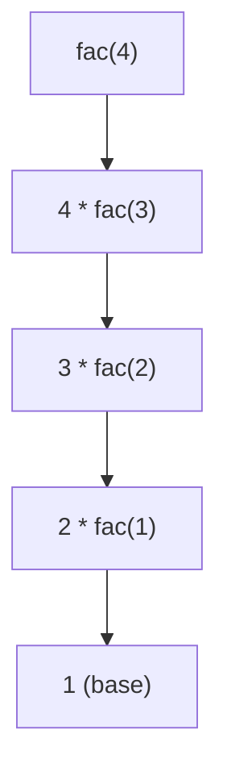

[TOC]

# A1 Computer Fundamentals

## A1.1.1 Describe the functions and interactions of the main CPU components

### CPU

- is the primary computational(计算的) engine of the computer, responsible for executing instructions.

- it is a hardware component(组成部分) that performs 

  - **Arithmetic (算数，计算)**
  - **Logical or input/output operations**, in order to process data from input devices into useful information. 

- Block Diagram of CPU

  - 

- **Key Components of CPU**

  - Component refers to a distinct functional unit or part within the CPU that has a specific role in the processors operation.
  - **Control Unit (CU)**
  - **Arithematic Logic Unit (ALU)**
  - **Registers (寄存器)**
    - IR, PC, MAR, MDR, CIR, AC
  - **Cache (高速缓存)**
    - L1,L2,L3
  - **Buses (总线)**
    - Control Bus 
    - Data Bus
    - Address Bus

- **Control Unit**

  - Responsible for orchestrating the **fetch-decode-execute cycle**. lts primary functions include **decoding and interpreting instructions fetched from** **memory** and **generating control signals** to **activate the hardware units** within the CPU. This involves **parsing(解析)** the instructions opcode (operation code), which determines the **specific action** such as reading data, writing data, performing calculations or testing logic. 

- **Arithmetic Logic Unit (ALU) 算数逻辑单元**

  - Performs **arithmetic and logical operations**. It is where the **actual computation happens**, such as addition, subtraction, and logical operations like AND, OR, NOT, and so on. 

  - **Works with the** **Accumulator** **(ACC)** or **general-purpose registers** to store results. 

    - ACC是累加器，作用有

    - **暂存中间结果**：它专门用于**暂时存放算术逻辑单元 (ALU)** 运算的**中间结果**。

      **隐含操作数**：在许多 CPU 指令中，累加器被作为运算的一个**隐含操作数**。

      - **例如：** 在执行一个简单的 `ADD X`（加 X）指令时，CPU 会将内存地址 X 中的值取出，然后**与累加器 (ACC)** 中当前的值相加，并将最终的结果重新存回 **ACC** 中。

  - **Receives control signals** from the Control Unit (CU) telling it which operation to do. 


- **Registers 寄存器 **

  - A register is a **small-capacity, very fast storage** **location available** within the CPU, used to store data **temporarily** during the execution of programs. It is capable of **holding instructions, storage addresses or data.** 
  - Common register includes
    - **PC(Program Counter)**: Holds the **address** for the next instruction. It is incremented automatically after each instruction is executed(the most common way is to say that it is incremented at the end of the fetch phase), pointing to the next instruction in the program's memory location. 指向了 CPU 接下来要从主内存 (RAM) 中取出的那条指令。
    - **IR(Instruction Register)**: Holds the **current** instruction being executed. It acts as a temporary holding area for the instruction before it is decoded and executed. (decode and execute will be discussed later.)
    - **MAR (Memory Address Register)**: 
      - Stores the **address in memory** where **the next piece of data or instruction** is to be found or stored. 
      - **MAR** can also hold the **destination address** where processed data should be stored in the memory.
      - To enable communication between the **MAR** and **primary memory**, a **connection via the Address Bus** is used. Bus will be discussed later. 
    - **MDR (Memory Data Register)**: 
      - MDR **holds the data** **or instruction** that is **being transferred** **to or from** primary memory. 存的数据或者指令，可以是从memory fetch过来的，也可以是即将要store进memory中某一个地方的data
      - MDR works closely with the **MAR**; the **address in the MAR** determines which data is **loaded** into the MDR. loaded就是拿到memory对应address中的instruction/data，然后通过data bus存进MDR的过程
      - After processing, the **ALU places the result into the MDR**, which is then **written to the RAM** at the address specified by the MAR.
      - The **Data Bus** enables the transfer of data between **RAM and the MDR**. 
    - **ACC(Acumulator)**: A special-purpose register used to store **intermediate results of operations**. It is often used for arithmetic and logical operations. It can also be used as a temporary storage Accumulator (AC) | location for other data. ALU的专用register.
  
- **Buses 总线**

  - A bus is a shared communication pathway which **transfers data** between components within a computer. 

  - 和Bus有关的，就不局限于CPU，而是整个计算机主板或者外部的设备，因此之后的components就不是cpu内部的组件了, CPU内部组件的data transfer使用的是一个叫做internal bus的东西 

    - Control Bus

      - Carries **control signals (not actual data)** from the **Control Unit (CU)** to other components, managing actions and timing. 
    - It can be unidirectional or bidirectional. 可是单向，也可以是双向。
      - Handles commands like **read/write, interrupts, timing, and acknowledgments.**
  
    - Data Bus 

      - A pathway for transferring **actual data** between the CPU, memory, and other components. 
    - Width affects speed (e.g., 32-bit vs 64-bit)
      - Bidirectional (data flows both ways). 既可以从CPU到components，这是一个store，也可以components到cpu，这是一个load
  
    - Address Bus

      - A pathway which carries **memory addresses** from the CPU to specify **where data should be read or written.** It's `where`, so the address bus carries address.

      - Address Bus is unidirectional, only the CPU sends memory address to components.

        

- **Types of CPU processors**

- Key terms you need to know first: 

- Parallel processing: A computing technique in which **multiple processors or cores** within a **single machine, or across multiple machines,** **simultaneously** execute **different parts of a task or multiple tasks to improve the overall speed and efficiency** of computation. 

- Architecture:  The **design and organization** of a computer systems hardware and software components. This includes the structure and functionality to 

  perform computational tasks. 

  - Single-core processor:
    - A single-core processor possess(拥有) **one processing unit (core)** integrated into a single circuit. This core is the fundamental unit that reads and executes instructions from processes. With a **singular processing path**, it handles one instruction at a time, following a **sequential execution** model.
    - This architecture was standard in **early CPUs and older computers**, where task completion relied **on the linear processing of instructions.** 
    - Its primary limitation is in **executing parallel processing demands**. As computational tasks become more complex and **multitasking** becomes essential, single-core processors face limitations in performance, leading to potential bottlenecks(瓶颈) in processing efficiency. 
  - Multi-core processor:
    - A multi-core processor is a **single computing component(a single chip**) that contains **two or more independent processing cores**, each capable of **executing instructions in parallel.** 
    - This architecture enables the processor to **handle multiple instructions at once(due to multi-core)**, significantly improving performance(faster) over single-core designs, especially for **multitasking and parallel processing tasks.**
    - Ideal for multitasking, gaming, and servers
    - Software must be specifically written to take advantage of the **multiple cores to see performance benefits.**
    - They offer improved **performance and efficiency** by **distributing workloads across multiple processing units(distibute a big task to sub-tasks, and each task is completed by a processing unit(core) inside the computing component(chip) simultaneously.**
  - Co-processor:
    - are specialized processors designed to **supplement** the main CPU, **offloading(分流) specific tasks** to optimize performance. Co-processor can be **integrated into CPU or exist as seperate entites**. Co-processors **free the main CPU** to focus on **general processing tasks.** 
    - This is a processor with a specific job to support the main CPU. Allows tasks to **run in parallel**, enhancing overall system performance.
    - Examples include Graphics Processing Units (GPUs), audio processors, and Digital Signal Processors (DSPs). 
    - When accomplishing these tasks, co-processors may be used:
      - graphics rendering, mathematical calculations, or data encryption(加密)

## A1.1.2 Describe the role of GPU

> GPU stands for graphics processing unit, a specialized electronic circuit **containing numerous processing units.** 

**Features of GPU**

- GPU processes **highly parallel structure**, ideal for **complex graphic calculations.** 
- GPU can be **intergrated** inside CPU, or **descrete**(a seprate card).
- GPU communites with software using APIs like DirectX or OpenGL.
- Not only for processing and rendering graphics, GPU is increasingly used for **machine learning** and other **computationally intensive workloads.** 

**GPU architecture** 

- GPU has a **distinct architecture** which sets them apart from conventional CPUs, and allows them to process **large blocks of data cocurrently**(同时的), leading to more efficient processing for certain types of tasks.  

| GPU Features                  | Characteristic                                               | Example                                                      |
| ----------------------------- | ------------------------------------------------------------ | ------------------------------------------------------------ |
| Parallel Processing Abilities | GPU has thousands of small cores designed for parallel computing | Can process multiple pixels at the same time, significantly reducing the time required to apply the filter to the entire image |
| High Throughput(吞吐量)       | GPU is optimized for high throughput, meaning that it can process a large amount of data simultaneously. This feature is especially useful for graphic rendering and complex calculations | In graphic rendering like video games or 3D simulations, high throughput allows it to process and display complex scenes in real time. It can calculate the color, position and texture of thouthands of pixels cocurrently, enabling detailed graphics. |
| Memory                        | GPUs are equipped with high speed memory(VRAM), which handles the large data sets and textures, required in high resolution video rendering and complex scientific calculations. | GPU requires on VRAM (high-speed memory) to store and manage the textures of large data sets for rendering scenes. The high speed allows fast manipulations of this data, enabling the rendering for high-resolution videos in real-time without buffering and delays |

**Real World Applications of GPU**

- rendering complex graphic in video games

  - rendering high resolution textures, realistic lighting effects and smooth frame effects. 
  - enhancing the gaming experience, providing higher frame rates, and off-loading rendering work from the CPU. 

- AI and machine learning

  - faster process of large data sets
  - the training process of ML model involves extensive matrix multiplications(multidimensional) and other operations which can be parallelized effectively on a GPU

- Scientific computing and large simulations

  - quicker computations in physics simulations and climate modelling 

- Graphic design and video editing

  - epecially in the creation of 3D models and environments, GPU enables designers to visualize their work in real-time

  - Using softwares like Blender, GPUs are utilized to render complex scenes, including lighting effects, shadows and textures, in real-time(实时的). 

    

## A1.1.3 Explain the differences between the CPU and the GPU (HL only)


### Design Philosophy and usage scenarios


#### Design Philosophy

- **CPU**
  - The design philosophy of CPUs emphasizes **flexibility and generalizability**, enabling CPUs to efficiently process a **wide variety** of instructions and data types. It's generalized. 
  - CPUs are also designed for **low latency**, meaning they prioritize getting things done quickly, even if it is just one task at a time. 
  - These features mean that CPUs often have **smaller number of cores**, but each core is **very poweful** with features such as **larger caches** and **complex logic units**. This allows CPUs to handle a wider variety of instructions efficiently. 
  - Another design philosophy for CPUs is to focus on **branch prediction(分支预测)**. CPUs excel at **predicting which instruction** will be needed **next and fetching it in advance**. This **minimizes** wasted time and keeps the core running **smoothly**. 
    - **Branch prediction**: Because the CPU is incredibly fast, fetching instructions from memory feels slow comparing to the CPU.  If the CPU waits for every `if` condition to finish before fetching the next instruction, the core would waste many cycles doing nothing. So instead, it **guesses** whether the program will take path A or path B. It then **preloads(fetch) the instructions** for the predicted path, keeping the pipeline running smoothly. 
  - The last design philosophy for CPU is **instruction versatility(指令多样性/通用性)**. CPUs are built to **understand and execute a large set of instructions**, making them ideal for running **general-purpose software** such as web browsers, office applications, and even video games (though not for the intensive graphics processing needed in some games).  
    - 用途通用，可用指令概括范围广
- **GPU**
  - The primary design philosophy for **GPU** is **high** **throughput**(吞吐量). It is optimized for tasks that can be seperated into smaller and independent tasks. GPUs have a significantly **larger number of cores** compared to CPUs, but each core is **less powerful** and desiged for **smaller tasks**. This allows **GPUs** to process a large amount of data sets and complete a large amount of computations **simultaneously.** 
    - **GPUs** are optimized for **SIMD** operations**, where the same instruction is applied to many data elements **at once.
      - **SIMD** stands for **Single Instruction, Multiple Data.** 
        - 一条指令被“广播”给许多数据元素。
        - 因为图像、矩阵、向量这种任务，本来就是“一次处理很多一样的计算”。
        - GPU 同时让大量数据执行同一种运算，因此它们在**并行计算**上特别快。
    - **GPUs** are designed to **move data efficiently between cores and memory**, prioritizing high bandwidth over complex logic components in each core. 
      - GPU 不追求每个 core 的复杂逻辑处理能力，而是依靠高带宽和海量并行单元来实现超高吞吐量。因此它在处理大量、统一、重复的数据计算时远远快于 CPU

#### Usage Scenarios

- **CPU**
  - running operating systems and managing system resources
  - executing general purpose software tasks
  - decoding and handling user input
  - multitasking between different applications 
- **GPU**
  - processing graphics and rendering images and videos for gaming and video editing
  - accelerating scientific algorithms and machine learning model training
  - encoding and decoding video streams
  - cryptocurrency mining


### Core architecture, processing power, memory access, power efficiency


#### Core architecture

- **Instruction set architecture (ISA)** is an element in the core architecture of CPU, which defines the fundemental operations a CPU can perform.
  - Each instruction in **ISA** specifies a particular operation involving arithmetic operations, data movement, logical operations, control flow changes, or system interactions. 
  - Unique to a CPU are specific **types of instructions** such as **system management instructions** and **complex branching instructions**. 
- **GPU** also has an **ISA instruction set architecture**
  - Each instruction in GPU's ISA is designed for handling extensive arithmetic operations and data movement, and there is less emphasis on complex logical operations and control flow changes. 
  - Unigue to a GPU's ISA are specific types of instructions **optimized for graphics rendering and parallel data processing tasks**, such as the following:
    - **Single instruction, multiple data(SIMD)**: Allow a single operation to be applied simultaneously to a parallel nature of graphics processing and certain types of computational tasks in scientific computing and deep learning.
    - **Texture mapping and manipulation instructions**: Essential for graphics processing, these instructions handle tasks like **pixel interpolation(像素差值 算出中间值的颜色)**and **texture fetching(从纹理图片里拿出某个位置的像素)**, which are important for rendering images and videos. 


####  Processing Power

> refers to the abiilty of a device to perform computational tasks. It is a measure of how much work a CPU or GPU can perform in a given amount of time, which directly impacts the performance of software applications running on these processors.

Factors that may influence the processing power(how much work can be performed in a given amount of time) of CPU and GPU:

- the number of cores: core越多，processing power越大，给定时间能能完成的工作越多
- clock speed: 每秒能“跳动”多少次，是一种频率，指每秒能够完成的clock cycle的数量。时钟越快 → 单核心处理速度越快 → 任务完成得更快
- thermal management: 散热越好 → 处理器越能维持最高性能运行
- power delivery to the processor: 更强的供电 → 芯片能维持高频 + 全核心(core)工作 → 性能(performance)最大化


**CPU:**

- Fewer but more **powerful** cores.
- **High clock speeds** + **high instructions per cycle (IPC)** + **branch prediction** and **out-of-order** execution optimize **sequential task processing**.
- Multithreading allows efficient handling of **multiple task**s and complex computational instructions.

**GPU:**

- Hundreds to thousands of cores, optimized for l**arge-scale parallel processing.**
- High **memory bandwidth** and **specialized** cores (e.g., tensor cores) enhance f**ast processing of large data blocks.**
- **SIMD** allows performing the **same operation on multiple data points** simultaneously, maximizing **throughput**.
- Individual GPU cores may be **lower clocked and simpler**, but are specialized for **parallel execution**, providing **tremendous parallel processing power.**


#### Memory Access

> refers to how these processors retrieve and manipulate data stored in computer memory. 

**CPU:**

- Uses a **memory hierarchy** to efficiently manage data access, typically including L1, L2, and sometimes L3 caches(SRAM).
- This hierarchy is designed to **minimize memory latency** (the delay between issuing a request and receiving the data).
  - This is the advantage of SRAM(cache). CPU get fetch the data/instruction that is being used frequently within a short time period. 
- In multi-core CPU environments, **cache coherence protocols(缓存一致性协议)** are needed to ensure that all cores see a consistent view of memory, preventing data conflicts and maintaining data integrity.

**GPU:**

- Often uses a **unified memory architecture（内存统一架构）**,  allowing both CPU and GPU to access a large shared memory pool.
- Equipped with **high-bandwidth memory** to handle the demands of massive parallel processing. 
- GPUs prioritize **memory throughput(高吞吐量)** over low latency because they need to **feed hundreds to thousands of parallel cores simultaneously**.

**Summary/Comparison:**

- **CPUs** use low-latency memory → optimized for rapid task switching and quick data retrieval/processing.
- **GPUs** use high-throughput memory → optimized for handling large volumes of data and supporting massive parallel computation.


#### Power Efficiency

> CPUs and GPUs use electrical power to perform computational tasks. Power efficiency is a significant aspect of processor design and operation, especially in environments where energy consumption impacts cost, thermal management, and system longevity. 
>
> Power efficiency is often measured **by the amount of computational work performed per watt**.

**CPU:**

- Power efficiency is often measured **by the amount of computational work performed per watt**. This ratio indicates the relationship between **computational output and power consumption** and serves as a benchmark to **compare the efficiency of different CPU models**. Higher performance per watt → more power-efficient CPU. 
- Modern CPUs incorporate advanced power management technologies that adjust power usage based on workload. For example, **Dynamic Voltage and Frequency Scaling (DVFS) 频率调整** reduces power consumption when full processing power is not needed.
- **Thermal Design Power (TDP)** **热设计功耗** is the maximum amount of heat a CPU can generate under normal conditions that the cooling system is designed to dissipate. Efficient CPUs can deliver higher performance while staying within a lower TDP.  指CPU在正常条件下，散热系统能设计处理的最大热量。高效 CPU 能在较低 TDP 下提供更多性能(perfomance)。

**GPU:**

- High-performance computing and gaming GPUs also **emphasize power efficiency** due to **potentially high energy consumption**.
- When handling large workloads, GPUs improve power efficiency by **distributing tasks across many cores**, reducing **power per task compared to serial processing.** 由于总输入功率watt不变，分配到多个cores可以通过parallel computing完成更多的tasks，power efficiency增加，和sequential computing相比。 
- GPUs also have energy-saving features similar to CPUs, such as lowering clock speeds or powering down idle cores.
- GPUs are generally more power-efficient than CPUs for parallel processing tasks.

**Summary/Comparison:** 

- **CPU:** Power efficiency measured as computing work per watt → uses techniques like dynamic voltage and frequency scaling (DVFS) and manages TDP to balance performance and energy use.

- **GPU:** Power efficiency achieved by distributing workload across many cores and parallel processing → can lower clock speeds or close idle cores when full power is not needed.

- **Key difference:** CPUs optimize energy use for variable workloads; GPUs optimize energy use for massive parallel tasks.


### CPUs and GPUs working together: Task division, data sharing, and coordinating execution

> CPUs are designed for general-purpose processing, and GPUs are designed for parallel processing capability. General-purpose processing is executing a variety of instructions with complex logic and decision-making. Parallel processing is performing the same operation simultaneously on multiple pieces of data.

#### Task Division

- **CPU:** Handles sequential and control-intensive tasks → manages the system, performs logic and decision-making, and processes tasks like OS management, network communication, and I/O handling.

- **GPU:** Handles parallelizable, data-intensive tasks → executes hundreds to thousands of independent tasks simultaneously, such as matrix multiplications in machine learning, pixel processing in graphics rendering, and data analysis in scientific computations.

- **Summary:** CPUs coordinate and make decisions, while GPUs perform large-scale parallel computations.


#### Data Sharing

- **Challenge:** For **efficien**t CPU-GPU collaboration, data **must be shared** → initially in CPU memory → t**ransferred to GPU via PCIe(Peripheral Component Interconnect Express,外设互联快线）** which can be a bottleneck.
- **Solution:** **Unified memory(内存统一)** allows CPU and GPU to access the **same physical memory**, simplifying **data sharing and reducing transfer overhead.**

**Summary:** Data sharing is essential for CPU-GPU cooperation, and unified memory minimizes transfer bottlenecks.


#### Coordinating Execution

> Coordinating CPU–GPU execution requires programming models such as CUDA and OpenCL, which handle task division, memory management, and synchronization. Modern systems dynamically choose whether the CPU or GPU handles a task based on workload for optimal performance and energy efficiency.

Modern systems dynamically choose whether the CPU or GPU handles a task based on workload for optimal performance and energy efficiency.

- **屏障（barrier）用于让所有参与线程在继续执行前都到达同一个点。**在并行编程中，屏障用于实现同步点：线程会暂停执行，直到所有参与线程都到达屏障点。最后一个线程到达后，所有线程才会继续后续操作。一种同步机制。
  A *barrier* forces all participating threads(线程) to reach a specific execution point before any can proceed. In parallel programming, barrier is used for implementing synchonization point. The threads will be paused temporarily, until all participating threads reach a specific execution point(barrier point), the threads will run again. A type of synchronization mechanism.

- **事件（event）允许线程等待特定条件发生，并在条件满足时通知一个或多个线程，比屏障更灵活。允许线程在特定条件满足之前等待。与屏障不同，屏障是在预定点同步一组线程，而事件更灵活，可以用来通知一个或多个等待线程，某个特定条件已经发生，例如任务完成或所需数据可用。**一种同步原语。
  An *event* lets threads wait for certain conditions and signals one or more threads when a task is finished or data becomes available, offering more flexibility than barriers. It allows threads wait(pause) until certain conditions are reached. A type of syncrhonization primitive. 


## A1.1.4 Explain the purposes of different types of primary memory


### Registers, cache (L1, L2, L3), random-access memory (RAM), and read-only memory (ROM)


#### Registers

- The **fastest and smallest type of memory**, built **directly** **into the CPU**. They store **data, instructions and addresses** the CPU is **actively executing**. This memory is **volatile ( Requires power to maintain the stored data)**. The fundamental unit of data handled by a CPUs architecture is the word size, which describes the size of a register. In general, registers hold 32 or 64 bits of data.


#### Cache(L1,L2,L3)

- **High-speed** memory residing **on or close** to the CPU. Caches bridge the **speed gap between registers and RAM**, holding frequently used data and instructions for quick retrieval. This memory is volatile(requires power to maintain). 
  - Cache的作用是，和CPU相比，memory的速度太慢了。所以CPU会有空窗期，而cache存frequently used data and instructions，用于加速这个过程(quick retrieval).
  - |1 cache typically ranges from **32 KB to 256 KB per core**, with data and instruction caches separate in some architectures.  一个core一个
  - |2 cache typically ranges from **256 KB to 16 MB per core** or **shared across multiple cores**.  一个core一个或者多个core share
  - |3 cache typically ranges from **2 MB to 32 MB shared across all cores in a CPU.** 多个core share


#### Random Access Memory (RAM)

- The **primary workspace of the computer**. RAM **temporarily ( volatile )** stores the currently running **operating system, processes, and active data and instructions**. This memory is volatile.
  - **SRAM**
    - Cache
    - Fast, stable, won't refresh
    - expensive, less storage place and large volume
  - **DRAM**
    - refresh 不断刷新
    - slow
    - Large capacity, cheaper compare to SRAM


#### Read-only Memory (ROM)

- A **non-volatile** memory that stores **essential instructions and data** for the computer to **start up** (for example, the BIOS or firmware（固件）). 
- The data stored in ROM is only modifiable through special processes. 
- ROM's role is primarily for **firmware storage** and it is not directly involved in the day-to-day memory access hierarchy involving registers, cache and RAM. ltis better considered as a **separate entity focused on system boot-up（启动） and low-level startup operations.** Used primarily for starting up a computer. 


### The interaction of the CPU with different types of memory to optimize performance

> The interaction between CPU and memories is guided by the principles of minimizing latency and maximizing throughput for data and instruction access.
>
> - Latency:  is the time it takes for data to move from its source to its destination. Latency is usually described as low or high.

- Throughput: is the amount of data that can be processed or transmitted in a given amount of time.


#### Interaction between CPU and Registers

- **Direct Interaction**:  The CPU has **internal registers**, which are the fastest type of memory available. These registers are used to store **immediate data** which the CPU **needs for current operations**, such as **operands for arithmetic operations, address pointers, and the results of operations.** 

- **Optimization**: By utilizing registers for the **most immediately necessary data and instructions**, the CPU minimizes the **need** to **access slower types of memory,** significantly speeding up processing times. 


#### Interaction between CPU and Cache(L1, L2, L3)

- **Hierarchical use**: Cache memory serves as a high-speed intermediary between the CPU and the slower main memory (RAM). 
  - L1 has the smallest capacity but fastest speed. L3 has the largest capacity but slowest speed, but **stiil faster than RAM.**
- **Data and instruction prefetching**: Modern CPUs use **advanced prediction algorithms** to anticipate which data and instructions **will be needed soon**, and **load them into the cache** ahead of time（提前）. This reduces data-waiting delays and improves overall performance.
- **Spatial and temporal locality 时间空间局部性**: Caches use spatial locality (nearby data is likely to be accessed soon) and temporal locality (recently accessed data will likely be reused) to keep relevant information close to the CPU, improving performance.


#### Interaction between CPU and Main Memory (RAM)

- **Central Data Repository**: RAM holds the **operating system**, **applications** and **data** that are currently in use. It provides a much larger space for data storage compared to caches and registers. 
- **Interaction through momory controller**: The CPU accesses RAM **through the memory controller**, which manages **data transfers, controls access timing, and optimizes the data flow** between them. In order to improve the performance. 
- **Virtual Memory (虚拟内存)**: Virtual memory uses **part of the hard drive or SSD** to extend system memory. The CPU swaps data between RAM and this virtual space, but accessing it is **much slower** than using RAM directly. 


#### Interaction between CPU and the Read-only memory (ROM)

- **Boot-up (start up) process**: ROM stores the **firmware or BIOS** used during **computer startup**. The CPU reads this data at boot(启动时) to initialize hardware and load the operating system from secondary storage into RAM.

  

### The relevance of terms cache miss and cache hit

- In order to fetch the data/instruction, The CPU checks **registers** first, then **L1, L2, L3 caches**, and **finally RAM** to find needed data. If the data is found in a cache (**a cache hit**), access is **very fast**. If it’s not found (**a cache miss**), the CPU must **fetch it from RAM, which is slower.**
- To **reduce** cache misses, CPUs use techniques such as **prefetching** (**predicting and loading needed data to cache early**), **smart memory allocation (placing data to improve hit rates)**, and **cache replacement policies (deciding which data to remove when the cache is full)**.


 


## A1.1.5 Describe the fetch, decode and execute cycle

> The fetch-decode-execute cycle is the fundamental cycle of instruction execution in a computer. This cycle is also known as the instruction cycle. 

- **Fetch** : the CPU fetches an instruction from your memory(`RAM`).  
- **Decode**: The CPU decodes the instruction, which means it interprets the instruction into a set of low level operations that the CPU can execute. 
- **Execute**: The CPU executes the instruction, which means it carries out the low level operations that were specified in the decoded instruction. 


### The **Fetch** Phase

In the **fetch** phase, **the CPU retrieves a machine language instruction from main memory(often `RAM`). It involves the CPU sending a request to `RAM` to fetch the instruction.** The address of the instruction is then being strored in `MAR`, and the fetched instruction is then transferred to a special register called the `IR` in register. 

The complete process is like this:

1. **Address Identification:** The address of the next instruction, held in the **Program Counter (PC)** (often assumed but crucial), is transferred to the **Memory Address Register (MAR)**. This happens internally within the CPU.
2. **Address Transmission:** The address in the **MAR** is then placed onto the **Address Bus**. The **Address Bus** is **unidirectional**(单向的), carrying the memory location from the CPU to the **RAM**.
3. **Command Issuance:** Simultaneously, the **Control Unit (CU)** asserts a $\text{READ}$ signal onto the **Control Bus**. The **Control Bus** carries the command necessary to execute the operation.
4. **Data Retrieval:** **RAM** receives the address (via the **Address Bus**) and the $\text{READ}$ command (via the **Control Bus**). It locates the instruction and places its binary contents onto the **Data Bus**(instructions or data are all knowns as data).
5. **Data Reception:** The instruction travels across the **Data Bus** (which is **bidirectional**) and is temporarily held in the **Memory Data Register (MDR)** within the CPU. So you get the idea that **MDR** holds the intruction or data that is being transferred from or to memory. 
6. **Instruction Loading:** Finally, the instruction is transferred from the **MDR** to the **Instruction Register (IR)**, where it will be held for the remainder of the cycle. Here you also get the idea that **IR** holds the current instruction being executed. 
7. **Preparation:** The **PC** is incremented to point to the subsequent instruction address. Most times **PC** is incremented automatically.

### The **Decode** Phase

In **decode** phase, the CPU interprets the machine language instruction fetched during the previous phase. This phase is primarily done by the **CU (control unit)**, which decodes the instruction by analyzing these possible components:

- **Opcode (operation code)**: dictates(规定) the type of operation
- **Operands**: The data/address to be operated on
- **Addressing Modes**: Determine how to load the **operands**

The complete process is like this:

- The goal of the Decode Phase is for the **Control Unit** to interpret the instruction held in the **IR** and determine the necessary steps for execution.

1. **Instruction Analysis:** The **CU** examines the instruction in the **IR**. It parses the **Opcode** (what operation to perform, e.g., $\text{ADD, STORE}$) and the **Operand** (the data or address to operate on).
2. **Control Signal Preparation:** Based on the decoded instruction, the **CU** generates the precise sequence of micro-operations (control signals) required for the Execution Phase. These signals will be transmitted across the **Control Bus**.
3. **Address Staging:** If the instruction requires data from **RAM** (e.g., $\text{ADD}$) or needs to store data back to **RAM** (e.g., $\text{STORE}$), the memory address (the Operand) is immediately extracted from the **IR** and placed into the **MAR**. This is an internal CPU operation preparing for the bus usage in the next phase. The **ACC** remains static during this phase.

### The **Execute** Phase

During the **execute** phase, the CPU performs the operations specified by the instruction decoded in the previous phase. The specific operation carried out is dictated by the opcode. Common operations include the following:

- **Arithmetic Operations:** Addition, Substraction, Multiplication, Division. These operations are often done by the **ALU**.
- **Logical Operations**: Logical functions like ${\text{AND}}$, ${\text{OR}}$ and ${\text{NOT}}$, also managed by the **ALU**. 
- **Memory Access Operations**: Load(reading data from memory into register) and store(writing data from register to memory). These involve operations with the memory. 
- **Control operations**: Conditional and unconditional jumps which alter the flow of execution based on specific conditions. 

The complete process is like this:

- This is the action phase, where the **CU** coordinates/activates the components to perform the task specified by the instruction. The operations heavily depend on the instruction type:
- A. **Data Transfer to/from RAM** (e.g., $\text{LOAD}$ or $\text{STORE}$)
  - The **MAR** sends the data address onto the **Address Bus**.
  - The **CU** asserts a $\text{READ}$ or $\text{WRITE}$ command via the **Control Bus**.
  - For $\text{LOAD}$ (reading data), data travels from **RAM** $\to$ **Data Bus** $\to$ **MDR** $\to$ **ACC**.
  - For $\text{STORE}$ (writing data), data travels from **ACC** $\to$ **MDR**; then, **MDR** $\to$ **Data Bus** $\to$ **RAM**.
- B. **Arithmetic/Logic Operations** (e.g., $\text{ADD}$ or $\text{AND}$)
  - Data sources (often the **ACC** and the **MDR**—containing data fetched from RAM using the bus system) are supplied to the **Arithmetic Logic Unit (ALU)**. This transmission occurs on the internal CPU bus.
  - The **CU** sends the specific operation command (e.g., $\text{ADD}$) to the **ALU** via the **Control Bus**.
  - The **ALU** performs the calculation.
  - The result is written back to the **ACC**, ready for the next operation.
- **Cycle Completion**
  - Once the instruction is executed, the **Control Unit** signals the end of the current cycle. The CPU immediately loops back to the **Fetch Phase**, using the updated address in the **PC** to begin retrieving the next instruction.   

### Examples of the **FDE Cycle**

#### (1) CPU Processing Cycle: WRITE Value 0x7E to Address 0x4F2

This outlines the Fetch-Decode-Execute Cycle for an instruction to write the value $\text{0x7E}$ to memory location $\text{0x4F2}$.

**Initial State Assumptions:**

* **PC:** $\text{0x100}$
* **ACC:** $\text{0x7E}$
* **Instruction:** $\text{STA 0x4F2}$ (Store Accumulator to $\text{0x4F2}$)

#### 1. 🚶 FETCH Phase: Getting the Instruction

1.  The address of the next instruction is moved: $[\text{PC}]$ ($\text{0x100}$) $\to \text{MAR}$ (Internal CPU Bus).
2.  The $\text{PC}$ is incremented: $[\text{PC}] + 1 \to \text{PC}$ ($\text{0x101}$).
3.  The address is placed on the bus: $[\text{MAR}] \to$ **Address Bus**.
4.  The $\text{CU}$ commands the read: $\text{CU}$ sends $\text{READ}$ signal $\to$ **Control Bus**.
5.  The instruction is retrieved: $\text{RAM[0x100]} \to$ **Data Bus** $\to \text{MDR}$.
6.  The instruction is loaded: $[\text{MDR}] \to \text{IR}$ (Internal CPU Bus).

#### 2. 🧐 DECODE Phase: Setting Up the Write

1.  The $\text{CU}$ decodes the instruction ($\text{STA}$) from the $\text{IR}$ and identifies it as a $\text{WRITE}$ operation.
2.  The destination address is staged: $[\text{IR}_{Operand}]$ ($\text{0x4F2}$) $\to \text{MAR}$.
3.  The data to be written is staged: $[\text{ACC}]$ ($\text{0x7E}$) $\to \text{MDR}$.

#### 3. ⚙️ EXECUTE Phase: Writing to Memory  

1.  The destination address is stabilized: $[\text{MAR}]$ ($\text{0x4F2}$) $\to$ **Address Bus**.
2.  The $\text{CU}$ commands the write: $\text{CU}$ sends $\text{WRITE}$ signal $\to$ **Control Bus**.
3.  The data is transmitted: $[\text{MDR}]$ ($\text{0x7E}$) $\to$ **Data Bus**.
4.  $\text{RAM}$ receives the address, command, and data.
5.  The data stored on that memory location is updated: $\text{RAM[0x4F2]}$ is set to $\text{0x7E}$.

#### 🔄 Cycle Complete

* The **Control Unit** signals the end of the current cycle.
* The $\text{CPU}$ loops back to the $\text{FETCH}$ phase, using the updated $[\text{PC}]$ ($\text{0x101}$) to begin the next instruction.

#### (2) CPU Processing Cycle for Comparison Instruction: $\text{CMP R1, R2}$

**Instruction Meaning:** Compare the value in register $\text{R1}$ with the value in register $\text{R2}$. The result of the comparison is used only to set the CPU Status Flags (e.g., Zero Flag, Carry Flag); no register receives the output.

**Initial State Assumptions:**

* **PC:** $\text{0x300}$ (Address of $\text{CMP}$ instruction)
* **R1:** $15$
* **R2:** $10$
* **Flags:** All flags are initially cleared.

#### 1. 🚶 FETCH Phase: Getting the Instruction

1.  The address is prepared: $[\text{PC}]$ ($\text{0x300}$) $\to \text{MAR}$ (Internal CPU Bus).
2.  The $\text{PC}$ is incremented: $[\text{PC}] + 1 \to \text{PC}$ ($\text{0x301}$).
3.  The address is transmitted: $[\text{MAR}] \to$ **Address Bus**.
4.  The $\text{CU}$ commands the read: $\text{CU}$ sends $\text{READ}$ signal $\to$ **Control Bus**.
5.  The instruction is retrieved: $\text{RAM[0x300]} \to$ **Data Bus** $\to \text{MDR}$.
6.  The instruction is loaded: $[\text{MDR}] \to \text{IR}$ ($\text{CMP R1, R2}$ is now in $\text{IR}$).

#### 2. 🧐 DECODE Phase: Interpreting the Comparison

1.  The $\text{CU}$ decodes the instruction ($\text{CMP}$) from the $\text{IR}$. 
2.  The $\text{CU}$ identifies the instruction as an $\text{ALU}$ operation that requires the contents of $\text{R1}$ and $\text{R2}$.
3.  The $\text{CU}$ prepares the sequence of signals to use the $\text{ALU}$ for subtraction while directing the result **not** to be stored in a register like the $\text{ACC}$.

#### 3. ⚙️ EXECUTE Phase: Performing the Comparison

1.  **Preparation for Subtraction:** $[\text{R1}]$ ($15$) and $[\text{R2}]$ ($10$) are moved to the inputs of the $\text{ALU}$ (Internal CPU Bus). *Note: Comparison is typically performed by subtraction: $\text{R1} - \text{R2}$.*
2.  **ALU Operation:** The $\text{CU}$ sends the $\text{SUBTRACT}$ command to the $\text{ALU}$ (via the **Control Bus**).
3.  **Result and Flags:** The $\text{ALU}$ calculates the difference ($15 - 10 = 5$).
    * The arithmetic result ($5$) is **discarded** (it does not load into $\text{R1}$ or $\text{ACC}$).
    * **Crucially, the resulting condition** is used by the $\text{ALU}$ to set the **CPU Status Flags**.
4.  **Flag Setting:** Since the result (5) is positive and non-zero:
    * The **Zero Flag** is cleared (set to 0).
    * The **Carry Flag** (Borrow) is cleared (set to 0, assuming unsigned arithmetic).
    * The **Sign/Negative Flag** is cleared (set to 0).
5.  **Control Flow Enablement:** The setting of these flags now enables future conditional instructions (like $\text{BGT}$, $\text{BLE}$, etc.) to alter the $\text{PC}$ based on this comparison.

#### 🔄 Cycle Complete

* The $\text{Control Unit}$ signals the cycle end.
* The $\text{CPU}$ begins the next $\text{FETCH}$ phase from the updated $[\text{PC}]$ ($\text{0x301}$).


## A1.1.7 Describe internal and external types of secondary memory storage

> Secondary memory storage is non-volatile and retains data even when the computer is powered off, enabling data persistence. Examples of secondary memory storage include hard disk drives (HDDs), solid-state drives (SSDs), optical discs, and flash drives. 


### Internal hard drives (SSD, HDD) and embedded multimedia cards (eMMCs)


#### Internal hard disk drives (HDDs)

- A type of storage device that stores data on magnetic disk platters. 

- HDDs are the most common type of **internal storage**, and they are typically used in desktop computers, laptops and servers.
- HDDs offer **high storage capacities and are very reliable**, but they can be **comparatively slow to access data** (average sustained data transfer rate for a hard disk is between **100 MB/s to 200 MB/s**). 
- A hard disk drive (HDD) is called **“hard”** because it uses **rigid, non-flexible magnetic platters（磁盘）**to store data, unlike the bendable floppy disks used in the past. 
  - Inside an HDD, several **platters** **spin at high speed** while a **read/write** **head(读写磁头)** moves across **their surfaces**. The head **stores and retrieves data by magnetizing tiny regions on the platter, almost like writing on a fast-spinning metal disc.** 读写头通过**磁化盘面上的微小区域**来记录或读取数据，就像在一张飞速旋转的金属唱片上“刻字”和“读字”。
- Advantages of HDD:
  - Large store capacities
  - high reliability
  - relative affordability, compared to SSD
- Disadvantages of HDD:
  - slow data access speeds
  - noisy during working
  - may be damaged from drops or shocks because of moving parts
  - higher power consumption: requires more energy to spin the magnetic platters

---

#### Solid-State Drives (SSDs)

- Another storage device that uses **non-volatile flash memory** to store data, offering **much faster access speeds, lower power consumption, and greater durability** than traditional hard disk drives because it **contains no moving parts(no spinning magnetic disk platters).** 

- SSDs serve the same purpose as traditional hard disk drives (HDDs) but are **faster and consume less power.** SSDs have no moving parts, leading to **quicker access times and lower latency.**

- The average data transfer rate for an SSD can **significantly exceed that of HDDs**, in some cases reaching **2,500 MB/s to 7,000 MB/s.** 

- How it works?

  - An SSD stores data using **NAND flash memory**, a **non-volatile** technology that retains information without power. Data is kept in **floating-gate transistors (memory cells) 浮栅晶体管** arranged in a grid. Each cell stores a bit (or multiple bits) by **holding or releasing electrical charge.**
  - NAND flash is structured into **blocks**, which contain smaller **pages**. Data is **written in pages** but **erased in entire blocks**. Reading involves **sensing the charge level in the floating gate transistor.**
  - An internal **SSD controller** handles key tasks such as **data transfer, error correction, and wear-levelling（磨损均衡）**—an algorithm that spreads **write/erase cycles** evenly to **extend lifespan**, since flash cells endure only limited write cycles.
  - NAND flash types include **SLC, MLC, TLC, and QLC**, storing 1, 2, 3, or 4 bits per cell respectively, each balancing cost, speed, and endurance differently.
    - **Memory cell** 是最小单位,
    - 每个 memory cell 是一个 **floating-gate transistor**，
    - 无数 cells 排成一个 **grid**，
    - **Grid** 是由所有 memory cells 组成的物理网格结构，**Page** 是从该网格中划分出来、用于写入和读取操作的逻辑单元，
    - 这些 **cells** 被组织成一个个 **pages（最小写入单位）**，
    - 多个 **pages** 再组成 **blocks（最小擦除单位）**。

- The sophisticated R/W/E cycle of SSD:

  - Each memory cell is a tiny transistor. It contains a **floating gate** in the middle. The floating gate can **trap or release electrical charge**.
  - **Writing** 
    - When writing a 1 or 0, the SSD controller **applies voltage to inject or remove charge** in the floating gate. The charge state determines the cell’s **binary value** (or multiple bits for multi-level cells).
  - **Reading**
    - Data is read by **sensing the charge** in the floating gate to determine whether the cell stores 0 or 1.
  - **Erase**
    - The floating gates of all cells in a **block** are cleared simultaneously. Therefore, **erase operations are performed per block**, while **write operations are performed per page**.

  

- Advantages of SSD: 
  - **fast** access speed
  - **high** data transfer rate
  - **Low** power usage(no spinning magnetic disk platters)
  - **strong durability** due to the absence of mechanical parts
  -  No spinning disks or moving heads, so **operation is quiet**
- Disadvantages of SSD:
  - **higher** cost per gigabyte
  - **Limited write/erase cycles:** NAND flash cells can only endure a **finite** number of writes/erases before wearing out(磨损）
  - **Capacity limitations:** The average capacity a SSD can reach is **much smaller** than HDD

---

#### Embedded multimedia cards (eMMCs)

- eMMC is a **type of NAND flash memory storage** that integrates the memory, controller, and multimedia card interface in a **single package on a device's motherboard.**

- **Characteristics:**

  - Solid-state, but **generally slowe**r than SSDs (lower sequential read/write speeds and IOPS)

  - Storage capacity typically **16–256 GB**

  - **Lower cost** than SSDs, commonly used in budget devices

- **Advantages:**

  - Fast data access

  - Reliable and shock-resistant

  - Affordable for **low to mid-range devices**

- **Disadvantages:**

  - Slower than SSDs

  - Limited storage capacity compared to SSDs and HDDs

  - More expensive than HDDs

---

### External hard drives, optical drives, flash drives, memory cards, and network attached storage


#### External hard drives(SSD, HDD)

- come in a variety of sizes and capacities, and they can be used to back up important data, transfer files between computers, or simply store data. The basic functionality of external HDDs and SSDs is the same as for internal HDDs and SSDs. 

---

#### Optical Drives

- An optical drive reads and writes data **on optical discs using laser technology**
- Storage Mechanism:
  - Data is stored as **pits（凹点）and lands（平地)** on a **spiral track (螺旋轨道**) of a polycarbonate disc with a reflective metal layer. 
- Read Process:
  - Laser light reflects **differently off pits and lands**; sensors detect light variations and convert them to electrical signals. 
- Advantages:
  - High storage capacity, compatible with older devices. 
- Disadvantages:
  - Slower data access, fragile, easily scratched or dusty. 

---

#### Flash Drives/USB Flash Drives

- Small, portable storage devices that connect via USB.
- Uses NAND flash memory to store data.
- Portable, fast data transfer, relatively affordable.
- Lower storage capacity than HDDs/SSDs; data loss possible; losing the device may cause security risks.

---

#### Memory Cards 存储卡

- Memory cards are **small, removable storage devices** that are typically used in portable devices, such as **smartphones, tablets and digital cameras.** 
- Uses NAND flash memory to store data.
- Portable, compact（体积小巧）, available in various capacities.
- Easily lost or damaged; may not be compatible(兼容) with all devices.

---

#### Network attached storage 

- **Centralized** storage device accessible by **multiple devices on a network.**
- Uses HDDs, SSDs, or hybrid combinations(混合使用); can be configured with RAID
  - RAID（Redundant Array of Independent Disks 独立磁盘冗余阵列）把多块硬盘组合在一起，来防止硬盘故障并保证数据可用性
- Centralized storage, shared access for multiple devices, scalable, high administrative control.
- More expensive than individual external drives, requires configuration, requires network connection.


## A1.1.8 Describe the concept of compression

> Compression can significantly decrease the amount of disk space needed for files and the bandwidth required for transferring them, facilitating more efficient use of resources. 


### Lossless and Lossy Compression Methods

---


#### Lossless Compression

- Lossless compression **identifies redundant patterns** and **eliminates them** without losing any essential information. 
- This ensures that the **decompressed(解压缩 从压缩状态恢复到原文件状态) file** is an exact **replica** of the original file, preserving its **integrity and quality.** The process of lossless compression is reversible, without losing any essential information.
- The compression ratio achieved through lossless compression is generally smaller comparing lossy compression.

---

#### Lossy Compression

- Lossy compression employs a more **aggressive strategy** to achieve higher compression ratios. 
- It **deliberately discards some data**, typically **minor details** that are **less noticeable (perceptual redundancy)** to the human eye or ear. 
- This allows for **significantly smaller file sizes**, making it suitable for applications such as **audio, video and images.** However, the discarded information can **compromise（危及 损害）the quality of the reconstructed file.**  This means that this process is irreversible.
- Lossy Compression achieves higher compression ratio(smaller file size) but deliberately omitting some details.

---

### Differences between lossless and lossy compression

| Feature                    | Lossless Compression                                         | Lossy Compression                                            |
| -------------------------- | ------------------------------------------------------------ | ------------------------------------------------------------ |
| Data Integrity             | Preserves **all original data**; the decompressed file is identical to the original. | Introduces variations because **some data is deliberately discarded** as less critical. |
| Compression Ratio          | Lower compression ratios since **no data is removed.**       | Higher compression ratios achieved by **removing less important data**. |
| Applications               | Used when data integrity is **critical**, e.g., backups, archives, and document editing. | Used for audio, video, and images where **slight quality loss** is acceptable for smaller file sizes. |
| Perceptual Redundancy      | Does not exploit perceptual redundancy.                      | Exploits perceptual redundancy, **discarding details humans are unlikely to notice.** |
| Reversible vs Irreversible | Reversible — original data can be **perfectly reconstructed(decompressed).** | Irreversible — discarded data **cannot be restored**, causing **permanent information loss.** |

---


### Run-length encoding, transform coding 


- **Run-length encoding(RLE)** is a simple and efficient **lossless compression technique** that is well suited for data with **repetitive patterns**. It works by **identifying and replacing consecutive occurrences** **of the same value** with a single code that represents the **length of the run**. For instance, the sequence AAAAA would be encoded（编码）as 5A. 

- **Transform coding**, on the other hand, is a more advanced **lossy** **compression technique**. It uses mathematical transformations (like the DCT(discrete cosine transform)) to convert data into a form where **its structure and redundancy are easier to identify**. This makes it far more efficient for complex data and enables much higher compression ratios.

  - Transform coding is a technique of lossy compression, because the compressed file cannot be perfectly reconstructed. The process is irreversible, where some data and information are being deliberately discarded permanently. 

  It is widely used in:

  - **JPEG**, which transforms images into **frequency domain representation before quantizing(量化）**

  - **MP3**, which transforms audio signals into **frequency domain representation before encoding(编码)** 

    

| Compression Type     | Examples                          | Typical Applications                                        |
| -------------------- | --------------------------------- | ----------------------------------------------------------- |
| Lossless             | GIF, TIFF, PNG, PDF, ZIP          | Backups, archives, text files, simple graphics              |
| Lossy                | JPEG, MP3, MP4                    | Images, audio, video where small quality loss is acceptable |
| Technique (Lossless) | Run-Length Encoding (RLE)         | Fax images（传真）, simple graphics, text compression       |
| Technique (Lossy)    | Transform Coding (JPEG, MP3, MP4) | Images, audio, video compression                            |


## A1.1.9 Describe the different types of services in cloud computing

> The term "cloud" refers to cloud computing, where organization are allowed to access and utilize computing resources (such as servers, storage, databases) over the internet to offer flexible resources.
>
> Organizations can save money by only paying for the **computational resources they use**, rather than paying for **an expensive server** which they **might not use at full capacity all the time.** 


### Software as a service(SaaS)

- **SaaS** is a cloud computing model where **software applications are hosted and managed** by a third-party provider and accessed by organizations **through a web browser or mobile app over the internet.** **SaaS** eliminates the need for organizations to **install and maintain software on their own devices**, making it convenient and cost-effective. 
- Software as a service的service指的是软件不用下载、不用安装、不用自己维护，直接在网上用就行。

Key Characteristics of software as a service(SaaS):

- **All-inclusive**: Organizations have access to the full application suite with automatic updates and maintenance, without any upfront costs.

- **Scalability**: SaaS applications can be easily **scaled up or down** to meet changing organizational needs, ensuring optimal performance and resource utilization. 

- **Accessiblity**: SaaS applications are **accessible** from anywhere **with an internet connection**, providing organizations with **flexibility and mobility.** 

- **Security**:  SaaS providers implement **robust security measures** to protect **sensitive organizational data** and **ensure the integrity of the applications.**

- Examples of **SaaS**:

  - Gmail

  - Canva

  - Google Sheets

  - Google Docs

  - Google Drive

    


---


### Platform as a service(PaaS)

- **PaaS** provides a **cloud-based** environment(**on the internet**) for developers to build, deploy, and manage their applications.

Key Characteristics of PaaS: 

- **DevOps-friendly:** PaaS supports **rapid development and deployment cycles**. DevOps is a set of practices which **combines software engineering (Dev) and information technology (Ops).** 
- **Infrastructure Abstraction**: PaaS simplifies application management by handling **OS updates, database administration, and networking configuration.**
- **Reduced operational costs**: PaaS eliminates the need to **purchase and maintain hardware and software.** 


- **Examples of PaaS Applications**

  - Heroku: A **fully managed platform** where you **deploy apps simply by pushing your code.**

  - Google App Engine: A Google-powered platform that **auto-scales** and **runs your app with minimal configuration.**

  - Firebase: A **backend-in-a-box** that gives you **databases, auth, hosting, and more without managing servers.**

  - Azure App Service: Microsoft’s fully managed environment for **building, deploying, and scaling web apps effortlessly.**

    

---


### Infrastructure as a service (laaS)

- **laaS** provides **virtualized** computing resources, such as **servers, storage and networking, over the internet**. It gives businesses the flexibility to provision and manage t**heir own IT infrastructure** without the need to **invest in physical hardware and software.** 
- **Virtualization** uses software to **create virtual versions of hardware resources**, allowing multiple independent **virtual machines** to run on a single physical device. Each VM behaves like a **separate computer** with its own operating system and applications. This technology improves hardware utilization, enhances flexibility, simplifies management, enables scalability, and provides strong isolation for better security.

**Key Characteristics of IaaS:**

- **Customization**: **IaaS** allows businesses and firms to **tailor(定做) their own IT structures to their specific needs and requirements.** 
- **Scalability**: Resources can be **easily provisioned and scaled up or down** as needed, ensuring optimal perfomance. 
- **Control**: Businesses have **full control** over **configuration and management** of their IaaS infrastructure.


**Examples of IaaS Applications:** 

- Amazon Web Service(AWS): Provides on-demand **virtual servers** where you **control the OS, storage, and network.**
- Microsoft Azure Virtual Machines: Offers **scalable VMs** where you **manage everything above the hardware layer.**
- IBM Cloud Virtual Servers: Provides **secure, flexible VMs** designed for **enterprise-level workloads.**
- Google Compute Engine(GCE): Gives **highly customizable virtual machines** running on Google’s global infrastructure.


---


### Choosing the right cloud service model


| Feature                 | **SaaS**                             | **PaaS**                                     | **IaaS**                                                     |
| ----------------------- | ------------------------------------ | -------------------------------------------- | ------------------------------------------------------------ |
| **Control**             | Lowest                               | Medium                                       | Highest                                                      |
| **Flexibility**         | Lowest                               | Medium                                       | Highest                                                      |
| **Resource Management** | Service provider manages everything  | Service provider manages most resources      | Customer manages most resources(service providers manage the physical resources(eg.physical servers)) |
| **Cost**                | Most cost-effective                  | Medium cost                                  | Most expensive                                               |
| **Suitability**         | Basic applications for general users | Rapid development/deployment and custom apps | Specialized apps with hardware access                        |


# A3 Databases

## A3.1.1 Explain the features, benefits and limitations of relational databases.

- **Features:** 

  - Store data in tables(relations/entities), where *row = record = tuple = instance, column = attribute = field = feature.*

  - Each table has primary key to uniquely identify each record.

  - Foreign keys link tables together.

  - Allows relationships between tables (one-to-one, one-to-many, many-to-many).

  - Supports SQL (Structured Query Language) to query and manage data. Allow fast access and
    manipulation.

  - ***Primary Key***: A primary key is an attribute that uniquely identifies each record in a table and
    cannot be duplicated or null. 

  - ***Foreign Key***: is an attribute in one table that refers to the primary key of another table, thereby
    creating a relationship between the two entities. 

  - ***Cardinality***: is the type of relationship between the entities.
    • one-to-one: One-single record in the first table can only be connected with one record in the
    second table, vice versa.
    • one-to-many: An instance in one entity can be related to many instances(rows) in another
    entity.
    • many-to-many: Many instances in one entity can be related to many instances in another entity.
    Single record in tableA can be connected to multiple records in tableB, single record in tableB
    can also be connected to multiple records in tableA. 

  - ***Modality***: is the necessity of relationships between tables.
    • Mandatory: An entity occurrence must be related to another entity occurrence. Use full line
    to represent in ERD(**Chen's notation**).
    • Optional: An entity occurrence may or may not be related to another entity occurrence. Use
    dotted line to represent in ERD(**Chen's notation**).

  - Advantages of RDS:

    - Store large amount of data
    - Allow fast retrieval of information 
    - Allow multi-user access securely
    - Ensure data integrity and consistency

    

- **Benefits**: 

  - Scalability: RDS is more easier to scale than flat file database. 
  - Less duplication of data (because data can be split into different tables, linked by primary key and foreign key). Reduced redundancy.
  - More accurate and consistent data (because of primary/foreign keys and constraints). Better data integrity.
  - Easier to search and update using SQL.
  - Secure — access can be controlled.
  - Works well for large amounts of structured data.
  - Normalization is supported to reduce insert anomaly, update anomaly and deletion anomaly.
  - Reliable transaction processing: Relational databases have several checks that occur when transactions take place to ensure that the transactions are reliable. 
  - Community support: There are multiple streams of support for users of relational databases. 

- **Limitations**

  - Can be difficult to design at the start. The different entities and models within the database can be complex and challenging to implement. 

  - Big data scalability: Relational database models are not the best model for storing data that will be mined to make complex decisions. 

  - Rigid schema: The schemas of the database are rigid data types, and relationships must conform to very specific rules.

  - Unstructured data handling: Unstructured data that does not follow the rigid schema of the database model can be difficult to place within the model. For example videos. 

- **Composite key and Concatenated key**(used when single attribute cannot uniquely idendify each row)

  - ***Composite key***

    - A composite key is a logical **primary key** that consists of **two or more attributes** combined together to **uniquely identify a row** in a table.  
    - E.g. Neither `student_id` nor `course_id` alone can uniquely indentify each row, but the *combination* of both uniquely identifies an enrollment record.  `(student_id, course_id)` is a **composite key**.

  - ***Concatenated key*** 

    - A concatenated key is a physical implementation of a composite key, where multiple attributes are **literally joined (concatenated)** into a single value — often as a string — to serve as a **unique identifier.** Not primary key.     

  - **The difference between these two keys:** 

    - 

      


## A3.2.1 Describe database schema

- ***Database schema***:  is a blueprint of the database that identifies the different entities (tables), attributes (fields) and relationships (links) within the database, including the restraints on the data. 
  - ***Conceptual schema:*** identifies all the entities within the database and the relationship between these entities. This model does not contain specific details such as the attributes within the entities nor information about the restraints on the data, but does identify the types of relationships between the data.  
  - 

- ***Logical Schema***: This model of the database identifies the different attributes within each of the entities. This will include the primary keys and foreign keys which create the relationships between the entities. Primary key is bold, foreign key is represented by "*". 
  - 

  - ***Physical Schema***: This model of the databases identifies the different attributes and their data types as well as the primary key and foreign key link that will create the relationships between entities. 
- 

## A3.2.2 Construct ERDs

- **Entity relationship diagrams (ERDs)** show the entities (tables), attributes (fields), and relationships within a relational database. 
- ***Chen Notation Sytle*** 
  - 
- Steps to construct an ERD:  
  - Step1: Identify the level of ERD required (conceptual, logical or physical). This will determine the detail required. 
  - Step2: Identify the entities involved and, if required, the attributes and data types. 
  - Step3: Identify the relationships (using verbs) between the entities. 
  - Step4: Identify the cardinality of the relationship, one-to-one, one-to-many or many-to-many. 
  - Step5: Identify the modality of the relationships. Are they optional or mandatory?  

## A3.2.3 Outline the different data types used in relational databases

- String data types: 
  - 
  - ***Char*** is a fixed length. The length is defined by **CHAR(7)**, also includes spaces. If you insert a character less than 7 characters, Mysql will use spaces to replenish. Often used for fixed length ID, password, country code or status flags. 
  - ***VARCHAR*** is a variable length. Often used for names, emails, description. 
  - ***TEXT*** is a longer text, often used for blog posts, articles, or comments&product reviews.
  - ***MEDIUMTEXT*** is for larger texts, often used for complete books, novels, long documentation, or large JSON data. 
  - ***LONGTEXT*** is the largest data type. Used for complete software codebases, and archival data. 
  - For ***ENUM***, you must choose on value from the predefined list, often used for status fields or user roles. 
  - For ***SET***, you can choose zero or multiple records from the predefined list, often used for user skills/interests or multiple tags/categories. 
- Numeric data types:
  - 
  - ***BIT*** stores bit-field values where each bit can be 0 or 1. Often used to store boolean values(True/False,Open/Shut down), or permission flags. 
  - ***BOOL*** is best used for boolean flags, toggle(开关) settings, and status indicator. (Zero means false, non-zero means true).
  - ***INT*** can only store a whole number. Best used for primary keys(foreign keys), quantities or IDs(without character).
  - REMEBER, use ***FLOAT*** directly. If you want to add contraints on the decimal places of the number, use ***DECIMAL(a,b)***. The first argument a is the length of the whole number, b is the number of decimal places. 
- Date/time data types: 
  - 

## A3.2.4 Construct tables for relational databases

- 

## A3.2.5 Explain the difference between normal forms

> 如果要用一句话概括Normalization的要求，那就是the data **should rely on the key and only rely on the key, cannot rely on anything else.**
>
> Databases that are not designed properly can have the following issues. 

- **Insert Anomalies** 

  -  You cannot add data correctly as the data is dependent on other attributes in the database. You can’t insert a new record into the database without also adding other data that shouldn’t be required — because the table is not properly normalized. For example, you cannot add a course that isn't chosen by any students.

- **Deletion Anomalies:**

  - The database may have attributes that rely on non-related attributes. If you delete the non-related attributes, you unintentionally lose data. Non-related attributes are stored together in one table, if you want do delete an instance of an attribute and thus delete the whole row, you will lost other data in this row.

- **Update Anomalies: **

  -  Any update in a badly designed database will be a challenge as you have to look through every section of the database to ensure all items are deleted. This is not a challenge in a small database, but for a database with hundreds thousands, or millions of records, this becomes a significant problem. If there's duplicated data, and you want to update this data, if you don't change it everywhere manually, the data will be inconsistent and you will no longer know which one is the correct version.   

- **So what is normalization?**

  - Normalization is the process of organizing data in a database to reduce redundancy and improve data integrity & consistency. 
  - It involves breaking down large tables into smaller, related tables and defining relationships between them.

- **Functional Dependencies**

  - **Functional dependency** means that one attribute (or a group of attributes) uniquely determines another attribute.  

    > For example, If you know A, than you can find exactly one B, they we say A functionally determines B.
    > `Uniquely determine` means each value of A corresponds to exactly one value of B,
    > but a value of B may correspond to many A’s. If two rows have the same value of A, they must have the same value of B. 

- **The process of normalization**

  - unformal form:
    - Initial candidate (possible) primary key identified
    - Repeating groups identified using indentation(缩进)
      - Repeating groups are the new data that needs to be added when a new entry is created.
      - Atomic的意思是每一个cell都只有一个值，没有重复，repeated group指的是一个单元格存了多个值，或者未来可能需要存多个值(potentially possible)。这是1NF需要确保的。 
  - 
  - 
  - 

> Here are some key terms that you must know when normalizing:

 - **Partial Dependency**: A partial dependency occurs when a non-prime attribute(非主键属性) is functionally dependent on part of a composite primary key, not on the whole key. 例如主键：(StudentID, CourseID)（复合主键）StudentName 只依赖 StudentID，不是整个主键 → 部分依赖。这是2NF需要消除的情况。

 - **Transitive Dependency**: A transitive dependency occurs when a non-prime attribute is functionally dependent on another non-prime attribute, which in turn is dependent on the primary key. 当一个非主键属性依赖于另一个非主键属性，而这个非主键属性又依赖于主键时，这叫叫传递依赖。这是3NF要消除的情况。

 - **Non-key Dependency**: A non-key dependency occurs when a non-prime attribute depends on another non-prime attribute rather than on the primary key. 任何非主键属性依赖于另外一个非主键属性，就是非键依赖。违反3NF，因为非键属性不应该依赖于非键属性。

> Here are some terms related to this topic

- **Referential integrity**: ensures that a foreign key value in one table must either be null or match an existing primary key value in another table, so that relationships between tables remain consistent.  

- **Data redundancy**: occurs when the same piece of information is stored in **multiple places in the database**, leading to inconsistencies and unnecessary storage. 

- **The characteris of unnormalized database and each normal forms:**

  - **Unnormalized data** contains **repeating groups, multi-valued attributes, and no defined primary key**, leading to data redundancy and anomalies. Not atomic. 

  - **First Normal Form(1NF)** means all attributes are atomic and each row is uniquely identifiable by a primary key. Unique means that there are no rows that are extactly the same. **All entries** in a **column** are of the **same kind**. 

  - **Second Normal Form(2NF)**: A relation is in **Second Normal Form (2NF)** if it is in 1NF and every non-prime attribute is fully functionally dependent on the entire primary key (no partial dependency). 说人话就是，**Every non-key column must depend on the** **entire** **Primary Key.**

  - **Third Normal Form(3NF):** A relation is in **Third Normal Form (3NF)** if it is in 2NF and no non-prime attribute is transitively dependent on the primary key.  说人话就是，**No non-key column depends on another non-key column.**


- **Three types of normal forms**:

  - **First normal form**:  The repeating data is moved into a new entity. The non repeating data stays in its own entity and is given a unique identifier (primary key). The primary key from the non-repeating entity is placed in the new entity as a foreign key. In the new entity a unique identifier is found. This will most likely be a composite key. The issue with the first normal form is that the new entity will have attributes that only rely on one part of the key, known as partial key dependencies. This does not align with the normalized database philosophy of the whole key and nothing but the key.
  - **Second normal form**: The partial key dependencies are removed into their own entity and a primary key is identified. The primary key features in the entity it was removed from as both a primary key and a foreign key at this point. The issue with second normal form is that some attributes in the entities do not rely on the key, they are their own information. These are known as transitive or non-key dependencies. These, again, do not align with the normalized database philosophy of "the whole key and nothing but the key".
  - **Third normal form**:  The transitive or non-key dependencies are moved into their own entity and given a primary key. The primary key becomes a foreign key in the entity it was removed from. Transitive dependencies can be present in any of the entities previously created. Once they are removed, your entities should meet the normalized database philosophy of "the whole key and nothing but the key". 

- **How to construct from UNF to 1NF to 2NF to 3NF:**

  - - Split, to get 1NF

    - Find a composite key, two attributes that can uniquely identify each record/row. 然后说人话就是，判断哪些attribute不依赖整个composite key，只是依赖一部分，找出来，然后拆分成2个表。原本的保留，新的attribute组成新的表，表的PK就是这些attribute依赖的那个，然后同样的那个attribute作为FK留在原表中。可能会拆分成多个。

    - 然后，判断哪些是partial dependent的，列出来, 这些再次拆分成子表。A partial dependent on B，那么把B这个attribute留在原表作为FK，新的表的PK就是这个attribute。新的表的另外一个attribute就是A。

    - 

    - 

    - 

      

## A3.2.6 Construct a database normalized to 3NF for a range of real-world examples

> 书上一堆废话，A3.2.5的内容掌握了就行

## A3.2.7 Evaluate the need for denormalizing databases

- **Advantages**
  - Simpler and faster queries as the database has to look at fewer entities to collect all the data.
  - Faster data retrieval as the database has fewer joins to complete. 
- **Disadvantages**
  - More challenging updates and inserts as some of the data is repeated.
  - Updating code can be difficult to write as the data is in multiple places. 
  - There may be inconsistencies as there are duplicate copies of data.
  - The fact there are many copies of some data requires more storage.
  - 这书上写的还是废话，其实就是**data redundancy**或者说是**duplicated data**

## A3.3.1 Outline the difference between data language types within structured query language (SQL)

- 

- ***Data definition language(DDL)***
  - is used to create the database structures. 
  - It is used to create the schema, the tables, and constraints within the database. Using DDL statements, you can create the outline of the database. 
  - Example ***DDL*** commands in SQL:
    - **CREATE** used to create a entity/table. 
    - **ALTER** used to change the structure of the table/database
    - **DROP** used to delete table/entity from within the database structure. 
    - **TRUNCATE** used to remove all records/rows from an entity/table within the database structure, **but will not delete the table itself, only the records inside will be affected.** 
    - **RENAME** used to rename an entity/table within a database structure. 
    - **COMMENT** used to add a comment to the table, used when creating the table. 

- ***Data manipulation language(DML)***
  - is used to access the data within the database and to manipulate the data within the database. For example, querying the table for information, updating records, and deleting records. 
  - 

- **Data control language(DCL)**
  - is used to control access to the database. The DCL helps to maintain security in the database as it allows user to have access to the database or it can revoke data from the database. 
  - **GRANT** allows user access privileges in a database. 
    - GRANT privileges ON database_name.table_name TO 'username'@'host';
      - E.g. 
        - GRANT SELECT, INSERT, ALTER, UPDATE ON demo.test TO 'username'@'host';
        - GRANT ALL PRIVILEGES ON demo.test TO 'username'@'host';
  - **REVOKE** allows the removal of privileges in a database. 
    - REVOKE privileges school.students FROM 'username'@'localhost';
      - E.g. 
        - REVOKE SELECT, INSERT, ALTER, UPDATE ON demo.test TO 'username'@'host';
        - REVOKE ALL PRIVILEGES ON demo.test TO 'username'@'host';

- **Transaction control language(TCL)**
  - is used to complete the changes in a database. 
  - 
  - 一个 transaction（事务）就是一组要么全部成功、要么全部失败的操作。
  - E.g.
    START TRANSACTION;
    UPDATE accounts SET balance = balance - 100 WHERE id = 1;
    UPDATE accounts SET balance = balance + 100 WHERE id = 2;
    COMMIT;
  - 如果中途出错，就可以用 `ROLLBACK` 回到最初状态。
  - `COMMIT` 将当前事务中的所有更改 **永久写入数据库**。
    START TRANSACTION;
    UPDATE students SET grade = 90 WHERE id = 1;
    COMMIT;
  - `COMMIT` 用于永久提交前面的 transaction 中的所有操作，无法撤销
  - `ROLLBACK` 撤销自上次 `START TRANSACTION` 以来所做的所有更改。
    START TRANSACTION;
    UPDATE students SET grade = 90 WHERE id = 1;
    ROLLBACK;
  - `ROLLBACK` 用于撤销前面的 transaction 中的所有操作(当 administrator 后悔前面的操作)

### Using SQL to develop a database/table

- **Create table**

```sql
CREATE DATABASE demoDB;

-- With primary key
CREATE TABLE table_name (
    Attribute1 datatype NOT NULL PRIMARY KEY,
    Attribute2 datatype,
    Attribute3 datatype
);

-- With primary key and foreign key
CREATE TABLE table_name (
    Attribute1 datatype NOT NULL PRIMARY KEY,
    Attribute2 datatype,
    Attribute3 datatype,
    Attribute4 datatype,
    FOREIGN KEY (Attribute4) REFERENCES other_table(Attribute4)
);
-- other_table is the name of another table that you are linking with
```

- **Drop table**

```sql
# Drop the tabel itself
DROP TABLE table_name;
```

- **Alter table**

```sql
-- Add a column
ALTER TABLE table_name
ADD COLUMN attribute datatype AFTER existing_attribute;

-- Example
ALTER TABLE Customer
ADD COLUMN deliveryAddress VARCHAR(255) AFTER customer_name;

-- Drop a column
ALTER TABLE table_name
DROP COLUMN attribute;

-- Example
ALTER TABLE Customer
DROP COLUMN deliveryPreference;

-- Modify column datatype
ALTER TABLE students
MODIFY COLUMN age VARCHAR(50);

-- Change column name and datatype
ALTER TABLE students
CHANGE COLUMN old_name new_name VARCHAR(50);

-- Rename the table
ALTER TABLE students RENAME TO pupils;

-- Add primary key
ALTER TABLE students
ADD PRIMARY KEY (id);

-- Add foreign key
ALTER TABLE orders
ADD CONSTRAINT fk_customer
FOREIGN KEY (customer_id)
REFERENCES customers(customer_id);

-- Add constraints
-- Primary key constraint
ALTER TABLE students
ADD CONSTRAINT pk_student_id PRIMARY KEY (student_id);

-- Unique constraint
ALTER TABLE students
ADD CONSTRAINT unique_email UNIQUE (email);

-- Check constraint
ALTER TABLE students
ADD CONSTRAINT check_age CHECK (age >= 0 AND age <= 120);

-- Drop a constraint
ALTER TABLE table_name
DROP CONSTRAINT constraint_name;

-- NOT NULL
ALTER TABLE students
MODIFY COLUMN name VARCHAR(50) NOT NULL;

-- Default value
ALTER TABLE students
ALTER COLUMN status SET DEFAULT 'active';
```

- **Modifying data in a table**

```sql
-- Insert value
INSERT INTO table_name (Attribute1, Attribute2, Attribute3, ...)
VALUES (value1, value2, value3, ...);

-- Update value
UPDATE table_name
SET Attribute1 = value1, Attribute2 = value2
WHERE condition;

-- Delete value with condition
DELETE FROM table_name
WHERE condition;
```


## A3.3.2 Construct queries between two tables in SQL

> I also include some common sql commands in this chapter, not only containing the contents in the textbook.

- **Queries** are used in databases to extract data and provide context for data.  Data within a database has little relevance unless it is put into context. Queries can be used for filtering, which means finding the data you want to know from the database. 

- **BETWEEN**

```sql
SELECT * FROM table_name 
WHERE attributel BETWEEN valuel AND value2;

# Example
SELECT * from students where score BETWEEN 90 and 100
```

-  **ORDER BY** 

```sql
# Order by attribute ASC(default), DESC
SELECT * from table_name WHERE condition order by attribute ASC or DESC;

# Example
SELECT student_name from tests_score order by score ASC;

SELECT student_name from tests_score order by score ASC, student_name ASC;
```

- **GROUP BY**

```sql 
# Group by certain attribute
SELECT Attribute1, Attribute2
FROM table_name
WHERE condition
GROUP BY Attribute1, Attribute2
ORDER BY Attribute1;  

# Example show the average score of each subject
SELECT avg(score) as average_score, subject from Subjects group by subject order by avg(score) DESC;

```

- **HAVING** 
- Can be only used after GROUP BY

```sql
# Using having to filter the rows in group
SELECT COUNT(Attribute2), Attribute from table_name GROUP BY Attribute HAVING COUNT(Attribute2) condition;

# Example
SELECT COUNT(CustomerID), CustomerCountry FROM Customer GROUP BY CustomerCountry HAVING COUNT(CustomerID) > 2;
```

- **JOIN**
- There are three types of JOIN
  - `INNER JOIN` returns all the records that have matching values in both tables.
  - `LEFT JOIN`  returns all rows from the left table, and the matched rows from the right table. If there is no match, the result will still include the left table row**, but the right table columns will **show NULL. 
  - `RIGHT JOIN` returns all rows from the right table, and the matched rows from the left table. If there is no match, the left table columns will **show NULL**.  

```sql
# INNER JOIN
SELECT table_name1.attribute1, table_name1.attribute2, table_name1.attribute3, table_name2.attribute2 FROM table_name1 INNER JOIN table_name2 WHERE table_name1.attribute1 = table_name2.attribute2;

# Example
SELECT Item.ItemID, Item.ItemDesc, Item.ItemCost, Item.ArtistID, Artist.ArtistName, Artist.ArtistEmail FROM Item INNER JOIN Artist ON Item.ArtistID = Artist.ArtistID WHERE ItemCost > 100;
```

- **LIKE**
- The Like operator is used within the Where operator to look for non-exact matches. This is known as pattern matching within the attribute.
- There are two wildcards used within the database system
  - `_` represents one single character
  - `%` represents any number of characters(zero, one, or many). 

```sql
# Only select the Artist whose name ends with 'work'
SELECT Attribute1, Attribute2 FROM table_name WHERE Attribute LIKE pattern;
SELECT * FROM Artist WHERE ArtistName LIKE '%work';

# Only select the Artist whose name starts with 'work'
SELECT Attribute1, Attribute2 FROM table_name WHERE Attribute LIKE pattern;
SELECT * FROM Artist WHERE ArtistName LIKE 'work%';

# Only select the Artist whose name contains the substring 'work'
SELECT Attribute1, Attribute2 FROM table_name WHERE Attribute LIKE pattern;
SELECT * FROM Artist WHERE ArtistName LIKE '%work%';
```

- **CASE WHEN** **and** **CASE**

```sql
# Format for CASE WHEN
CASE
    WHEN condition1 THEN result1
    WHEN condition2 THEN result2
    ...
    ELSE resultN
END AS xxx
FROM xxxx;

# Example for CASE WHEN
SELECT name, score,
    CASE
        WHEN score >= 90 THEN 'A'
        WHEN score >= 80 THEN 'B'
        WHEN score >= 70 THEN 'C'
        ELSE 'Fail'
    END AS grade
FROM Scores;

# Example for CASE
CASE score
    WHEN 90 THEN 'Perfect'
    WHEN 80 THEN 'Good'
    ELSE 'Average'
END AS grade
FROM Scores;

SELECT name,
  CASE score
      WHEN 90 THEN 'Perfect'
      WHEN 80 THEN 'Good'
      ELSE 'Average'
  END AS grade 
FROM Scores;
```

-  **IF** 

```sql
# Format for IF in Mysql
IF(condition, value_if_true, value_if_false)

# Example       
SELECT name, 
       IF(score >= 60, 'Pass', 'Fail') AS result
FROM Students;
```

- **IFNULL**
  - deal when null occurs

```sql 
# Format for IFNULL in Mysql
IFNULL(expression, default_value)

# Example
SELECT name, salary + IFNULL(bonus, 0) AS total_income
FROM Employees;
# This means, if bonus is NULL, the value returned by be zero, if you don't use IFNULL to check, the result may be NULL
```

- **NULLIF**
  - When two values equal, return null 

```sql
# Format for NULLIF in mysql
NULLIF(expr1, expr2)

# Example
SELECT NULLIF(10, 10);  -- return NULL
SELECT NULLIF(10, 5);   -- return 10

# Example: Dealing with potential ZeroDivisionError
SELECT year_salary / NULLIF(months,0) as avg_salary from employees;
```

- **Common Operations in Mysql**

```sql
=  # check if equals to 
!= # not equals to 
BETWEEN a AND b # both inclusive
xxx IN (x,y,z) # check whether the given value is in the predefined set
IS NULL
IS NOT NULL
AND, OR, NOT
/ # float division
div # integer division
```

- **Subquery 子查询**

```sql
# Basic format for subquery command
SELECT column_name
FROM table_name
WHERE column_name operator (SELECT column_name FROM table_name WHERE condition);

# Find the student whose score is above the average                        
SELECT name, grade
FROM Students
WHERE grade > (SELECT AVG(grade) FROM Students);

# 找出成绩前两位的同学
SELECT name, grade
FROM Students
where grade in (SELECT grade from Students order by grade DESC limit 2);
```

## A3.3.3 Explain how SQL can be used to update data in a database

> `INSERT INTO`以及`UPDATE`以及`DELETE`的用法前面都写了（注意这些都是DML，不需要`TABLE`关键字)

## A3.3.4 Construct caculations with a database using SQL's aggregate function

- Aggregate functions allow you to perform calculations on the data in the database.

```sql
# Calculate the average
SELECT AVG(attribute) FROM TABLE_NAME;

SELECT AVG(age) FROM student;

# Calculate the average with condition
SELECT AVG(attribute) FROM TABLE_NAME WHERE condition;

SELECT AVG(score) FROM student WHERE score > 87;

# Returns the number of rows using COUNT with condition
SELECT COUNT(attribute) FROM TABLE_NAME;

SELECT COUNT(student_id) FROM student;

SELECT COUNT(attribute) FROM TABLE_NAME WHERE condition;

SELECT COUNT(score) FROM student where score > 87;

# This only counts of the number of unique rows
SELECT COUNT(DISTINCT attribute) FROM student;

SELECT COUNT(DISTINCT hobby) FROM student;

# Returns the highest value in an entity for a selected attribute
SELECT MAX(attribute) FROM TABLE_NAME;

SELECT MAX(attribute) FROM TABLE_NAME WHERE condition;

# Returns the smallest value in an entity for a selected attribute
SELECT MIN(attribute) FROM TABLE_NAME;

SELECT MIN(attribute) FROM TABLE_NAME WHERE condition;

# Returnes the total sum of the data 
SELECT SUM(attribute) FROM TABLE_NAME;

SELECT SUM(attribute) FROM TABLE_NAME WHERE condition;
```


# B2 Programming

## B2.1.1 Construct and trace programs using a range of global and local variables of various data types

- A variable is a space in memory used to store data, referenced by a unique identifier. In python, variable is a **named reference** that points to the memory location where the object is stored, allow the program to **get access and manipulate** that object through the variable. 
- Data types in python
  - 
- **Global and Local variable** in python
  - Global variables:  
    - Defined **outside functions**.
    - Accessible anywhere in the file.
    - To modify inside a function, use `global`.

```python
x = 10  # global variable

def modify():
    global x
    x += 5

modify()
print(x)  # Output: 15
```

  - Local variables:
    - Defined inside a function.
    - Accessible only inside that function.
    - Can shadow a global variable with the same name.

```python
x = 10  # global

def func():
    x = 5  # local
    print(x)

func()  # Output: 5
print(x)  # Output: 10 (global unchanged)
```

## B2.1.2 Construct programs that can extract and manipulate substrings

- 
- **Negative Indexing** for subtring:
  - In Python, **negative indices** allow you to access elements from the **end of a list/string**. 
  - `-1` refers to the **last element**, `-2` to the **second last**, and so on.

```python
# Using negative indexing to extract substrings
text = "Data-Science-101"

print(text[-3:])    # Output: "101"       -> last 3 characters
print(text[:-4])    # Output: "Data-Science" -> all except last 4
print(text[-11:-6]) # Output: "Science"   -> slice using negative start and end

# The third argument: Steps
text = "abcdefghij"

print(text[-1:-6:-1]) # Output: "jihgf"  -> reverse slice from end
print(text[-2::-2])   # Output: "igeca"  -> every 2nd char from second last to start, remember that when you use a negative step, the sequence is from right to the left

# Combining both positive and negative indexes
text = "Machine-Learning"

print(text[8:-1])  # Output: "Learning" -> from index 8 to second last
print(text[-8:14]) # Output: "Learn"     -> from 8th last to index 14 (end exclusive)
```

## B2.1.3 Describe how programs use common exception handling techniques

- Benefits for handling exception:

  - Prevent program crashes – keeps the program running or ends it safely when errors occur. 

  - Improve user experience – gives clear error messages instead of raw system errors.
  - Support debugging and logging – records error details for analysis.
  - Handle special cases – e.g., catching ZeroDivisionError when dividing numbers.
    -Cleaner code – avoids excessive if checks by directly handling errors with try/excep 
- Python **exception handling** method

```python
# Basic try-except
try:
    x = 10 / 0   # This will raise ZeroDivisionError
except ZeroDivisionError:
    print("Cannot divide by zero!")

# Catching multiple errors
try:
    num = int(input("Enter a number: "))
    result = 10 / num
except ZeroDivisionError:
    print("Division by zero is not allowed.")
except ValueError:
    print("Invalid input. Please enter an integer.")
    
# Using else and finally
# else runs if no exception occurs. finally always runs, regardless of exception
try:
    number = int(input("Enter a number: "))
    result = 10 / number
except ZeroDivisionError:
    print("Cannot divide by zero!")
except ValueError:
    print("That's not a valid number.")
else:
    print(f"10 divided by {number} is {result}")
finally:
    print("End of program.")
    
# Tip: when you don't know what kind of error will occur
try:
    number = 10/0
except Exception as e:
    print("An error catched:",e)
```

- **Common Python Exceptions**
  - 

## B2.1.4 Construct and use common debugging techniques

## B2.2.1 Compare static and dynamic data structures

- Static structure:
  - Have a fixed size that is determined at compile time and cannot be changed during program execution. Faster access, but less flexible.
  - Advantages: 
    - Faster access and operations(contiguous memory) 
    - Predictable memory usage(fixed size)
    - No runtime allocation overhead
  - Disadvantages:
    - Inflexible size
    - Potential memory waste
    - Cannot adapt to changing data needs 
      **Warning:  In python, tuple and list store the reference of the objects, reference points to the memory location of the objects.**

- Dynamic structure:
  - Can grow or shrink during program execution. Memory is allocated at runtime. More flexible but but slightly slower.
  - Advantages: 
    - Flexible size.  
    - Efficient memory storage. 
    - Adapt to runtime requirements. 
    - Easier to work with. 
  - Disadvantages:
    - Slightly slower due to resizing
    - Memory allocation overhead. 
    - More complex implementation
    - **Resize: In Python, list resize means that when the list runs out of capacity, the interpreter allocates a larger block of memory and copies the existing elements into it, so new items can be appended(this will consume longer time).** 

## B2.2.2 Construct programs that apply arrays and lists (Excluding Two-dimensional arrays in Java)

- **One dimensional list in python**

```python
# Creating list
# Empty list
my_list = []

# List with elements
fruits = ["apple", "banana", "cherry"]

# List with mixed types
mixed = [1, "hello", 3.14, True]
  
# Accessing list elements
fruits = ["apple", "banana", "cherry"]

print(fruits[0])   # "apple"
print(fruits[-1])  # "cherry" (negative index)

# Modifying list
fruits = ["apple", "banana", "cherry"]

# Add elements
fruits.append("orange")      # Add at the end
fruits.insert(1, "mango")    # Add at index 1

# Remove elements
fruits.remove("banana")      # Remove by value
popped = fruits.pop()        # Remove last element and return it
popped2 = fruits.pop(2) 		 # Remove by index, and return it
del fruits[0]                # Delete element at index 0 

# Update elements
fruits[0] = "blueberry"

# List operations
a = [1, 2, 3]
b = [4, 5]

# Concatenation
c = a + b        # [1, 2, 3, 4, 5]

# Repetition
d = a * 2        # [1, 2, 3, 1, 2, 3]

# Check membership
2 in a           # True

# Iterating over lists
for fruit in fruits:
    print(fruit)

for i in range(len(fruits)):
    print(i, fruits[i])
    
# Iterating over lists but also return the index
name = ["Michael","Jack","Charles","Tiago","Mike"]
for index, element in enumerate(name):
    print(index,name)

# List comprehension
# Simple comprehension: square numbers
squares = [x**2 for x in range(5)]  # [0, 1, 4, 9, 16]

# With condition: only even numbers
even_squares = [x**2 for x in range(5) if x % 2 == 0]  # [0, 4, 16]
```

- **Common list Methods**

- `len(list)`  

  - Returns the number of elements in the list.  
  - **Arguments:** only the list itself.

- `list.sort(key=None, reverse=False)`  

  - Sorts the list in place (modifies the original list).  
  - **Arguments:**  
    - `key` → function to specify sorting criteria, e.g., `key=str.lower`  
    - `reverse` → `True` for descending order, `False` for ascending (default)

- `list.reverse()`  

  - Reverses the elements of the list in place.  
  - **Arguments:** none

- `list.index(x, start=0, end=len(list))`  

  - Returns the index of the first occurrence of `x`.  
  - **Arguments:**  
    - `x` → element to find  
    - `start` → optional, index to start searching (default 0)  
    - `end` → optional, index to stop searching (default end of list)

- `list.count(x)`  

  - Returns the number of times `x` occurs in the list.  
  - **Arguments:**  
    - `x` → element to count

- `list.clear()`  

  - Removes all elements from the list.  
  - **Arguments:** none

- `max(list)`

- `min(list)`

  

### Shallow Copy vs Deep Copy in Python Lists

Python lists are **mutable**, so sometimes copying them needs care. There are two main ways to copy a list:

---

#### 1. Shallow Copy

- Creates a **new list object**, but the **elements themselves are still references** to the original objects(points to the same memory location).
- Modifying **mutable elements** inside the copy will affect the original list.
- Methods to create a shallow copy: 

```python
# Using slicing
original = [[1, 2], [3, 4]]
shallow = original[:]

# Using list() constructor
shallow2 = list(original)

# Using copy module
import copy
shallow3 = copy.copy(original)

```python
# Example
original = [[1, 2], [3, 4]]
shallow = original[:]
shallow[0][0] = 99
print(original)  # Output: [[99, 2], [3, 4]]
```

#### 2. Deep Copy

- Creates a **new list object** and **recursively copies all nested objects** (each element gets its own copy in memory).
- Changes in the deep copy **do not affect the original list**.
- Method to create a deep copy:

```python
import copy
# Using copy.deepcopy()
original = [[1, 2], [3, 4]]
deep = copy.deepcopy(original)

# Example
original = [[1, 2], [3, 4]]
deep = copy.deepcopy(original)
deep[0][0] = 99
print(original)  # Output: [[1, 2], [3, 4]]
```

## B2.2.3 Explain the concept of a stack as a “last in, first out” (LIFO) data structure (HL Only)

- **Stack** is a ADT(abstract data types) which defines a collection of elements with **LIFO (Last In, First Out)** behavior.
- **Stack is a linear data structure that follows the Last in, First out rule. The last elements pushed into the stack will be first one removed from the stack.**
- **Being an ADT means that a stack **specifies what operations are allowed and how they behave, **but does not dictate how it is implemented**. You could use arrays, linked lists, or other structures to implement stack. 
- Common Stack Methods:
  - 
- This will help you understand it more clearly:
  - 
- Overflow and underflow:
  - 
- Applications of stack in computing:
  - Function call management (Call Stack) : Stacks are essential in recursive algorithms. Every time a recursive call is made the current state is pushed onto the stack. Once the base case is resolved the pop method is used to resolve the calls.  
    - 
  - Undo/Redo in text editors
  - Parsing: A stack is used to ensure that all of the brackets are closed. For example, in Java if the bracket `{}` are closed, every time an open bracket `{ `is read it is pushed onto the stack and every time a closed bracket ``}`` is read it is popped from the stack.  An empty stack means the correct number of brackets. 
    - 
  - Undo functions: A stack is used to keep a track of the operations completed by a user of a program. Every operation is pushed onto a stack. Each time they undo an action, the last action is popped from the stack and reversed. 
  - Expression evaluation (postfix, infix)
  - Syntax parsing (like checking parentheses in code)
  - Memory management 
  - Move back to the last page in a browser(pop)
- Applications of stack outside computing
  - Pile of dishes, Tower of boxes,Undo history in drawing
- When are stack and queue suitable
  - 

## B2.2.4 Explain the concept of a queue as a “first in, first out” (FIFO) data structure (HL Only)

- **Queue** is also a ADT(abstract data types) which defines a collection of elements **with FIFO (First In, First Out) behavior.**

- **Queue is a linear data structure that follows the First in, First out rule. The first element enqueue into the queue will be first one removed from the queue.**  

- **Being an ADT means that a queue **specifies what operations are allowed and how they behave, **but does not dictate how it is implemented**. You could use multiple ways to implement queue.

- A diagram to help understand FIFO:

  - 

    - **Here, notice that the left is the rear(队尾)，the right is the head(队头), you can also do it reversly.**

  - Common Methods for Queue:

    - 

  - Applications of queue in computing:

    - CPU scheduling (process queues)
    - Print spooling 
    - If you send many jobs to the printer, they are added to the print queue. If your printer is connected to your machine then once each print job has completed, the dequeue () method is called to get the next one. 
    - I/O buffering
    - Network packet handling (router queues): 
    - Queues are used to manage traffic in routers and switches. Data packets are stored in the queue until they can be processed or serialized. 
    - BFS (Breadth-First Search) in graphs

  - Applications of queue outside computing:

    - People waiting in line. Ticket counter line. Call center waiting system. 

  - When are stack and queue most suitable?

    - 

    

### Advantages and Disadvtanges of stack and queue

---

- 

## B2.3.2 Construct programs utilizing appropriate selection structures

## B2.3.3 Construct programs that utilize looping structures to perform repeated actions

## B2.4.2 Construct and trace algorithms to implement a linear search and binary search for data retrieval (HL Only)

- Big O notation: Time complextity:
  - 

- **Calculate Time complexity**
  - To calculate Big O complexity, consider how the number of operations of the algorithm changes with the size of the input. Follow these steps.

    - Count the **number of operations**. Identify the **main operations** of the algorithm and use these as a base for your calculation as you scale up the data set.

    - Ignore anything that is **constant or outside the method**. For example, printing the result of the method (this only happens once) or assigning a variable (for example, minIndex = 0, which happens outside of the method). **These do not change once the method begins.**  

    - **Change the input size and count the number of operations.** If the number has not changed, the complexity is O(1). If it has changed proportionally (linearly), the complexity is O(n). If it has changed quadratically, the complexity is O(n^2).

- **Linear Search**

```python
def linear_search(lst, target):
    for i in range(len(lst)):
        if lst[i] == target:
            return i
    return -1

# Example usage
data = [4, 2, 9, 1, 7]
print(linear_search(data, 9))  # Output: 2
print(linear_search(data, 5))  # Output: -1
```

  - Notice that the best complexity for linear search is O(1). Regardless the input size(length of list), the result is the first element. Will only take one operation, even the input size is really large.
  - The average and worst complexity are O(n).

- **Binary Search**

```python
def binary_search(lst, target):
    original = [(index, name) for index, name in enumerate(lst)]
    lst.sort()
    left = 0
    right = len(lst) - 1
    while left <= right:
        mid = (left + right) // 2
        if lst[mid] == target:
            for j in range(len(original)):
                if original[j][1] == target:
                    return original[j][0]
        elif lst[mid] > target:
            right = mid - 1
        else:
            left = mid + 1
    return -1

         
# Example usage
sorted_data = [1, 3, 5, 7, 9, 11]
print(binary_search(sorted_data, 7))  # Output: 3
print(binary_search(sorted_data, 2))  # Output: -1
```

- 程序的时间复杂度 = 代码中最耗时操作的复杂度。把代码拆成若干片段，每段单独分析复杂度。比较每段复杂度，最大的那个就是整个程序的复杂度。低阶、常数、顺序执行的片段都不影响最终复杂度，只看增长最快的部分。


## B2.4.3 Construct and trace algorithms to implement bubble sort and selection sort, evaluating their time and space complexities


#### **Bubble sort**

---


- Simple comparison-based sorting algorithm
- Repeatedly steps through the list
- Compares adjacent elements, if they are in wrong order, swap them
- Each pass moves the largest unsorted element to it's correct position
  - Largest element bubble up to the end of the interval 
  - the interval will shrink each pass

- **Example of python code utilizing bubble sort**

```python
arr = [1, 663, 8, 2, 4, 1, 22, 66, 20, 122]
for i in range(len(arr)-1):
  for j in range(0,len(arr)-i-1):
    if arr[j] > arr[j+1]:
      arr[j], arr[j+1] = arr[j+1], arr[j]
print(arr)
```

- The outer loop controls the number of passes need to sort the array. For an array of length `len(arr)`, the number of passes needed in only `len(arr)-1`. 
- The inner loop is responsible for shrinking the interval. 外层循环每经过一次，就意味着在这个区间内，最大的元素已经被bubble up到了区间的末尾。bubble sort的判断区间的左边界永远是从0开始，而右边界每次要shrink。初始的边界应该是`[0,len(arr)-1)`, `-1`的原因是后续的判断需要`arr[j+1]`，这样子写不会out of range(索引`j`最大只能为列表倒数第二个元素的索引)。而外层循环每结束一次，意味着有一个element被排好序。举个例子，第一次循环，`i`为0，说明0个元素被排序，第二次循环，此时`i`等于1，说明已经有1个元素被排好序，右边的区间就应该`-1`,也就是`-i`. 以此类推，右边的界限loop每次都应当减去`i`，减去已经排序好的元素数量。
- The if statement in the inner loop is clear. Since we are aiming to sort the array with ascending order, the condition will be like this. Swap them if the element is bigger than the element at the right side of it. 
- Due to the nested for loop, the time complexity of bubble sort is $O(n^2)$, every time, the inner loop will traverse through the whole interval, which is really slow.

- **An optimization of bubble sort using a flag**

```python
arr = [1, 663, 8, 2, 4, 1, 22, 66, 20, 122]
for i in range(len(arr)-1): # Outer Loop: Controll the numer of passes needed, only len(arr)-1 times needed
  flag = False
  for j in range(0,len(arr)-i-1): # Inner Loop: -1 to prevent list index out of range(j+1 later)
    if arr[j] > arr[j+1]:
      arr[j], arr[j+1] = arr[j+1], arr[j]
      flag = True
      
  if not flag:
    break
    
print(arr)
```

- The intention and purpose of `flag` is:
  - 如果在某一次pass（outer loop）中，完全没有发生任何交换 (`flag` 一直是 `False`)，那说明数组已经是有序的，可以提前退出(`break`)。
- The best time complexity:
  - If the array is already sorted, the loop will exit early
    - 外层循环只跑了 **1 次** → `O(1)`
    - 内层循环跑了 **n-1 次比较** → `O(n)`, `n`是数组长度
    - 所以整体复杂度是`O(n)`
    - **提前退出只会在整趟内没有交换时触发**(整个数组都完成排序)，局部有序不会让提前退出生效  
- Advantages of bubble sort
  - Simple to **understand and implement**.
  - In-place(原地), **minimal memory usage.**
  - Stable(稳定性), **preserves order of same elements. **(the sequence of elements won't change if they are the same(no swap)). 
- Disadvantages of bubble sort
  - Very slow for large datasets, most cases the time complexity is $O(n^2)$， 慢的要死，你写python无脑用sort()就行。
    - 在任何case下，inner loop都必须被完成，哪怕是已经sort好的，inner loop都要跑一遍才可以break。每一次pass(outer loop)都要进行$>=$​1次的operation。**内层循环必须完整执行**。并且每一次inner loop的迭代都有可能有多次swap，这也是在most cases中比selection sort慢一些的原因。
  - Inefficient compared to other sorting algorithms.  
- When to use bubble sort
  - Small datasets only or nearly sorted data(with optimization) 

#### **Selection sort**

---


- **Python implementation for selection sort**  

```python
arr = [1, 663, 8, 2, 4, 1, 22, 66, 20, 122]

for i in range(len(arr)-1):
  min_index = i
  for j in range(i+1,len(arr)):
    if arr[j] < arr[min_index]:
      min_index = j
  
  arr[i], arr[min_index] = arr[min_index],arr[i]

print(arr)
```

- Features of selection sort: 
  - Time complextiy: Always $O(n^2)$. But **slight quicker than bubble sort, because only <=1 operation(swap) needed each pass.** 
- Advantages of selection sort:
  - Works well and easy to implement **on small datasets.**
  - **No addiional storage needed** as elements are being **swapped in place**(原地交换，不需要额外数组空间).
  - Comparing to bubble sort, the **number of swaps** required each pass **is minimized**(<=1 time).
    - 每轮最多进行一次交换 
- Disadvantages for selection sort:
  - Inefficient for **large datasets.**
  - Comparing to bubble sort, selection sort is **not that stable**, because the **order of same elements are not preserved.** 

#### **Quicksort**

---

- The ouline of **quicksort** algorithm:
  1. **Chooese a pivot**: Pick one element to act as the pivot.
  2. **Partition the array**: Move all elements smaller than the pivot to one side, and all greater ones to the other side. (The pivot is now in its correct final position.)
  3. **Recursively sort sub-arrays:** Apply the same pivot-and-partition process to the left and right parts. The recursion will end once the length of the array is equal to 1, meaning that there's no need to sort.
  4. **Combine results**: When both sides are sorted, the whole array is sorted. 
- What is **divide-and-conque**r(partition here) ?:
  - **Divide and conquer** is a problem-solving strategy that breaks a l**arge problem into smaller sub-problems,** solves each sub-problem **recursively**, and then **combines** their results to form the **final solution.** 

- There are **mutiple ways** to implement quick sort, this the easiest one to understand:

```python
def quick_sort(arr):
    # 1. 递归的出口：如果数组为空或者只有一个元素，就不用排了，直接返回
    # 这步极其重要
    if len(arr) <= 1:
        return arr
    
    # 2. 挑基准 (Pivot)。这里我们挑中间那个数，这样写代码方便
    pivot = arr[len(arr) // 2]
    
    # 3. 站队（分区）
    left = []   # 放比pivot小的
    right = []  # 放比pivot大的
    middle = [] # 放和pivot一样大的（处理重复元素） 
    
    for num in arr:
        if num < pivot:
            left.append(num)
        elif num > pivot:
            right.append(num)
        else:
            middle.append(num)
    
    # 4. 递归排序左边和右边，然后把结果拼起来
    # quick_sort(left) 会把左边队伍排好序
    # quick_sort(right) 会把右边队伍排好序
    # middle 因为都和pivot相等，所以已经有序了
    return quick_sort(left) + middle + quick_sort(right) #这是合并三个列表的过程

my_list = [5, 3, 8, 4, 2]
sorted_list = quick_sort(my_list)
print(sorted_list) # 输出：[2, 3, 4, 5, 8]

my_list2 = [64, 34, 25, 12, 22, 11, 90]
sorted_list2 = quick_sort(my_list2)
print(sorted_list2) # 输出：[11, 12, 22, 25, 34, 64, 90]
```

- Advantages of quick sort: 
  - Efficient for larg datasets. The average time complexity is `O(nlogn)`.
  - Vert little memory overhead required.
- Disadvantages of quick sort:
  - The time complexity is unstable comparing to merge sort. The worst time complexity of quiksort is `O(n^2)`.  
  - Potential stackoverflow if the recursion is too deep. 
  - Does not work well for small datasets.
- An optimized version using **list comprehension**: 

```python
def quick_sort(arr):
    # 1. 递归的出口：如果数组为空或者只有一个元素，就不用排了，直接返回
    if len(arr) <= 1:
        return arr
    
    # 选择基准元素（中间位置的元素）
    pivot = arr[len(arr)//2]
    
    # 分区操作
    left = [x for x in arr if x < pivot]    # 小于基准的元素
    middle = [x for x in arr if x == pivot] # 等于基准的元素
    right = [x for x in arr if x > pivot]   # 大于基准的元素
    
    # 递归排序并合并结果
    return quick_sort(left) + middle + quick_sort(right)

my_list = [5, 3, 8, 4, 2]
sorted_list = quick_sort(my_list)
print(sorted_list) # 输出：[2, 3, 4, 5, 8]

my_list2 = [64, 34, 25, 12, 22, 11, 90]
sorted_list2 = quick_sort(my_list2)
print(sorted_list2) # 输出：[11, 12, 22, 25, 34, 64, 90]
```

- Explanation of the **time complexity of quick sort** under different situations: 
  - Fast and average case:
    - The complexity for each pass is `O(n)`, since there are nearly `logn` passes, the complexity overall is nearly `O(nlogn)`. 
  - Worst case:
    - 想想一下你的pivot是数组中的最大元素，这意味着sub-array的分配将会很不合理，left里有一堆，right里面没有，因为没有比pivot大的。三个列表推导的复杂度还是`O(n`, 但是由于此时没有把数组拆成两半，需要n次递归的调用才能处理完所有元素，因此时间复杂度大约是`O(n^2)`, 当pivot取了最大或最小的时候。
  - 
  - 每层（pass）的复杂度是3个列表推导式 = `O(n)`，由于pivot(数组middle)每次都是区间的最大值，递归每次让长度``-1`，因此复杂度是`O(n)``, 总体的就是``O(n) * O(n) = O(n^2)``.  

## B2.4.4 Explain the fundamental concept of recursion and its applications in programming

- **Why use functions?**
  - Reusability: Write once, use multiple times
  - Modularity: Break complex problems into smaller parts
  - Readability: Make code easier to understand and read
  - Maintainability: Easier to debug and modify
  - Testing: Isolate and test individual components

- **What is recursion**
  - Recursion means keep **calling the function itself** with updated parameters, until the **base case**(也称为递归出口) is reached.
  - Recursion breaks a big problem into multiple small sub-problems, until reaches the base case, the break will stop, and return the value. 
- **Advantages of recursion**
  - Elegant(优雅的) and readable code:
    - Perfect for inherently recursive problems, like tree, fractals
    - Code closely mirros problem structures
  - Simplifies complex problems
    - Breaks large problem into smaller, identical sub-problems
    - Reduces code length for complex data structures or problems
  - Enable powerful algorithms
    - Foundation for **divide and conquer**（分治法）like merge sort, quick sort
    - Essential for dynamic programming and backtracking
- **Disadvantages of recursion**
  - Performance overhead
    - High memory usage due to the use of stack
    - Potential stack overflow due to deep recursion(unreasonable base case, not terminating condition)
    - Slower than iteration due to function call overhead
  - Diffcult to debug and trace
    - Hard to follow execution flow through multiple recursive calls
    - Hard for beginner to maintain and understand
  - Potential Inefficiency 
    - Can lead to exponential time complexity, for example $O(n^2)$
    - May recompute the same subproblems repeatedly without optimization
- **A way to understand how a recursion function works**
  - when the parameter is larger(deep recursion) and the recursion condition is complex, it is really hard to simulate the recursion process in your brain
  - Instead, draw a recursion tree will make the problem become very easy
  - This is a recursive function for factorial, the most simplest example
  - You may calculate the result rapidlay, but I just want to use this example to show how recursion tree works

```python
def fac(n):
  if n==1 or n==0:
    return 1
  else:
    return n*fac(n-1)
  
n = int(input("Input the value"))
print(fac(n))
```

The recursion tree for this factorial function is like this:



- When the program meets the base case, call fac() with the actual parameter 1 (``fac(1)``), the function will return 1, due to the **terminating condition.** 
- Then, go back to the parent level, `2*fac(1)`, using the value returned from the base case, this level can be resolved.
- Go back to the parent level again, `3*fac(2)`, this level needs the returned value from `fac(2)`, which is the result of the child level. Then, this level get resolved.
- So on.
- **The key is, keep calling the function itself, iterating the recursive process, once it reaches the base case, return the value from bottom to top.**

