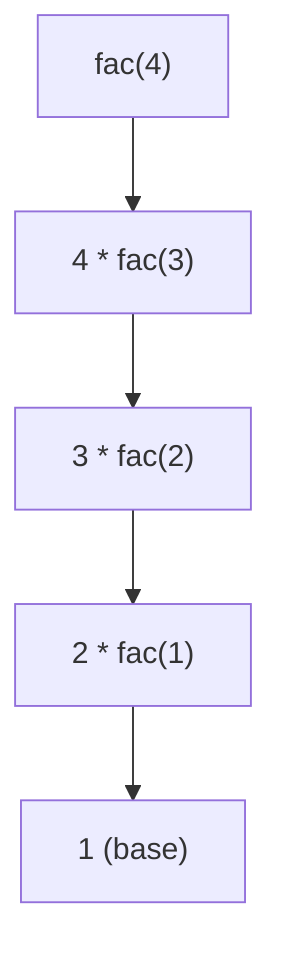

# B2 Programming

## B2.1.1 Construct and trace programs using a range of global and local variables of various data types

- A variable is a space in memory used to store data, referenced by a unique identifier. In python, variable is a **named reference** that points to the memory location where the object is stored, allow the program to **get access and manipulate** that object through the variable. 
- Data types in python
  - 
- **Global and Local variable** in python
  - Global variables:  
    - Defined **outside functions**.
    - Accessible anywhere in the file.
    - To modify inside a function, use `global`.

```python
x = 10  # global variable

def modify():
    global x
    x += 5

modify()
print(x)  # Output: 15
```

  - Local variables:
    - Defined inside a function.
    - Accessible only inside that function.
    - Can shadow a global variable with the same name.

```python
x = 10  # global

def func():
    x = 5  # local
    print(x)

func()  # Output: 5
print(x)  # Output: 10 (global unchanged)
```

## B2.1.2 Construct programs that can extract and manipulate substrings

- 
- **Negative Indexing** for subtring:
  - In Python, **negative indices** allow you to access elements from the **end of a list/string**. 
  - `-1` refers to the **last element**, `-2` to the **second last**, and so on.

```python
# Using negative indexing to extract substrings
text = "Data-Science-101"

print(text[-3:])    # Output: "101"       -> last 3 characters
print(text[:-4])    # Output: "Data-Science" -> all except last 4
print(text[-11:-6]) # Output: "Science"   -> slice using negative start and end

# The third argument: Steps
text = "abcdefghij"

print(text[-1:-6:-1]) # Output: "jihgf"  -> reverse slice from end
print(text[-2::-2])   # Output: "igeca"  -> every 2nd char from second last to start, remember that when you use a negative step, the sequence is from right to the left

# Combining both positive and negative indexes
text = "Machine-Learning"

print(text[8:-1])  # Output: "Learning" -> from index 8 to second last
print(text[-8:14]) # Output: "Learn"     -> from 8th last to index 14 (end exclusive)
```

## B2.1.3 Describe how programs use common exception handling techniques

- Benefits for handling exception:

  - Prevent program crashes – keeps the program running or ends it safely when errors occur. 

  - Improve user experience – gives clear error messages instead of raw system errors.
  - Support debugging and logging – records error details for analysis.
  - Handle special cases – e.g., catching ZeroDivisionError when dividing numbers.
    -Cleaner code – avoids excessive if checks by directly handling errors with try/excep 
- Python **exception handling** method

```python
# Basic try-except
try:
    x = 10 / 0   # This will raise ZeroDivisionError
except ZeroDivisionError:
    print("Cannot divide by zero!")

# Catching multiple errors
try:
    num = int(input("Enter a number: "))
    result = 10 / num
except ZeroDivisionError:
    print("Division by zero is not allowed.")
except ValueError:
    print("Invalid input. Please enter an integer.")
    
# Using else and finally
# else runs if no exception occurs. finally always runs, regardless of exception
try:
    number = int(input("Enter a number: "))
    result = 10 / number
except ZeroDivisionError:
    print("Cannot divide by zero!")
except ValueError:
    print("That's not a valid number.")
else:
    print(f"10 divided by {number} is {result}")
finally:
    print("End of program.")
    
# Tip: when you don't know what kind of error will occur
try:
    number = 10/0
except Exception as e:
    print("An error catched:",e)
```

- **Common Python Exceptions**
  - 

## B2.1.4 Construct and use common debugging techniques

## B2.2.1 Compare static and dynamic data structures

- Static structure:
  - Have a fixed size that is determined at compile time and cannot be changed during program execution. Faster access, but less flexible.
  - Advantages: 
    - Faster access and operations(contiguous memory) 
    - Predictable memory usage(fixed size)
    - No runtime allocation overhead
  - Disadvantages:
    - Inflexible size
    - Potential memory waste
    - Cannot adapt to changing data needs 
      **Warning:  In python, tuple and list store the reference of the objects, reference points to the memory location of the objects.**

- Dynamic structure:
  - Can grow or shrink during program execution. Memory is allocated at runtime. More flexible but but slightly slower.
  - Advantages: 
    - Flexible size.  
    - Efficient memory storage. 
    - Adapt to runtime requirements. 
    - Easier to work with. 
  - Disadvantages:
    - Slightly slower due to resizing
    - Memory allocation overhead. 
    - More complex implementation
    - **Resize: In Python, list resize means that when the list runs out of capacity, the interpreter allocates a larger block of memory and copies the existing elements into it, so new items can be appended(this will consume longer time).** 

## B2.2.2 Construct programs that apply arrays and lists (Excluding Two-dimensional arrays in Java)

- **One dimensional list in python**

```python
# Creating list
# Empty list
my_list = []

# List with elements
fruits = ["apple", "banana", "cherry"]

# List with mixed types
mixed = [1, "hello", 3.14, True]
  
# Accessing list elements
fruits = ["apple", "banana", "cherry"]

print(fruits[0])   # "apple"
print(fruits[-1])  # "cherry" (negative index)

# Modifying list
fruits = ["apple", "banana", "cherry"]

# Add elements
fruits.append("orange")      # Add at the end
fruits.insert(1, "mango")    # Add at index 1

# Remove elements
fruits.remove("banana")      # Remove by value
popped = fruits.pop()        # Remove last element and return it
popped2 = fruits.pop(2) 		 # Remove by index, and return it
del fruits[0]                # Delete element at index 0 

# Update elements
fruits[0] = "blueberry"

# List operations
a = [1, 2, 3]
b = [4, 5]

# Concatenation
c = a + b        # [1, 2, 3, 4, 5]

# Repetition
d = a * 2        # [1, 2, 3, 1, 2, 3]

# Check membership
2 in a           # True

# Iterating over lists
for fruit in fruits:
    print(fruit)

for i in range(len(fruits)):
    print(i, fruits[i])
    
# Iterating over lists but also return the index
name = ["Michael","Jack","Charles","Tiago","Mike"]
for index, element in enumerate(name):
    print(index,name)

# List comprehension
# Simple comprehension: square numbers
squares = [x**2 for x in range(5)]  # [0, 1, 4, 9, 16]

# With condition: only even numbers
even_squares = [x**2 for x in range(5) if x % 2 == 0]  # [0, 4, 16]
```

- **Common list Methods**

- `len(list)`  

  - Returns the number of elements in the list.  
  - **Arguments:** only the list itself.

- `list.sort(key=None, reverse=False)`  

  - Sorts the list in place (modifies the original list).  
  - **Arguments:**  
    - `key` → function to specify sorting criteria, e.g., `key=str.lower`  
    - `reverse` → `True` for descending order, `False` for ascending (default)

- `list.reverse()`  

  - Reverses the elements of the list in place.  
  - **Arguments:** none

- `list.index(x, start=0, end=len(list))`  

  - Returns the index of the first occurrence of `x`.  
  - **Arguments:**  
    - `x` → element to find  
    - `start` → optional, index to start searching (default 0)  
    - `end` → optional, index to stop searching (default end of list)

- `list.count(x)`  

  - Returns the number of times `x` occurs in the list.  
  - **Arguments:**  
    - `x` → element to count

- `list.clear()`  

  - Removes all elements from the list.  
  - **Arguments:** none

- `max(list)`

- `min(list)`

  

### Shallow Copy vs Deep Copy in Python Lists

Python lists are **mutable**, so sometimes copying them needs care. There are two main ways to copy a list:

---

#### 1. Shallow Copy

- Creates a **new list object**, but the **elements themselves are still references** to the original objects(points to the same memory location).
- Modifying **mutable elements** inside the copy will affect the original list.
- Methods to create a shallow copy: 

```python
# Using slicing
original = [[1, 2], [3, 4]]
shallow = original[:]

# Using list() constructor
shallow2 = list(original)

# Using copy module
import copy
shallow3 = copy.copy(original)

```python
# Example
original = [[1, 2], [3, 4]]
shallow = original[:]
shallow[0][0] = 99
print(original)  # Output: [[99, 2], [3, 4]]
```

#### 2. Deep Copy

- Creates a **new list object** and **recursively copies all nested objects** (each element gets its own copy in memory).
- Changes in the deep copy **do not affect the original list**.
- Method to create a deep copy:

```python
import copy
# Using copy.deepcopy()
original = [[1, 2], [3, 4]]
deep = copy.deepcopy(original)

# Example
original = [[1, 2], [3, 4]]
deep = copy.deepcopy(original)
deep[0][0] = 99
print(original)  # Output: [[1, 2], [3, 4]]
```

## B2.2.3 Explain the concept of a stack as a “last in, first out” (LIFO) data structure (HL Only)

- **Stack** is a ADT(abstract data types) which defines a collection of elements with **LIFO (Last In, First Out)** behavior.
- **Stack is a linear data structure that follows the Last in, First out rule. The last elements pushed into the stack will be first one removed from the stack.**
- **Being an ADT means that a stack **specifies what operations are allowed and how they behave, **but does not dictate how it is implemented**. You could use arrays, linked lists, or other structures to implement stack. 
- Common Stack Methods:
  - 
- This will help you understand it more clearly:
  - 
- Overflow and underflow:
  - 
- Applications of stack in computing:
  - Function call management (Call Stack) : Stacks are essential in recursive algorithms. Every time a recursive call is made the current state is pushed onto the stack. Once the base case is resolved the pop method is used to resolve the calls.  
    - 
  - Undo/Redo in text editors
  - Parsing: A stack is used to ensure that all of the brackets are closed. For example, in Java if the bracket `{}` are closed, every time an open bracket `{ `is read it is pushed onto the stack and every time a closed bracket ``}`` is read it is popped from the stack.  An empty stack means the correct number of brackets. 
    - 
  - Undo functions: A stack is used to keep a track of the operations completed by a user of a program. Every operation is pushed onto a stack. Each time they undo an action, the last action is popped from the stack and reversed. 
  - Expression evaluation (postfix, infix)
  - Syntax parsing (like checking parentheses in code)
  - Memory management 
  - Move back to the last page in a browser(pop)
- Applications of stack outside computing
  - Pile of dishes, Tower of boxes,Undo history in drawing
- When are stack and queue suitable
  - 

## B2.2.4 Explain the concept of a queue as a “first in, first out” (FIFO) data structure (HL Only)

- **Queue** is also a ADT(abstract data types) which defines a collection of elements **with FIFO (First In, First Out) behavior.**

- **Queue is a linear data structure that follows the First in, First out rule. The first element enqueue into the queue will be first one removed from the queue.**  

- **Being an ADT means that a queue **specifies what operations are allowed and how they behave, **but does not dictate how it is implemented**. You could use multiple ways to implement queue.

- A diagram to help understand FIFO:

  - 

    - **Here, notice that the left is the rear(队尾)，the right is the head(队头), you can also do it reversly.**

  - Common Methods for Queue:

    - 

  - Applications of queue in computing:

    - CPU scheduling (process queues)
    - Print spooling 
    - If you send many jobs to the printer, they are added to the print queue. If your printer is connected to your machine then once each print job has completed, the dequeue () method is called to get the next one. 
    - I/O buffering
    - Network packet handling (router queues): 
    - Queues are used to manage traffic in routers and switches. Data packets are stored in the queue until they can be processed or serialized. 
    - BFS (Breadth-First Search) in graphs

  - Applications of queue outside computing:

    - People waiting in line. Ticket counter line. Call center waiting system. 

  - When are stack and queue most suitable?

    - 

    

### Advantages and Disadvtanges of stack and queue

---

- 

## B2.3.2 Construct programs utilizing appropriate selection structures

## B2.3.3 Construct programs that utilize looping structures to perform repeated actions

## B2.4.2 Construct and trace algorithms to implement a linear search and binary search for data retrieval (HL Only)

- Big O notation: Time complextity:
  - 

- **Calculate Time complexity**
  - To calculate Big O complexity, consider how the number of operations of the algorithm changes with the size of the input. Follow these steps.

    - Count the **number of operations**. Identify the **main operations** of the algorithm and use these as a base for your calculation as you scale up the data set.

    - Ignore anything that is **constant or outside the method**. For example, printing the result of the method (this only happens once) or assigning a variable (for example, minIndex = 0, which happens outside of the method). **These do not change once the method begins.**  

    - **Change the input size and count the number of operations.** If the number has not changed, the complexity is O(1). If it has changed proportionally (linearly), the complexity is O(n). If it has changed quadratically, the complexity is O(n^2).

- **Linear Search**

```python
def linear_search(lst, target):
    for i in range(len(lst)):
        if lst[i] == target:
            return i
    return -1

# Example usage
data = [4, 2, 9, 1, 7]
print(linear_search(data, 9))  # Output: 2
print(linear_search(data, 5))  # Output: -1
```

  - Notice that the best complexity for linear search is O(1). Regardless the input size(length of list), the result is the first element. Will only take one operation, even the input size is really large.
  - The average and worst complexity are O(n).

- **Binary Search**

```python
def binary_search(lst, target):
    original = [(index, name) for index, name in enumerate(lst)]
    lst.sort()
    left = 0
    right = len(lst) - 1
    while left <= right:
        mid = (left + right) // 2
        if lst[mid] == target:
            for j in range(len(original)):
                if original[j][1] == target:
                    return original[j][0]
        elif lst[mid] > target:
            right = mid - 1
        else:
            left = mid + 1
    return -1

         
# Example usage
sorted_data = [1, 3, 5, 7, 9, 11]
print(binary_search(sorted_data, 7))  # Output: 3
print(binary_search(sorted_data, 2))  # Output: -1
```

- 程序的时间复杂度 = 代码中最耗时操作的复杂度。把代码拆成若干片段，每段单独分析复杂度。比较每段复杂度，最大的那个就是整个程序的复杂度。低阶、常数、顺序执行的片段都不影响最终复杂度，只看增长最快的部分。


## B2.4.3 Construct and trace algorithms to implement bubble sort and selection sort, evaluating their time and space complexities


#### **Bubble sort**

---


- Simple comparison-based sorting algorithm
- Repeatedly steps through the list
- Compares adjacent elements, if they are in wrong order, swap them
- Each pass moves the largest unsorted element to it's correct position
  - Largest element bubble up to the end of the interval 
  - the interval will shrink each pass

- **Example of python code utilizing bubble sort**

```python
arr = [1, 663, 8, 2, 4, 1, 22, 66, 20, 122]
for i in range(len(arr)-1):
  for j in range(0,len(arr)-i-1):
    if arr[j] > arr[j+1]:
      arr[j], arr[j+1] = arr[j+1], arr[j]
print(arr)
```

- The outer loop controls the number of passes need to sort the array. For an array of length `len(arr)`, the number of passes needed in only `len(arr)-1`. 
- The inner loop is responsible for shrinking the interval. 外层循环每经过一次，就意味着在这个区间内，最大的元素已经被bubble up到了区间的末尾。bubble sort的判断区间的左边界永远是从0开始，而右边界每次要shrink。初始的边界应该是`[0,len(arr)-1)`, `-1`的原因是后续的判断需要`arr[j+1]`，这样子写不会out of range(索引`j`最大只能为列表倒数第二个元素的索引)。而外层循环每结束一次，意味着有一个element被排好序。举个例子，第一次循环，`i`为0，说明0个元素被排序，第二次循环，此时`i`等于1，说明已经有1个元素被排好序，右边的区间就应该`-1`,也就是`-i`. 以此类推，右边的界限loop每次都应当减去`i`，减去已经排序好的元素数量。
- The if statement in the inner loop is clear. Since we are aiming to sort the array with ascending order, the condition will be like this. Swap them if the element is bigger than the element at the right side of it. 
- Due to the nested for loop, the time complexity of bubble sort is $O(n^2)$, every time, the inner loop will traverse through the whole interval, which is really slow.

- **An optimization of bubble sort using a flag**

```python
arr = [1, 663, 8, 2, 4, 1, 22, 66, 20, 122]
for i in range(len(arr)-1): # Outer Loop: Controll the numer of passes needed, only len(arr)-1 times needed
  flag = False
  for j in range(0,len(arr)-i-1): # Inner Loop: -1 to prevent list index out of range(j+1 later)
    if arr[j] > arr[j+1]:
      arr[j], arr[j+1] = arr[j+1], arr[j]
      flag = True
      
  if not flag:
    break
    
print(arr)
```

- The intention and purpose of `flag` is:
  - 如果在某一次pass（outer loop）中，完全没有发生任何交换 (`flag` 一直是 `False`)，那说明数组已经是有序的，可以提前退出(`break`)。
- The best time complexity:
  - If the array is already sorted, the loop will exit early
    - 外层循环只跑了 **1 次** → `O(1)`
    - 内层循环跑了 **n-1 次比较** → `O(n)`, `n`是数组长度
    - 所以整体复杂度是`O(n)`
    - **提前退出只会在整趟内没有交换时触发**(整个数组都完成排序)，局部有序不会让提前退出生效  
- Advantages of bubble sort
  - Simple to **understand and implement**.
  - In-place(原地), **minimal memory usage.**
  - Stable(稳定性), **preserves order of same elements. **(the sequence of elements won't change if they are the same(no swap)). 
- Disadvantages of bubble sort
  - Very slow for large datasets, most cases the time complexity is $O(n^2)$， 慢的要死，你写python无脑用sort()就行。
    - 在任何case下，inner loop都必须被完成，哪怕是已经sort好的，inner loop都要跑一遍才可以break。每一次pass(outer loop)都要进行$>=$​1次的operation。**内层循环必须完整执行**。并且每一次inner loop的迭代都有可能有多次swap，这也是在most cases中比selection sort慢一些的原因。
  - Inefficient compared to other sorting algorithms.  
- When to use bubble sort
  - Small datasets only or nearly sorted data(with optimization) 

#### **Selection sort**

---


- **Python implementation for selection sort**  

```python
arr = [1, 663, 8, 2, 4, 1, 22, 66, 20, 122]

for i in range(len(arr)-1):
  min_index = i
  for j in range(i+1,len(arr)):
    if arr[j] < arr[min_index]:
      min_index = j
  
  arr[i], arr[min_index] = arr[min_index],arr[i]

print(arr)
```

- Features of selection sort: 
  - Time complextiy: Always $O(n^2)$. But **slight quicker than bubble sort, because only ≤1 operation(swap) needed each pass.** 
- Advantages of selection sort:
  - Works well and easy to implement **on small datasets.**
  - **No addiional storage needed** as elements are being **swapped in place**(原地交换，不需要额外数组空间).
  - Comparing to bubble sort, the **number of swaps** required each pass **is minimized**(≤1 time).
    - 每轮最多进行一次交换 
- Disadvantages for selection sort:
  - Inefficient for **large datasets.**
  - Comparing to bubble sort, selection sort is **not that stable**, because the **order of same elements are not preserved.** 

#### **Quicksort**

---

- The ouline of **quicksort** algorithm:
  1. **Chooese a pivot**: Pick one element to act as the pivot.
  2. **Partition the array**: Move all elements smaller than the pivot to one side, and all greater ones to the other side. (The pivot is now in its correct final position.)
  3. **Recursively sort sub-arrays:** Apply the same pivot-and-partition process to the left and right parts. The recursion will end once the length of the array is equal to 1, meaning that there's no need to sort.
  4. **Combine results**: When both sides are sorted, the whole array is sorted. 
- What is **divide-and-conque**r(partition here) ?:
  - **Divide and conquer** is a problem-solving strategy that breaks a l**arge problem into smaller sub-problems,** solves each sub-problem **recursively**, and then **combines** their results to form the **final solution.** 

- There are **mutiple ways** to implement quick sort, this the easiest one to understand:

```python
def quick_sort(arr):
    # 1. 递归的出口：如果数组为空或者只有一个元素，就不用排了，直接返回
    # 这步极其重要
    if len(arr) <= 1:
        return arr
    
    # 2. 挑基准 (Pivot)。这里我们挑中间那个数，这样写代码方便
    pivot = arr[len(arr) // 2]
    
    # 3. 站队（分区）
    left = []   # 放比pivot小的
    right = []  # 放比pivot大的
    middle = [] # 放和pivot一样大的（处理重复元素） 
    
    for num in arr:
        if num < pivot:
            left.append(num)
        elif num > pivot:
            right.append(num)
        else:
            middle.append(num)
    
    # 4. 递归排序左边和右边，然后把结果拼起来
    # quick_sort(left) 会把左边队伍排好序
    # quick_sort(right) 会把右边队伍排好序
    # middle 因为都和pivot相等，所以已经有序了
    return quick_sort(left) + middle + quick_sort(right) #这是合并三个列表的过程

my_list = [5, 3, 8, 4, 2]
sorted_list = quick_sort(my_list)
print(sorted_list) # 输出：[2, 3, 4, 5, 8]

my_list2 = [64, 34, 25, 12, 22, 11, 90]
sorted_list2 = quick_sort(my_list2)
print(sorted_list2) # 输出：[11, 12, 22, 25, 34, 64, 90]
```

- Advantages of quick sort: 
  - Efficient for larg datasets. The average time complexity is `O(nlogn)`.
  - Vert little memory overhead required.
- Disadvantages of quick sort:
  - The time complexity is unstable comparing to merge sort. The worst time complexity of quiksort is `O(n^2)`.  
  - Potential stackoverflow if the recursion is too deep. 
  - Does not work well for small datasets.
- An optimized version using **list comprehension**: 

```python
def quick_sort(arr):
    # 1. 递归的出口：如果数组为空或者只有一个元素，就不用排了，直接返回
    if len(arr) <= 1:
        return arr
    
    # 选择基准元素（中间位置的元素）
    pivot = arr[len(arr)//2]
    
    # 分区操作
    left = [x for x in arr if x < pivot]    # 小于基准的元素
    middle = [x for x in arr if x == pivot] # 等于基准的元素
    right = [x for x in arr if x > pivot]   # 大于基准的元素
    
    # 递归排序并合并结果
    return quick_sort(left) + middle + quick_sort(right)

my_list = [5, 3, 8, 4, 2]
sorted_list = quick_sort(my_list)
print(sorted_list) # 输出：[2, 3, 4, 5, 8]

my_list2 = [64, 34, 25, 12, 22, 11, 90]
sorted_list2 = quick_sort(my_list2)
print(sorted_list2) # 输出：[11, 12, 22, 25, 34, 64, 90]
```

- Explanation of the **time complexity of quick sort** under different situations: 
  - Fast and average case:
    - The complexity for each pass is `O(n)`, since there are nearly `logn` passes, the complexity overall is nearly `O(nlogn)`. 
  - Worst case:
    - 想想一下你的pivot是数组中的最大元素，这意味着sub-array的分配将会很不合理，left里有一堆，right里面没有，因为没有比pivot大的。三个列表推导的复杂度还是`O(n`, 但是由于此时没有把数组拆成两半，需要n次递归的调用才能处理完所有元素，因此时间复杂度大约是`O(n^2)`, 当pivot取了最大或最小的时候。
  - 
  - 每层（pass）的复杂度是3个列表推导式 = `O(n)`，由于pivot(数组middle)每次都是区间的最大值，递归每次让长度``-1`，因此复杂度是`O(n)``, 总体的就是``O(n) * O(n) = O(n^2)``.  

## B2.4.4 Explain the fundamental concept of recursion and its applications in programming

- **Why use functions?**
  - Reusability: Write once, use multiple times
  - Modularity: Break complex problems into smaller parts
  - Readability: Make code easier to understand and read
  - Maintainability: Easier to debug and modify
  - Testing: Isolate and test individual components

- **What is recursion**
  - Recursion means keep **calling the function itself** with updated parameters, until the **base case**(也称为递归出口) is reached.
  - Recursion breaks a big problem into multiple small sub-problems, until reaches the base case, the break will stop, and return the value. 
- **Advantages of recursion**
  - Elegant(优雅的) and readable code:
    - Perfect for inherently recursive problems, like tree, fractals
    - Code closely mirros problem structures
  - Simplifies complex problems
    - Breaks large problem into smaller, identical sub-problems
    - Reduces code length for complex data structures or problems
  - Enable powerful algorithms
    - Foundation for **divide and conquer**（分治法）like merge sort, quick sort
    - Essential for dynamic programming and backtracking
- **Disadvantages of recursion**
  - Performance overhead
    - High memory usage due to the use of stack
    - Potential stack overflow due to deep recursion(unreasonable base case, not terminating condition)
    - Slower than iteration due to function call overhead
  - Diffcult to debug and trace
    - Hard to follow execution flow through multiple recursive calls
    - Hard for beginner to maintain and understand
  - Potential Inefficiency 
    - Can lead to exponential time complexity, for example $O(n^2)$
    - May recompute the same subproblems repeatedly without optimization
- **A way to understand how a recursion function works**
  - when the parameter is larger(deep recursion) and the recursion condition is complex, it is really hard to simulate the recursion process in your brain
  - Instead, draw a recursion tree will make the problem become very easy
  - This is a recursive function for factorial, the most simplest example
  - You may calculate the result rapidlay, but I just want to use this example to show how recursion tree works

```python
def fac(n):
  if n==1 or n==0:
    return 1
  else:
    return n*fac(n-1)
  
n = int(input("Input the value"))
print(fac(n))
```

The recursion tree for this factorial function is like this:



- When the program meets the base case, call fac() with the actual parameter 1 (``fac(1)``), the function will return 1, due to the **terminating condition.** 
- Then, go back to the parent level, `2*fac(1)`, using the value returned from the base case, this level can be resolved.
- Go back to the parent level again, `3*fac(2)`, this level needs the returned value from `fac(2)`, which is the result of the child level. Then, this level get resolved.
- So on.
- **The key is, keep calling the function itself, iterating the recursive process, once it reaches the base case, return the value from bottom to top.**

